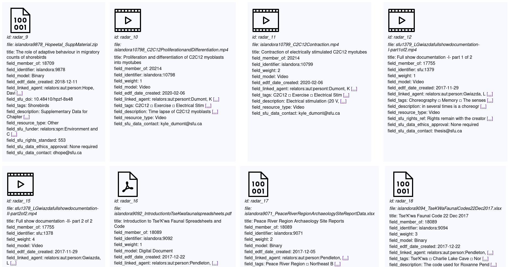
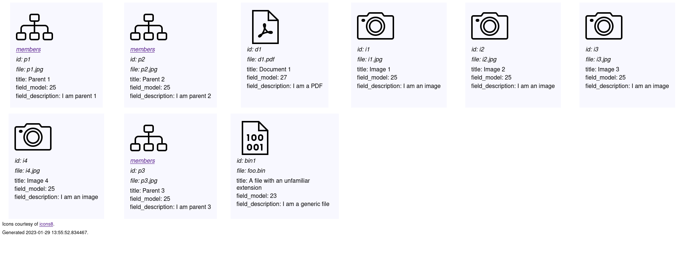

During `--check` in `create` tasks, you can generate a contact sheet from your input CSV by adding the command-line option `--contactsheet`, like this:

`./workbench --config somecreatetask.yml --check --contactsheet`

If you use this option, Workbench will tell you the location of your contact sheet, e.g. `Contact sheet is at /home/mark/hacking/islandora_workbench/contact_sheet_output/contact_sheet.htm`, which you can then open in your web browser.

Contact sheets looks like this:

The icons (courtesy of [icons8](https://icons8.com/)) indicate if the item in the CSV is an:

* image
* video
* audio
* PDF
* miscellaneous binary file
* compound item

There is also an icon that indicates that there is no file in the input CSV for the item.

Fields with long values are indicated by link formatted like "[...]". Placing your pointer over this link will show a popup that contains the full value. Also, in fields that have multiple values, the subdelimiter defined in your configuration file is replaced by a small square (&square;), to improve readability.

Compound items in the input CSV sheet are represented by a "compound" icon and a link to a separate contact sheet containing the item's members:

The members contact sheet looks like this:

You can define where your contact sheet is written to using the `contact_sheet_output_dir` configuration setting. If the directory doesn't exist, Workbench will create it. All the HTML, CSS, and image files that are part of the contact sheet(s) is written to this directory, so if you want to share it with someone (for quality assurance purposes, for example), you can give them a copy of the directory and its contents.

You can also define the path to an alternative CSS stylesheet to use for your contact sheets. The default CSS file is a `assets/contact_sheet/contact-sheet.css` within the Workbench directory. To specify your own CSS file, include its relative (to the Workbench directory) or absolute path in the `contact_sheet_css_path` config setting. If you use an alternative CSS file, you should base yours on a copy of the default one, since the layout of the contact sheets depends heavily on the default CSS.

