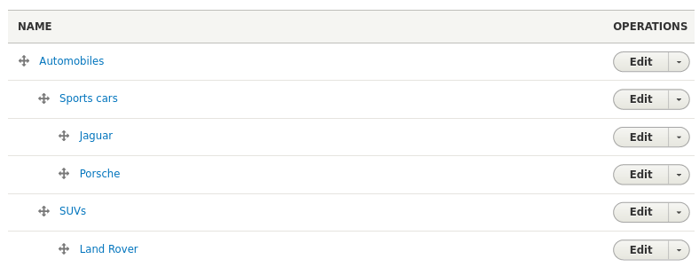

Islandora Workbench lets you creatw vocabulary terms from CSV files. This ability is separate from creating vocabulary terms at the same time as creating the nodes in `create` or `update` tasks, as described in "[Drupal fields and CSV fields](/islandora_workbench_docs/fields)" documentation. You should load a vocabulary using the options described here if any of these situations applies to you:

* you are working with a vocabulary that has fields in additiont term name.
* you are working with a vocabulary that is hierarchical.
* you want to use Workbench to load vocabulary terms but you want them to exist before (or separate from) the nodes that a `create` task creates.

If you want to create terms at the same time you are using a `create` task to create the nodes the terms are attached to, and if the terms you are creating don't have any additional fields or hierarchical relationships to other terms, you don't need to use the task described here. You can use the method you can create terms as described in as described in the "Taxonomy reference fields" section of "[Drupal fields and CSV fields](/islandora_workbench_docs/fields)."

### The configuration and input CSV files

To load terms into a vocabulary, you use a `create_terms` task. A typical `create_terms` configuration file looks like this:

```yaml
task: create_terms
host: "http://localhost:8000"
username: admin
password: islandora
input_csv: my_term_data.csv
vocab_id: myvocabulary
```

The `vocab_id` config option is required. It contains the machine name of the vocabulary you are loading the terms into. 

The CSV file identified in the `input_csv` option has one required column, `term_name`, which contains each term's name:

```text
term_name
Automobiles
Sports cars
SUVs
Jaguar
Porche
Land Rover
```

!!! note
    Unlike Input CSV files used during `create` tasks, input CSV files for `create_terms` tasks do not have an "id" column. Instead, `term_name` is the column whose values are the unique identifier for each term. Workbench assumes that term names are unique within a vocabulary. If the terms in the `term_name` column aren't unique, Workbench only creates the term the first time it encounters it in the CSV file. 

Two reserved but optional columns, `weight`, and `description`, are described next. You can also add columns that correspond to a vocabulary's field names, just like you do when you assemble your CSV for `create` tasks, as described in the "Vocabularies with custom fields" section below. A third reserved column header, `parent` is described in the "Hierarchical vocabularies` section.

### Term weight and description

Two other reserved CSV column headers are `weight` and `description`. All Drupal taxonomy terms have these two fields.

* `weight` is used to sort the terms in the vocabulary overview page in relation to their parent term (or the vocabulary root if a term has no parent). Values in the `weight` field are integers. The lower the weight, the earlier the term sorts. For example, a value of "0" (zero) sorts the term at the top in relation to its parent, and a value of "100" sorts the term much lower.
* `description` is, as the name suggests, a field that contains a description of the term.

Both `weight` and `description` are optional columns in your CSV.

### Vocabularies with custom fields

Example column headers in a CSV file for use in `create_terms` tasks that has two additional fields, "field_example" and "field_second_example", in addtion to the optional "description" column would look like this:

```text
term_name,field_example,field_second_example,description
```

Here is a sample CSV input file with headers (for "description" and "field_external_uri" fields) and two records:

```text
term_name,description,field_external_uri
Program file,Testing adding taxonomy terms (Program file),http://id.loc.gov/vocabulary/mfiletype/program
Data set,Testing adding taxonomy terms (Data set),https://www.wikidata.org/wiki/Q1172284
```

Optional fields don't need to be included in our CSV if you are not populating them, but fields that are configured as required in the vocabulary settings do need to be present, and populated (just like required fields on content types in `create` tasks). Running `--check` on a `create_terms` task will flag any required fields that are missing from your input CSV file.

### Hierarchical vocabularies

If you want to create a vocabulary that is hierarchical, like this:



you can add a `parent` column to your CSV and in it, include the term name of the term you want as the parent. For example, the above sample vocabulary was created using this CSV input file:

```text
term_name,parent
Automobiles,
Sports cars,Automobiles
SUVs,Automobiles
Jaguar,Sports cars
Porche,Sports cars
Land Rover,SUVs
```

One important aspect of creating a hierarchical vocabulary is that all parents must exist before their children. That means that within your CSV file, the rows for terms used as parents should be placed earlier than the rows for their children. If a term is named as a parent but doesn't exist (or doesn't exist yet because it came after the child term in the CSV), Workbench will create the child term and write a warning in the log indicating that the parent didn't exist at the time of creating the child. 

You can include the `parent` column in your CSV along with Drupal field names. Workbench will not only create the hierarchy, it will also add the field data to the terms:

```text
term_name,parent,description,field_external_uri
Automobiles,,,
Sports cars,Automobiles,"Sports cars focus on performance, handling, and driver experience.",https://en.wikipedia.org/wiki/Sports_car
SUVs,Automobiles,"SUVs, or Sports Utility Vehicles, are the most popular type of automobile.",https://en.wikipedia.org/wiki/Sport_utility_vehicle
Jaguar,Sports cars,,
Porche,Sports cars,,
Land Rover,SUVs,,
```
