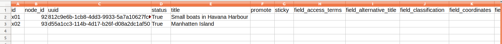

In some situations, you may want to create stub nodes that only have a small subset of fields, and then populate the remaining fields later. To facilitate this type of workflow, Workbench provides an option to generate a simple CSV file containing a record for every node created during a `create` task. This file can then be used later in `update` tasks to add additional metadata or in `add_media` tasks to add media.

 You tell Workbench to generate this file by including the optional `output_csv` setting in your `create` task configuration file. If this setting is present, Workbench will write a CSV file at the specified location containing one record per node created. This CSV file contains the following fields:

 * `id` (or whatever column is specified in your `id_field` setting): the value in your input CSV file's ID field
 * `node_id`: the node ID for the newly created node
 * `content_type`: the node's content type
 * `uuid`: the new node's UUID
 * `uid`: the ID of the user who created the node
 * `created`: the date stamp the node was created
 * `changed`: the date stamp the node was last updated
 * `published`: 1 if the node is published, 0if it is unpublished
 * `promote`: 1 if the node is promoted to the home page, 0 if it is not
 * `langcode`: the node' language code
 * `title`: the node's title
 * `url_alias`: the node's URL alias, if there is one

 The file will also contain empty columns corresponding to all of the fields in the target content type. An example, generated from a 2-record input CSV file, looks like this (only left-most part of the spreadsheet shown):

 

This CSV file is suitable as a template for subsequent `update` tasks, since it already contains the `node_id`s for all the stub nodes plus column headers for all of the fields in those nodes. You can remove from the template any columns you do not want to include in your `update` task. You can also use the node IDs in this file as the basis for later `add_media` tasks; all you will need to do is delete the other columns and add a `file` column containing the new nodes' corresponding filenames.

If you want to include in your output CSV all of the fields (and their values) from the input CSV, add `output_csv_include_input_csv: true` to your configuration file. This option is useful if you want a CSV that contains the node ID and a field such as `field_identifier` or other fields that contain local identifiers, DOIs, file paths, etc. If you use this option, all the fields from the input CSV are added to the output CSV; you cannot configure which fields are included.
