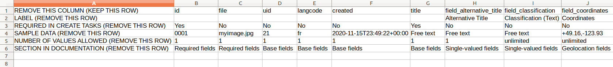

> This section describes creating CSV *file* templates. For information on CSV *field* templates, see the "Using CSV field templates" section below.

You can generate a template CSV file by running Workbench with the `--get_csv_template` argument:

`./workbench --config config.yml ----get_csv_template`

With this option, Workbench will fetch the field definitions for the content type named in your configuration's `content_type` option and save a CSV file with a column for each of the content type's fields. You can then populate this template with values you want to use in a `create` task. The template file is saved in the directory indicated in your configuration's `input_dir` option, using the filename defined in `input_csv` with `.csv_file_template` appended.

The template also contains three additional rows:

* sample data
* number of values allowed (either a specific maximum number or 'unlimited')
* the name of the section in the documentation covering the field type

Here is a screenshot of this CSV file template loaded into a spreadsheet application:

Note that the first column, and all the rows other than the field names, should be deleted before you use a popluated version of this CSV file in a `create` task.
