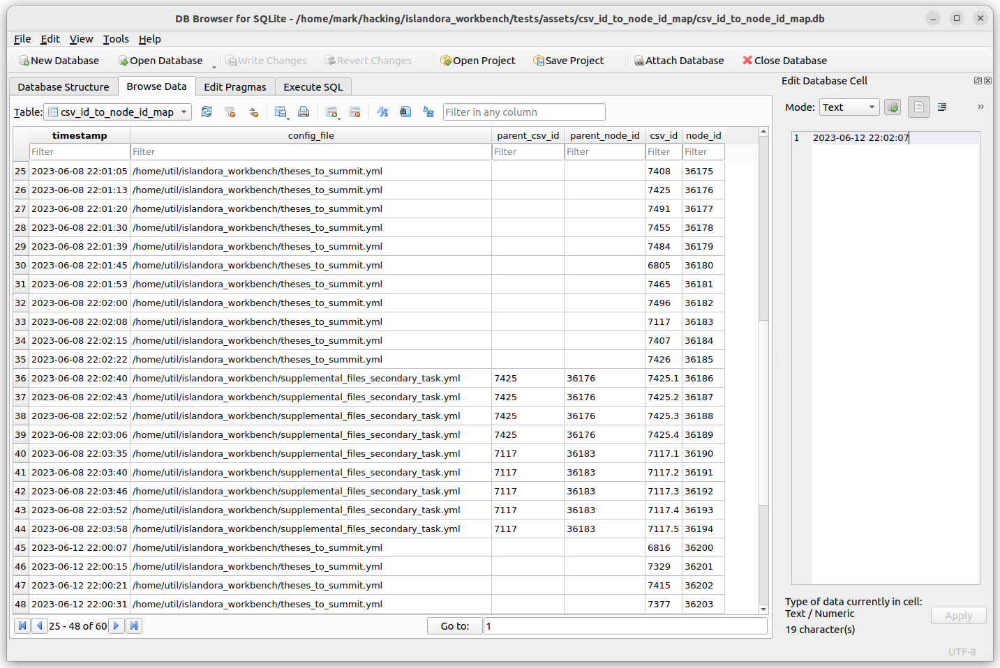

# The CSV ID to node ID map

By default, Workbench maintains a simple database that maps values in your CSV's ID column (or whatever column you define in the `id_field` config setting) to node IDs created in `create` tasks.

!!! note
    You do not need to install anything extra for Workbench to create this database. Workbench provides a utility script, `manage_csv_to_node_id_map.py` (described below), for exporting and pruning the data. You only need to install the `sqlite3` client or a third-party utility if you want to access the database in ways that surpass the capabilities of the `manage_csv_to_node_id_map.py` script.

    A useful third-party tool for viewing and modifying SQLite databases is [DB Browser for SQLite](https://sqlitebrowser.org/). Here is a sample screenshot illustrating the CSV to node ID map database table in DB Browser for SQLite (CSV ID and node ID are the two right-most columns):

    

Workbench optionally uses this database to determine the node ID of parent nodes when creating paged and compound content, so, for example, you can use `parent_id` values in your input CSV that refer to parents created in earlier Workbench sessions. But, you may find other uses for this data. Since it is stored in an SQLite database, it can be queried using SQL, or can be dumped using into a CSV file using the `manage_csv_to_node_id_map.py` script provided in Workbench's `scripts` directory.

!!! note
    In `create_from_files` tasks, which don't use an input CSV file, and when creating paged content from directories using the `paged_content_from_directories: true` setting, the filename is recorded instead of an "id".

One configuration setting applies to this feature, `csv_id_to_node_id_map_path`. By default, its value is `[your temporary directory]/csv_id_to_node_id_map.db` (see the [temp_dir](/islandora_workbench_docs/configuration/#miscellaneous-settings) config setting's documentation for more information on where that directory is). This default can be overridden in your config file. If you want to disable population of this database completely, set `csv_id_to_node_id_map_path` to `false`.

!!! warning
    Some systems clear out their temporary directories on restart. You may want to define the absolute path to your ID map database in the `csv_id_to_node_id_map_dir` configuration setting so it is stored in a location that will not get deleted on system restart.

The SQLite database contains one table, "csv_id_to_node_id_map". This table has five columns:

* `timestamp`: the current timestamp in `yyyy-mm-dd hh:mm:ss` format or a truncated version of that format
* `config_file`: the name of the Workbench configuration file active when the row was added
* `parent_csv_id`: if the node was created along with its parent, the parent's CSV ID
* `parent_node_id`: if the node was create along with its parent, the parent's node ID
* `csv_id`: the value in the node's CSV ID field (or in `create_from_files` tasks, which don't use an input CSV file, the filename)
* `node_id`: the node's Drupal node ID

If you don't want to query the database directly, you can use `scripts/manage_csv_to_node_id_map.py` to:

* Export the contents of the entire database to a CSV file.
    * To do this, in the Workbench directory, run the script, specifying the path to the database file and the path to the CSV output: `python scripts/manage_csv_to_node_id_map.py --db_path /tmp/csv_id_to_node_id_map.db --csv_path /tmp/output.csv`
* Export the rows that have duplicate (i.e., identical) CSV ID values, or duplicate values in any specific field.
    * To limit the rows that are dumped to those with duplicate values in a specific database field, add the `--nonunique` argument and the name of the field, e.g., `--nonunique csv_id`. The resulting CSV will only contain those entries from your database.
* Delete entries from the database that have a specific value in their `config_file` column.
    * To do this, provide the script with the `--remove_entries_with_config_files` argument, e.g., `python scripts/manage_csv_to_node_id_map.py --db_path csv_id_to_node_id_map.db --remove_entries_with_config_files create.yml`. You can also specify a comma-separated list of config file names (for example `--remove_entries_with_config_files create.yml,create_testing.yml`) to remove all entries with those config file names with one command.
* Delete entries from the database create before a specific date.
    * To do this, provide the script with the `--remove_entries_before` argument, e.g., `python scripts/manage_csv_to_node_id_map.py --db_path csv_id_to_node_id_map.db --remove_entries_before "2023-05-29 19:17"`.
* Delete entries from the database created after a specific date.
    * To do this, provide the script with the `--remove_entries_after` argument, e.g., `python scripts/manage_csv_to_node_id_map.py --db_path csv_id_to_node_id_map.db --remove_entries_after "2023-05-29 19:17"`.

The value of the `--remove_entries_before` and `--remove_entries_after` arguments is a date string that can take the form `yyyy-mm-dd hh:mm:ss` or any truncated version of that format, e.g. `yyyy-mm-dd hh:mm`, `yyyy-mm-dd hh`, or `yyyy-mm-dd`. Any rows in the database table that have a `timestamp` value that matches the date value will be deleted from the database. Note that if your timestamp value has a space in it, you need to wrap it quotation marks as illustrated above; if you don't, the script will delete all the entries on the timestamp value before the space, in other words, that day.
