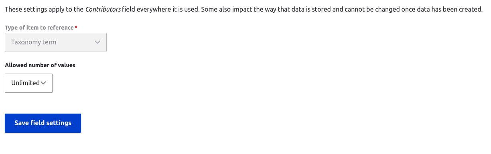

This documentation is aimed at developers who want to contribute to Islandora Workbench.

## General

* Bug reports, improvements, feature requests, and PRs are welcome. Before you open a pull request, *please open an issue so we can discuss your idea*. In cases where the PR introduces a potentially disruptive change to Workbench, we usually want to start a discussion about its impact on users in the `#islandoraworkbench` Slack channel.
    * When you open a PR, you will be asked to complete the Workbench [PR template](https://github.com/mjordan/islandora_workbench/blob/main/.github/PULL_REQUEST_TEMPLATE.md).
* All code must be formatted using [Black](https://black.readthedocs.io/en/stable/usage_and_configuration/the_basics.html). You can automatically style your code [using Black in your IDE of choice](https://black.readthedocs.io/en/stable/integrations/editors.html).
* Where applicable, unit and integration tests to accompany your code are very appreciated. Tests in Workbench fall into two categories:
    * *Unit tests* that do not require a live Islandora instance.
    * *Integration tests* that require a live Islandora instance running at `https://islandora.traefik.me/`.
* `workbench_utils.py` provides a lot of utility functions. Before writing a new utility function, please ensure that something similar to what you want to write doesn't already exist.

## Running tests

While developing code for Islandora Workbench, you should run tests frequently to ensure that your code hasn't introduced any regression errors. Workbench is a fairly large and complex application, and has many configuration settings. Even minor changes in the code can break things.

1. To run unit tests that do not require a live Islandora instance:
    * Unit tests in `tests/unit_tests.py` (run with `python tests/unit_tests.py`)
    * Unit tests for Workbench's Drupal fields handlers in `tests/field_tests.py` (run with `python tests/field_tests.py`)
1. To run integration tests that require a live Islandora instance running at `https://islandora.traefik.me/`
    * `tests/islandora_tests.py`, `tests/islandora_tests_check.py`,  `tests/islandora_tests_hooks.py`, and `tests/islandora_tests_paged_content.py` can be run with `python tests/islandora_tests.py`, etc.
    * The Islandora Starter Site deployed with [ISLE](https://github.com/Islandora-Devops/isle-dc) is recommended way to deploy the Islandora used in these tests. Integration tests remove all nodes and media added during the tests, unless a test fails. Taxonomy terms created by tests are not removed.
    * Some integration and field tests output text that beings with "Error:." This is normal, it's the text that Workbench outputs when it finds something wrong (which is probably what the test is testing). Successful test (whether they test for success or failure) runs will exit with "OK". If you can figure out how to suppress this output, please visit [this issue](https://github.com/mjordan/islandora_workbench/issues/160).

If you want to run the tests within a specific class, include the class name as an argument like this: `python tests/unit_tests.py TestCompareStings`

You can also specify multiple test classes within a single test file: `python tests/islandora_tests.py TestMyNewTest TestMyOtherNewTest`

## Writing tests

Islandora Workbench's tests are written using the Python built-in [module](https://docs.python.org/3/library/unittest.html) `unittest`, and as explained above, fall into two categories:

- Unit tests that do not require a live Islandora instance.
- Integration tests that require a live Islandora instance running at `https://islandora.traefik.me/`.

`unittest` groups tests into classes. A single test file can contain one or more test classes. Within each test class, you can put one or more test methods. As shown in the second example below, two reserved methods, `setUp()` and `tearDown()`, are reserved for setup and cleanup tasks, respectively, within each class. If you are new to using `unittest`, [this](https://www.pythontutorial.net/python-unit-testing/) is a good tutorial.

### A simple unit test

Islandora Workbench unit tests are much like unit tests in any Python application. The sample test below, from `tests/unit_tests.py`, tests the `validate_latlong_value()` method from the `workbench_utils.py` module. Since `workbench_utils.validate_latlong_value()` doesn't interact with Islandora, `https://islandora.traefik.me/` doesn't need to be available to run this unit test.

```python
class TestValidateLatlongValue(unittest.TestCase):

    def test_validate_good_latlong_values(self):
        values = ['+90.0, -127.554334', '90.0, -127.554334', '-90,-180', '+50.25,-117.8', '+48.43333,-123.36667']
        for value in values:
            res = workbench_utils.validate_latlong_value(value)
            self.assertTrue(res)

    def test_validate_bad_latlong_values(self):
        values = ['+90.1 -100.111', '045, 180', '+5025,-117.8', '-123.36667']
        for value in values:
            res = workbench_utils.validate_latlong_value(value)
            self.assertFalse(res)
```

This is a fairly standard Python unit test - we define a list of valid lat/long pairs and run them through the `workbench_utils.validate_latlong_value()` method expecting it to return `True` for each value, and then we define a list of bad lat/long pairs and run them through the method expecting it to return `False` for each value.

### A simple integration test

The two sample integration tests provided below are copied from `islandora_tests.py`.

The first sample integration test, `TestCreate`, looks like this (with line numbers added for easy reference). Configuration and CSV files used by this test are in `tests/assets/create_test`:

```python
1. class TestCreate(unittest.TestCase):
2.
3.     def setUp(self):
4.         self.current_dir = os.path.dirname(os.path.abspath(__file__))
5.         self.create_config_file_path = os.path.join(self.current_dir, 'assets', 'create_test', 'create.yml')
6.         self.create_cmd = ["./workbench", "--config", self.create_config_file_path]
7.
8.     def test_create(self):
9.         self.nids = list()
10.         create_output = subprocess.check_output(self.create_cmd)
11.         create_output = create_output.decode().strip()
12.         create_lines = create_output.splitlines()
13.         for line in create_lines:
14.             if 'created at' in line:
15.                 nid = line.rsplit('/', 1)[-1]
16.                 nid = nid.strip('.')
17.                 self.nids.append(nid)
18.
19.         self.assertEqual(len(self.nids), 2)
20.
21.     def tearDown(self):
22.         for nid in self.nids:
23.             quick_delete_cmd = ["./workbench", "--config", self.create_config_file_path, '--quick_delete_node', 'https://islandora.traefik.me/node/' + nid]
24.             quick_delete_output = subprocess.check_output(quick_delete_cmd)
25.
26.         self.rollback_file_path = os.path.join(self.current_dir, 'assets', 'create_test', 'rollback.csv')
27.         if os.path.exists(self.rollback_file_path):
28.             os.remove(self.rollback_file_path)
29.
30.         self.preprocessed_file_path = os.path.join(self.current_dir, 'assets', 'create_test', 'metadata.csv.preprocessed')
31.         if os.path.exists(self.preprocessed_file_path):
32.             os.remove(self.preprocessed_file_path)

```

As you can see, this test runs Workbench using the config file `create.yml` (line 10), which lives at `tests/assets/create_test/create.yml`, relative to the workbench directory. A tricky aspect of using real config files in tests is that all paths mentioned in the config file must be relative to the workbench directory. This `create.yml` defines the `input_dir` setting to be `tests/assets/create_test`:

```yaml
task: create
host: https://islandora.traefik.me
username: admin
password: password
input_dir: "tests/assets/create_test"
media_type: image
allow_missing_files: True
```

The test's `setUp()` method prepares the file paths, etc. and within the test's only test method, `test_create()`, runs Workbench using Python's `subprocess.check_output()` method, grabs the node IDs from the output from the "created at" strings emitted by Workbench (lines 14-17), adds them to a list, and then counts the number of members in that list. If the number of nodes created matches the expected number, the test passes.

Since this test creates some nodes, we use the test class's `tearDown()` method to put the target Drupal back into as close a state as we started with as possible. `tearDown()` basically takes the list of node IDs created in `test_create()` and runs Workbench with the `--quick_delete_node` option. It then removes any temporary files created during the test.

### A more complex integration test

Since Workbench is essentially a specialized REST client, writing integration tests that require interaction with Drupal can get a bit complex. But, the overall pattern is:

1. Create some entities (nodes, media, taxonomy terms).
1. Confirm that they were created in the expected way (doing this usually involves keeping track of any node IDs needed to run tests or to clean up, and in some cases involves parsing out values from raw JSON returned by Drupal).
1. Clean up by deleting any Drupal entities created during the tests and also any temporary local files.

An integration test that checks data in the node JSON is `TestUpdateWithMaxNodeTitleLength()`. Files that accompany this test are in `tests/assets/max_node_title_length_test`. Here is a copy of the test's code:

```python
1. class TestUpdateWithMaxNodeTitleLength(unittest.TestCase):
2.
3.     def setUp(self):
4.         self.current_dir = os.path.dirname(os.path.abspath(__file__))
5.         self.create_config_file_path = os.path.join(self.current_dir, 'assets', 'max_node_title_length_test', 'create.yml')
6.         self.create_cmd = ["./workbench", "--config", self.create_config_file_path]
7.         self.nids = list()
8.
9.         self.update_csv_file_path = os.path.join(self.current_dir, 'assets', 'max_node_title_length_test', 'update_max_node_title_length.csv')
10.         self.update_config_file_path = os.path.join(self.current_dir, 'assets', 'max_node_title_length_test', 'update.yml')
11.         self.update_cmd = ["./workbench", "--config", self.update_config_file_path]
12.
13.         self.temp_dir = tempfile.gettempdir()
14.
15.     def test_create(self):
16.         create_output = subprocess.check_output(self.create_cmd)
17.         self.create_output = create_output.decode().strip()
18.
19.         create_lines = self.create_output.splitlines()
20.         for line in create_lines:
21.             if 'created at' in line:
22.                 nid = line.rsplit('/', 1)[-1]
23.                 nid = nid.strip('.')
24.                 self.nids.append(nid)
25.
26.         self.assertEqual(len(self.nids), 6)
27.
28.         # Write out an update CSV file using the node IDs in self.nids.
29.         update_csv_file_rows = list()
30.         test_titles = ['This title is 37 chars___________long',
31.                        'This title is 39 chars_____________long',
32.                        'This title is 29 _ chars long',
33.                        'This title is 42 chars________________long',
34.                        'This title is 44 chars__________________long',
35.                        'This title is 28 chars long.']
36.         update_csv_file_rows.append('node_id,title')
37.         i = 0
38.         while i <= 5:
39.             update_csv_file_rows.append(f'{self.nids[i]},{test_titles[i]}')
40.             i = i + 1
41.         with open(self.update_csv_file_path, mode='wt') as update_csv_file:
42.             update_csv_file.write('\n'.join(update_csv_file_rows))
43.
44.         # Run the update command.
45.         check_output = subprocess.check_output(self.update_cmd)
46.
47.         # Fetch each node in self.nids and check to see if its title is <= 30 chars long. All should be.
48.         for nid_to_update in self.nids:
49.             node_url = 'https://islandora.traefik.me/node/' + str(self.nids[0]) + '?_format=json'
50.             node_response = requests.get(node_url)
51.             node = json.loads(node_response.text)
52.             updated_title = str(node['title'][0]['value'])
53.             self.assertLessEqual(len(updated_title), 30, '')
54.
55.     def tearDown(self):
56.         for nid in self.nids:
57.             quick_delete_cmd = ["./workbench", "--config", self.create_config_file_path, '--quick_delete_node', 'https://islandora.traefik.me/node/' + nid]
58.             quick_delete_output = subprocess.check_output(quick_delete_cmd)
59.
60.         self.rollback_file_path = os.path.join(self.current_dir, 'assets', 'max_node_title_length_test', 'rollback.csv')
61.         if os.path.exists(self.rollback_file_path):
62.             os.remove(self.rollback_file_path)
63.
64.         self.preprocessed_file_path = os.path.join(self.temp_dir, 'create_max_node_title_length.csv.preprocessed')
65.         if os.path.exists(self.preprocessed_file_path):
66.             os.remove(self.preprocessed_file_path)
67.
68.         # Update test: 1) delete the update CSV file, 2) delete the update .preprocessed file.
69.         if os.path.exists(self.update_csv_file_path):
70.             os.remove(self.update_csv_file_path)
71.
72.         self.preprocessed_update_file_path = os.path.join(self.temp_dir, 'update_max_node_title_length.csv.preprocessed')
73.         if os.path.exists(self.preprocessed_update_file_path):
74.             os.remove(self.preprocessed_update_file_path)
```

This test:

1. (line 16) creates some nodes that will be updated within the same test class (i.e. in line 45)
1. (lines 28-42) writes out a temporary CSV file which will be used as the `input_csv` file in a subsequent `update` task containing the new node IDs plus some titles that are longer than `max_node_title_length: 30` setting in the `assets/max_node_title_length_test/update.yml` file
1. (line 45) runs `self.update_cmd` to execute the `update` task
1. (lines 47-53) fetches the title values for each of the updated nodes and tests the length of each title string to confirm that it does not exceed the maximum allowed length of 30 characters.

`tearDown()` removes all nodes created by the test and removes all temporary local files.

## Adding a new Drupal field type

#### Overview of how Workbench handles field types

Workbench and Drupal exchange field data represented as JSON, via Drupal's REST API. The specific JSON structure depends on the field type (text, entity reference, geolocation, etc.). Handling the details of these structures when adding new field data during `create` tasks, updating existing field data during `update` tasks, etc. is performed by code in the `workbench_fields.py` module.

Each distinct field structure has its own class in that file, and each of the classes has the methods `create()`, `update()`, `dedupe_values()`, `remove_invalid_values()`, and `serialize()`. The `create()` and `update()` methods convert CSV field data in Workbench input files to Python dictionaries, which are subsequently converted into JSON for pushing up to Drupal. The `serialize()` method reverses this conversion, taking the JSON field data fetched from Drupal and converting it into a dictionary, and from that, into CSV data. `dedupe_values()` and `remove_invalid_values()` are utility methods that do what their names suggest.

Currently, Workbench supports the following field types:

* "simple" fields for
    * strings (for string or text fields)
    * integers
    * binary values 1 and 0
    * existing Drupal-generated entity IDs
* entity reference fields
* entity reference revision fields
* typed relation fields
* link fields
* geolocation fields
* authority link fields
* media track fields

Eventually, handlers for new Drupal field types will need to be added to Workbench as the community adopts more field types provided by Drupal contrib modules or creates new field types specific to Islandora.

!!! note
    If new field types are added to workbench_utils.py, corresponding logic must be added to functions in other Workbench modules (e.g. workbench_utils, workbench) that create, update, or export Drupal entities. Those places are commented in the code with either:

    "Assemble Drupal field structures from CSV data. If new field types are added to
    workbench_fields.py, they need to be registered in the following if/elif/else block."

    or

    "Assemble CSV output Drupal field data. If new field types are added to
    workbench_fields.py, they need to be registered in the following if/elif/else block."

#### Field class methods

The most complex aspect of handling field data is cardinality, or in other words, whether a given field's configuration setting "Allowed number of values" allows for a single value, a maximum number of values (for example, a maximum of 3 values), or an unlimited number of values.



Each field type's cardinality configuration complicates creating and updating field instances because Workbench must deal with situations where input CSV data for a field contains more values than are allowed, or when the user wants to append a value to an existing field instance rather than replace existing values, potentially exceeding the field's configured cardinality. Drupal's REST interface is very strict about cardinality, and if Workbench tries to push up a field's JSON that violates the field's cardinality, the HTTP request fails and returns a `422 Unprocessable Content` response for the node containing the malformed field data. To prevent this from happening, code within field type classes needs to contain logic to account for the three different types of cardinality and for the specific JSON structure created from the field data in the input CSV. When it detects that the number of instances in the CSV data surpasses the field's maximum configured cardinality, Workbench will truncate the incoming data and log that it did so via the `log_field_cardinality_violation()` utility function.

To illustrate this complexity, let's look at the `update()` method within the `SimpleField` class, which handles field types that have the Python structure `[{"value": value}]` or, for "formatted" text, `[{"value": value, "format": text_format}]`.

!!! note
    Note that the example structure in the preceding paragraph shows a single value for that field. It's a list, but a list containing a single dictionary. If there were two values in a field, the structure would be a list containing two dictionaries, like `[{"value": value}, {"value": value}]`. If the field contained three values, the structure would be `[{"value": value}, {"value": value}, {"value": value}]`

Lines 47-167 in the sample `update()` method apply when the field is configured to have a limited cardinality, either 1 or a specific number higher than 1. Within that range of lines, 49-113 apply if the `update_mode` configuration setting is "append", and lines 115-167 apply if the `update_mode` setting is "replace". Lines 169-255 apply when the field's cardinality is unlimited. Within that range of lines, 171-214 apply if the `update_mode` is "append", and lines 215-255 apply if it is "replace". An `update_mode` setting of "delete" simply removes all values from the field, in lines 28-30.

```python
1.     def update(
2.         self, config, field_definitions, entity, row, field_name, entity_field_values
3.     ):
4.     """Note: this method appends incoming CSV values to existing values, replaces existing field
5.     values with incoming values, or deletes all values from fields, depending on whether
6.     config['update_mode'] is 'append', 'replace', or 'delete'. It does not replace individual
7.     values within fields.
8.     """
9.     """Parameters
10.         ----------
11.         config : dict
12.             The configuration settings defined by workbench_config.get_config().
13.         field_definitions : dict
14.             The field definitions object defined by get_field_definitions().
15.         entity : dict
16.             The dict that will be POSTed to Drupal as JSON.
17.         row : OrderedDict.
18.             The current CSV record.
19.         field_name : string
20.             The Drupal fieldname/CSV column header.
21.         entity_field_values : list
22.             List of dictionaries containing existing value(s) for field_name in the entity being updated.
23.         Returns
24.         -------
25.         dictionary
26.             A dictionary representing the entity that is PATCHed to Drupal as JSON.
27.     """
28.     if config["update_mode"] == "delete":
29.         entity[field_name] = []
30.         return entity
31.
32.     if row[field_name] is None:
33.         return entity
34.
35.     if field_name in config["field_text_format_ids"]:
36.         text_format = config["field_text_format_ids"][field_name]
37.     else:
38.         text_format = config["text_format_id"]
39.
40.     if config["task"] == "update_terms":
41.         entity_id_field = "term_id"
42.     if config["task"] == "update":
43.         entity_id_field = "node_id"
44.     if config["task"] == "update_media":
45.         entity_id_field = "media_id"
46.
47.     # Cardinality has a limit.
48.     if field_definitions[field_name]["cardinality"] > 0:
49.         if config["update_mode"] == "append":
50.             if config["subdelimiter"] in row[field_name]:
51.                 subvalues = row[field_name].split(config["subdelimiter"])
52.                 subvalues = self.remove_invalid_values(
53.                     config, field_definitions, field_name, subvalues
54.                 )
55.                 for subvalue in subvalues:
56.                     subvalue = truncate_csv_value(
57.                         field_name,
58.                         row[entity_id_field],
59.                         field_definitions[field_name],
60.                         subvalue,
61.                     )
62.                     if (
63.                         "formatted_text" in field_definitions[field_name]
64.                         and field_definitions[field_name]["formatted_text"] is True
65.                     ):
66.                         entity[field_name].append(
67.                             {"value": subvalue, "format": text_format}
68.                         )
69.                     else:
70.                         entity[field_name].append({"value": subvalue})
71.                 entity[field_name] = self.dedupe_values(entity[field_name])
72.                 if len(entity[field_name]) > int(
73.                     field_definitions[field_name]["cardinality"]
74.                 ):
75.                     log_field_cardinality_violation(
76.                         field_name,
77.                         row[entity_id_field],
78.                         field_definitions[field_name]["cardinality"],
79.                     )
80.                     entity[field_name] = entity[field_name][
81.                         : field_definitions[field_name]["cardinality"]
82.                     ]
83.             else:
84.                 row[field_name] = self.remove_invalid_values(
85.                     config, field_definitions, field_name, row[field_name]
86.                 )
87.                 row[field_name] = truncate_csv_value(
88.                     field_name,
89.                     row[entity_id_field],
90.                     field_definitions[field_name],
91.                     row[field_name],
92.                 )
93.                 if (
94.                     "formatted_text" in field_definitions[field_name]
95.                     and field_definitions[field_name]["formatted_text"] is True
96.                 ):
97.                     entity[field_name].append(
98.                         {"value": row[field_name], "format": text_format}
99.                     )
100.                 else:
101.                     entity[field_name].append({"value": row[field_name]})
102.                 entity[field_name] = self.dedupe_values(entity[field_name])
103.                 if len(entity[field_name]) > int(
104.                     field_definitions[field_name]["cardinality"]
105.                 ):
106.                     log_field_cardinality_violation(
107.                         field_name,
108.                         row[entity_id_field],
109.                         field_definitions[field_name]["cardinality"],
110.                     )
111.                     entity[field_name] = entity[field_name][
112.                         : field_definitions[field_name]["cardinality"]
113.                     ]
114.
115.         if config["update_mode"] == "replace":
116.             if config["subdelimiter"] in row[field_name]:
117.                 field_values = []
118.                 subvalues = row[field_name].split(config["subdelimiter"])
119.                 subvalues = self.remove_invalid_values(
120.                     config, field_definitions, field_name, subvalues
121.                 )
122.                 subvalues = self.dedupe_values(subvalues)
123.                 if len(subvalues) > int(
124.                     field_definitions[field_name]["cardinality"]
125.                 ):
126.                     log_field_cardinality_violation(
127.                         field_name,
128.                         row[entity_id_field],
129.                         field_definitions[field_name]["cardinality"],
130.                     )
131.                     subvalues = subvalues[
132.                         : field_definitions[field_name]["cardinality"]
133.                     ]
134.                 for subvalue in subvalues:
135.                     subvalue = truncate_csv_value(
136.                         field_name,
137.                         row[entity_id_field],
138.                         field_definitions[field_name],
139.                         subvalue,
140.                     )
141.                     if (
142.                         "formatted_text" in field_definitions[field_name]
143.                         and field_definitions[field_name]["formatted_text"] is True
144.                     ):
145.                         field_values.append(
146.                             {"value": subvalue, "format": text_format}
147.                         )
148.                     else:
149.                         field_values.append({"value": subvalue})
150.                 field_values = self.dedupe_values(field_values)
151.                 entity[field_name] = field_values
152.             else:
153.                 row[field_name] = truncate_csv_value(
154.                     field_name,
155.                     row[entity_id_field],
156.                     field_definitions[field_name],
157.                     row[field_name],
158.                 )
159.                 if (
160.                     "formatted_text" in field_definitions[field_name]
161.                     and field_definitions[field_name]["formatted_text"] is True
162.                 ):
163.                     entity[field_name] = [
164.                         {"value": row[field_name], "format": text_format}
165.                     ]
166.                 else:
167.                     entity[field_name] = [{"value": row[field_name]}]
168.
169.     # Cardinality is unlimited.
170.     else:
171.         if config["update_mode"] == "append":
172.             if config["subdelimiter"] in row[field_name]:
173.                 field_values = []
174.                 subvalues = row[field_name].split(config["subdelimiter"])
175.                 subvalues = self.remove_invalid_values(
176.                     config, field_definitions, field_name, subvalues
177.                 )
178.                 for subvalue in subvalues:
179.                     subvalue = truncate_csv_value(
180.                         field_name,
181.                         row[entity_id_field],
182.                         field_definitions[field_name],
183.                         subvalue,
184.                     )
185.                     if (
186.                         "formatted_text" in field_definitions[field_name]
187.                         and field_definitions[field_name]["formatted_text"] is True
188.                     ):
189.                         field_values.append(
190.                             {"value": subvalue, "format": text_format}
191.                         )
192.                     else:
193.                         field_values.append({"value": subvalue})
194.                 entity[field_name] = entity_field_values + field_values
195.                 entity[field_name] = self.dedupe_values(entity[field_name])
196.             else:
197.                 row[field_name] = truncate_csv_value(
198.                     field_name,
199.                     row[entity_id_field],
200.                     field_definitions[field_name],
201.                     row[field_name],
202.                 )
203.                 if (
204.                     "formatted_text" in field_definitions[field_name]
205.                     and field_definitions[field_name]["formatted_text"] is True
206.                 ):
207.                     entity[field_name] = entity_field_values + [
208.                         {"value": row[field_name], "format": text_format}
209.                     ]
210.                 else:
211.                     entity[field_name] = entity_field_values + [
212.                         {"value": row[field_name]}
213.                     ]
214.                 entity[field_name] = self.dedupe_values(entity[field_name])
215.         if config["update_mode"] == "replace":
216.             if config["subdelimiter"] in row[field_name]:
217.                 field_values = []
218.                 subvalues = row[field_name].split(config["subdelimiter"])
219.                 subvalues = self.remove_invalid_values(
220.                     config, field_definitions, field_name, subvalues
221.                 )
222.                 for subvalue in subvalues:
223.                     subvalue = truncate_csv_value(
224.                         field_name,
225.                         row[entity_id_field],
226.                         field_definitions[field_name],
227.                         subvalue,
228.                     )
229.                     if (
230.                         "formatted_text" in field_definitions[field_name]
231.                         and field_definitions[field_name]["formatted_text"] is True
232.                     ):
233.                         field_values.append(
234.                             {"value": subvalue, "format": text_format}
235.                         )
236.                     else:
237.                         field_values.append({"value": subvalue})
238.                 entity[field_name] = field_values
239.                 entity[field_name] = self.dedupe_values(entity[field_name])
240.             else:
241.                 row[field_name] = truncate_csv_value(
242.                     field_name,
243.                     row[entity_id_field],
244.                     field_definitions[field_name],
245.                     row[field_name],
246.                 )
247.                 if (
248.                     "formatted_text" in field_definitions[field_name]
249.                     and field_definitions[field_name]["formatted_text"] is True
250.                 ):
251.                     entity[field_name] = [
252.                         {"value": row[field_name], "format": text_format}
253.                     ]
254.                 else:
255.                     entity[field_name] = [{"value": row[field_name]}]
256.
257.     return entity
```

Each field type has its own structure. Within the field classes, the field structure is represented in Python dictionaries and converted to JSON when pushed up to Drupal as part of REST requests. These Python dictionaries are converted to JSON automatically as part of the HTTP request to Drupal (you do not do this within the field classes) so we'll focus only on the Python dictionary structure here. Some examples are:

* `SimpleField` fields have the Python structure `{"value": value}` or, for "formatted" text, `{"value": value, "format": text_format}`
* `GeolocationField` fields have the Python structure `{"lat": lat_value, "lon": lon_value}`
* `LinkField` fields have the python structure `{"uri": uri, "title": title}`
* `EntityReferenceField` fields have the Python structure `{"target_id": id, "target_type": target_type}`
* `TypedRelationField` fields have the Python structure `{"target_id": id, "rel_type": rel_type:rel_value, "target_type": target_type}`
    * the value of the `rel_type` key is the relator type (e.g. MARC relators) and the relator value (e.g. 'art') joined with a colon, e.g. `relators:art`
* `AuthorityLinkField` fields have the Python structure `{"source": source, "uri": uri, "title": title}`
* `MediaTrackField` fields have the Python structure `{"label": label, "kind": kind, "srclang": lang, "file_path": path}`

To add a support for a new field type, you will need to figure out the field type's JSON structure and convert that structure into the Python dictionary equivalent in the new field class methods. The best way to inspect a field type's JSON structure is to view the JSON representation of a node that contains instances of the field by tacking `?_format=json` to the end of the node's URL. Once you have an example of the field type's JSON, you will need to write the necessary class methods to convert between Workbench CSV data and the field's JSON structure as applicable in all of the field class methods, making sure you account for the field's configured cardinality, account for the update mode within the `update()` method, etc.

Writing field classes is one aspect of Workbench development that demonstrates the value of unit tests. Without writing unit tests to accompany the development of these field classes, you *will* lose your mind. [tests/field_tests.py](https://github.com/mjordan/islandora_workbench/blob/main/tests/field_tests.py) contains over 80 tests in more than 5,000 lines of test code for a good reason.

## Islandora Workbench Integration Drupal module

[Islandora Workbench Integration](https://github.com/mjordan/islandora_workbench_integration) is a Drupal module that allows Islandora Workbench to communicate with Drupal efficiently and reliably. It enables some Views and REST endpoints that Workbench expects, and also provides a few custom REST endpoints (see the module's README for details).

Generally speaking, the only situation where the Integration module will need to be updated (apart from requirements imposed by new versions of Drupal) is if we add a new feature to Workbench that requires a specific View or a specific REST endpoint to be enabled and configured in the target Drupal. If a change is required in the Integration module, it is very important to communicate this to Workbench users, since if the Integration module is not updated to align with the change in Workbench, the new feature won't work.

A defensive coding strategy to ensure that changes in the client-side Workbench code that depend on changes in the server-side Integration module will work is, within the Workbench code, invoke the `check_integration_module_version()` function to check the Integration module's version number and use conditional logic to execute the new Workbench code only if the Integration module's version number meets or exceeds a version number string defined in that section of the Workbench code (e.g., the new Workbench feature requires version 1.1.3 of the Integration module). Under the hood, this function queries `/islandora_workbench_integration/version` on the target Drupal to get the Integration module's version number, although as a developer all you need to do is invoke the `check_integration_module_version()` function and inspect its return value. In this example, your code would compare the Integration module's version number with 1.1.3 (possibly using the `convert_semver_to_number()` utility function) and include logic so that it only executes if the minimum Integration module version is met.

!!! note
    Some Views used by Islandora Workbench are defined by users and not by the Islandora Workbench Integration module. Specifically, Views described in the "[Generating CSV files](https://mjordan.github.io/islandora_workbench_docs/generating_csv_files/)" documentation are created by users.