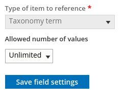
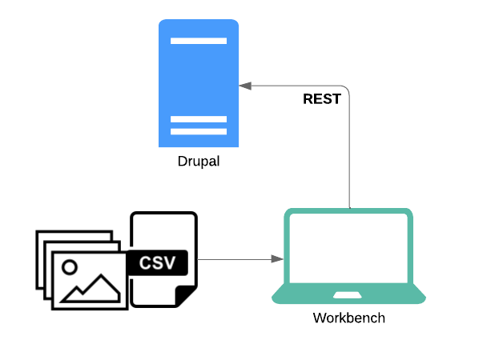

This page highlights the most important Drupal and Islandora features relevant to the use of Workbench. Its audience is managers of Islandora repositories who want a primer on how Drupal, Islandora, and Workbench relate to each other. The Workbench-specific ideas introduced here are documented in detail elsewhere on this site.

This page is not intended to be a replacement for the [official Islandora documentation](https://islandora.github.io/documentation/), which provides comprehensive and detailed information about how Islandora is structured, and about how to install, configure, and use it.

!!! question "Help improve this page!"
    Your feedback on the usefulness of this page is very important! Join the `#islandoraworkbench` channel in the [Islandora Slack](https://islandora.slack.com/join/shared_invite/zt-1ac9k1xs5-Hbeit2twqexyJCxZQg9ZBQ#/shared-invite/email), or leave a comment on [this Github issue](https://github.com/mjordan/islandora_workbench/issues/532).

## Why would I want to use Islandora Workbench?

Islandora Workbench lets you manage content in an Islandora repository at scale. Islandora provides web forms for creating and editing content on an item-by-item basis, but if you want to load a large number of items into an Islandora repository (or update or delete content in large numbers), you need a batch-oriented tool like Workbench. Simply put, Islandora Workbench enables you to get batches of content into an Islandora repository, and also update or delete content in large batches.

## How do I use Islandora Workbench?

Islandora Workbench provides the ability to perform a set of "[tasks](/islandora_workbench_docs/choosing_a_task/)". The focus of this page is the `create` task, but other tasks Workbench enables include `update`, `delete`, and `add_media`.

To use Islandora Workbench to create new content, you need to assemble a CSV file containing metadata describing your content, and arrange the accompanying image, video, PDF, and other files in specific ways so that Workbench knows where to find them.  Here is a very simple sample Workbench CSV file:

```text
file,id,title,field_model,field_description,date_generated,quality control by
IMG_1410.tif,01,Small boats in Havana Harbour,Image,Taken on vacation in Cuba.,2021-02-12,MJ
IMG_2549.jp2,02,Manhatten Island,Image,"Taken from the ferry from downtown New York to Highlands, NJ.",2021-02-12,MJ
IMG_2940.JPG,03,Looking across Burrard Inlet,Image,View from Deep Cove to Burnaby Mountain.,2021-02-18,SP
IMG_2958.JPG,04,Amsterdam waterfront,Image,Amsterdam waterfront on an overcast day.,2021-02-12,MJ
IMG_5083.JPG,05,Alcatraz Island,Image,"Taken from Fisherman's Wharf, San Francisco.",2021-02-18,SP
```

Then, you need to create a configuration file to tell Workbench the URL of your Islandora, which Drupal account credentials to use, and the location of your CSV file. You can customize many other aspects of Islandora Workbench by including various settings in your configuration file. Here is a very simple configuration file:

```yaml
task: create
host: http://localhost:8000
username: admin
password: islandora
input_csv: input.csv
content_type: islandora_object
```

!!! success inline end "Relevance to using Workbench"
    It is *very* important to run `--check` before you commit to having Workbench add content to your Drupal. Doing so lets Workbench find issues with your configuration and input CSV and files. See the "[Checking configuration and input data](/islandora_workbench_docs/check/)" documentation for a complete list of the things `--check` looks for.

When you have all these things ready, you tell Workbench to "check" your input data and configuration:

`./workbench --config test.yml --check`

Workbench will provide a summary of what passed the check and what needs to be fixed. When your checks are complete, you use Workbench to push your content into your Islandora repository:

`./workbench --config test.yml`

You can use a raw CSV file, a [Google Sheet](https://mjordan.github.io/islandora_workbench_docs/preparing_data/#using-a-google-sheet-as-the-input-csv-file), or an [Excel file](https://mjordan.github.io/islandora_workbench_docs/preparing_data/#using-an-excel-file-as-the-input-csv-file) as input, and your image, PDF, video, and other files can be stored [locally](https://mjordan.github.io/islandora_workbench_docs/preparing_data/#using-an-input-directory), or at [URLs](https://mjordan.github.io/islandora_workbench_docs/preparing_data/#using-urls-as-file-paths) on the web.

## Content types, fields, and nodes

Below are the Drupal and Islandora concepts that will help you use Workbench effectively.

### Content types

!!! success inline end "Relevance to using Workbench"
    Generally speaking, Islandora Workbench can only work with a single content type at a time. You define this content type in the `content_type` configuration setting.

Drupal categorizes what people see as "pages" on a Drupal website into content types. By default, Drupal provides "Article" and "Basic Page" content types, but site administrators can create custom content types. You can see the content types configured on your Drupal by logging in as an admin user and visiting `/admin/structure/types`. Or, you can navigate to the list of your site's content types by clicking on the Structure menu item, then the Content Types entry:


Islandora, by default, creates a content type called a "Repository Item". But, many Islandora sites use additional content types, such as "Collection". To find the machine name of the content type you want to use with Workbench, visit the content type's configuration page. The machine name will be the last segment of the URL. In the following example, it's `islandora_object`:


### Fields

!!! success inline end "Relevance to using Workbench"
    The columns in your CSV file correspond to fields in your Islandora content type.

The main structural difference between content types in Drupal is that each content type is configured to use a unique set of fields. A field in Drupal the same as a "field" in metadata - it is a container for an individual piece of data. For example, all content types have a "title" field (although it might be labeled differently) to hold the page's title. Islandora's default content type, the Repository Item, uses metadata-oriented fields like "Copyright date", "Extent", "Resource type", and "Subject".

Fields have two properties which you need to be familiar with in order to use Islandora Workbench:

1. machine name
1. type

To help explain how these two properties work, we will use the following screenshot showing a few of the default fields in the "Repository item" content type:


!!! success inline end "Relevance to using Workbench"
    In [most cases](/islandora_workbench_docs/fields/#using-field-labels-as-csv-column-headers) you can use a fields' human-readable labels as column headers in your CSV file, but within Islandora Workbench configuration files, you must use field machine names.

A field has a human-readable label, such as "Copyright date", but that label can change or can be translated, and, more significantly, doesn't need to be unique within a Drupal website. Drupal assigns each field a machine name that is more reliable for software to use than human-readable labels. These field machine names are all lower case, use underscores instead of spaces, and are guaranteed by Drupal to be unique within a content type. In the screenshot above, you can see the machine names in the middle column (you might need to zoom in!). For example, the machine name for the "Copyright date" field is `field_copyright_date`.

A field's "type" determines the structure of the data it can hold. Some common field types used in Islandora are "Text" (and its derivatives "Text (plain)" and "Text (plain, long)"), "Entity Reference", "Typed Relation", "EDTF", and "Link". These field types are explained in the "[Field Data (CSV and Drupal)](/islandora_workbench_docs/fields/)" documentation, but the important point here is that they are all represented differently in your Workbench CSV. For example:

* EDTF fields take dates in the Library of Congress' [Extended Date/Time Format](https://www.loc.gov/standards/datetime/) (an example CSV entry is `1964/2008`)
* Entity reference fields are used for taxonomy terms (an example entry is `cats:Tabby`, where "cats" is the name of the taxonomy and "Tabby" is the term)
* Typed relation fields are used for taxonomy entries that contain additional data indicating what "type" they are, such as using MARC relators to indicate the relationship of the taxonomy term to the item being described. An example typed relation CSV value is `relators:aut:Jordan, Mark`, where "relators:aut" indicates the term "Jordan, Mark" uses the MARC relator "aut", which stands for "author".
* Link fields take two pieces of information, a URL and the link text, like `http://acme.com%%Acme Products Inc.`


!!! success inline end "Relevance to using Workbench"
    Drupal fields can be configured to have multiple values.

Another important aspect of Drupal fields is their cardinality, or in other words, how many individual values they are configured to have. This is similar to the "repeatability" of fields in metadata schemas. Some fields are configured to hold only a single value, others to hold a a maximum number of values (three, for example), and others can hold an unlimited number of values. You can find each field's cardinality in its "Field settings" tab. Here is an example showing a field with unlimited cardinality:



Drupal enforces cardinality very strictly. For this reason, if your CSV file contains more values for a field than the field's configuration allows, Workbench will truncate the number of values to match the maximum number allowed for the field. If it does this, it will leave an entry in its log so you know that it didn't add all the values in your CSV data.

See the Islandora documentation for [additional information](https://islandora.github.io/documentation/user-documentation/metadata/#fields) about Drupal fields.

### Nodes

!!! success inline end "Relevance to using Workbench"
    In Islandora, a node is a metadata description - a grouping of data, contained in fields, that describe an item. Each row in your input CSV contains the field data that is used to create a node.

Think of a "node" as a specific page in a Drupal website. Every node has a content type (e.g. "Article" or "Repository Item") containing content in the fields defined by its content type. It has a URL in the Drupal website, like `https://mysite.org/node/3798`. The "3798" at the end of the URL is the node ID (also known as the "nid") and uniquely identifies the node within its website. In Islandora, a node is less like a "web page" and more like a "catalogue record" since Islandora-specific content types generally contain a lot of metadata-oriented fields rather than long discursive text like a blog would have. In `create` tasks, each row in your input CSV will create a single node.

Islandora Workbench uses the node ID column in your CSV  for some operations, for example updating nodes or adding media to nodes.

Content in Islandora can be hierarchical. For example, collections contain items, newspapers contain issues which in turn contain pages, and compound items can contain a top-level "parent" node and many "child" nodes. Islandora defines a specific field, `field_member_of` (or in English, "Member Of") that contains the node ID of another node's parent. If this field is empty in a node, it has no parent; if this field contains a value, the node with that node ID is the first node's parent. Islandora Workbench provides [several ways](https://mjordan.github.io/islandora_workbench_docs/paged_and_compound/) for you to create hierarchical content.

If you want to learn more about how Drupal nodes work, consult the [Islandora documentation](https://islandora.github.io/documentation/concepts/node-concepts/).

## Taxonomies

!!! success inline end "Relevance to using Workbench"
    Drupal's taxonomy system lets you create local authority lists for names, subjects, genre terms, and other types of data.

One of Drupal's most powerful features is its support for structured taxonomies (sometimes referred to as "vocabularies"). These can be used to maintain local authority lists of personal and corporate names, subjects, and other concepts, just like in other library/archives/museum tools.

Islandora Workbench lets you create taxonomy terms in advance of the nodes they are attached to, or at the same time as the nodes. Also, within your CSV file, you can use term IDs, term URIs, or term names. You can use term names both when you are creating new terms on the fly, or if you are assigning existing terms to newly created nodes.

Drupal assigns each term an ID, much like it assigns each node an ID. These are called "term IDs" (or "tids"). Like node IDs, they are unique within a single Drupal instance but they are not unique across Drupal instances.

Islandora uses several specific taxonomies extensively as part of its data model. These include Islandora Models (which determines how derivatives are generated for example) and Islandora Media Use (which indicates if a file is an "Original file" or a "Service file", for example).

The taxonomies created by Islandora, such as Islandora Models and Islandora Media Use, include Linked Data URIs in the taxonomy term entries. These URIs are useful because they uniquely and reliably identify taxonomy terms across Drupal instances. For example, the taxonomy term with the Linked Data URI `http://pcdm.org/use#OriginalFile` is the same in two Drupal instances even if the term ID for the term is 589 in one instance and 23 in the other, or if the name of the term is in different languages. If you create your own taxonomies, you can also assign earch term a Linked Data URI.

## Media

!!! success inline end "Relevance to using Workbench"
    By default, the file you upload using Islandora Workbench will be assigned the "Original file" media use term. Islandora will then automatically generate derivatives, such as thumbnails and extracted text where applicable, from that file and create additional media.

    However, you can use Workbench to upload additional files or pregenerated derivatives by assigning them other media use terms.

Media in Islandora are the image, video, audio, PDF, and other content files that are attached to nodes. Together, a node and its attached media make up a resource or item.

Media have types. Standard media types defined by Islandora are:

* Audio
* Document
* Extracted text
* FITS Technical Metadata
* File
* Image
* Remote video
* Video

In general when using Workbench you don't need to worry about assigning a type to a file. Workbench infers a media's type from the file extensions, but you can override this if necessary.

Media are also assigned terms from the Islandora Media Use vocabulary. These terms, combined with the media type, determine how the files are displayed to end users and how and what types of derivatives Islandora generates. They can also be useful in exporting content from Islandora and in digital preservation workflows (for example). A selection of terms from this vocabulary is:

* Original file
* Intermediate file
* Preservation Master File
* Service file
* Thumbnail image
* Transcript
* Extracted text

This is an example of a video media showing how the media use terms are applied:


The Islandora documentation provides additional information on [media](https://islandora.github.io/documentation/concepts/node-media/).


## Views

!!! success inline end "Relevance to using Workbench"
    You usually don't need to know anything about Views when using Islandora Workbench, but you can use Workbench to [export CSV data](/islandora_workbench_docs/generating_csv_files/#using-a-drupal-view-to-identify-content-to-export-as-csv) from Drupal via a View.

Views are another powerful Drupal feature that Islandora uses extensively. A View is a Drupal configuration that generates a list of things managed by Drupal, most commonly nodes. As a Workbench user, you will probably only use a View if you want to export data from Islandora via a `get_data_from_view` Workbench task.

Behind the scenes, Workbench depends on a Drupal module called Islandora Workbench Integration that creates a number of custom Views that Workbench uses to interact with Drupal. So even though you might only use Views directly when exporting CSV data from Islandora, behind the scenes Workbench is getting information from Drupal constantly using a set of custom Views.


## REST

!!! success inline end "Relevance to using Workbench"
     As a Workbench user, you don't need to know anything about REST, but if you encounter a problem using Workbench and reach out for help, you might be asked to provide your log file, which will likely contain some raw REST data.

REST is the protocol that Workbench uses to interact with Drupal. Fear not: as a user of Workbench, you don't need to know anything about REST - it's Workbench's job to shield you from REST's complexity.



However, if things go wrong, Workbench will include in its log file some details about the particular REST request that didn't work (such as HTTP response codes and raw JSON). If you [reach out for help](/islandora_workbench_docs/troubleshooting/), you might be asked to provide your Workbench log file to aid in troubleshooting. It's normal to see the raw data used in REST communication between Workbench and Drupal in the log.
