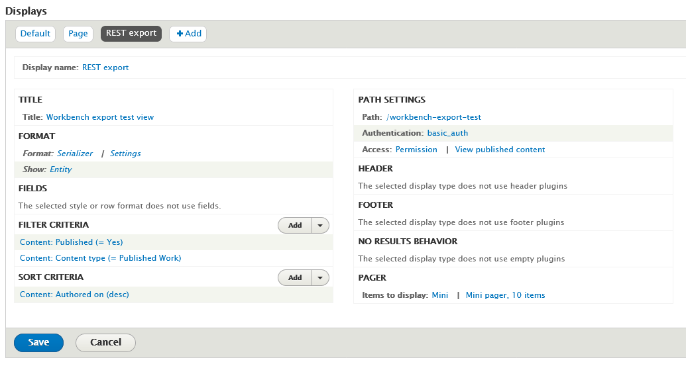
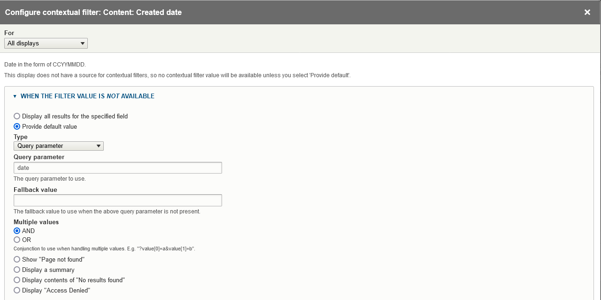

!!! note
    `export_csv` and `get_data_from_view` tasks can optionally also export the children (members) of the nodes they start from, such as book or newspaper issue pages or the children of compound items. See "[Exporting nodes together with their members](#exporting-nodes-together-with-their-members)" below. Other task types cannot export members.

## Exporting a CSV file containing field data from a list of node IDs

The `export_csv` task generates a CSV file that contains one row for each node identified in the input CSV file. The cells of the CSV are populated with data that is consistent with the structures that Workbench uses in `update` tasks. Using this CSV file, you can:

* see in one place all of the field values for nodes, which might be useful during quality assurance after a `create` task
* modify the data and use it as input for an `update` task using the `update_mode: replace` configuration option.

The CSV file contains two of the extra rows included in the CSV file template, described above (specifically, the human-readable field label and number of values allowed), and the left-most "REMOVE THIS COLUMN (KEEP THIS ROW)" column. To use the file as input for an `update` task, simply delete the extraneous column and rows.

A sample configuration file for an `export_csv` task is:

```yaml
task: export_csv
host: "http://localhost:8000"
username: admin
password: islandora
input_csv: nodes_to_export.csv
export_csv_term_mode: name
content_type: my_custom_content_type
# If export_csv_field_list is not present, all fields will be exported.
export_csv_field_list: ['title', 'field_description']
# Specifying the output path is optional; see below for more information.
export_csv_file_path: output.csv
```

The file identified by `input_file` has only one column, "node_id":

```text
node_id
7653
7732
7653
```

Some things to note:

* The output includes data from nodes only, not media.
* Unless a file path is specified in the `export_csv_file_path` configuration option, the output CSV file name is the name of the input CSV file (containing node IDs) with ".csv_file_with_field_values" appended. For example, if you `export_csv` configuration file defines the `input_csv` as "my_export_nodes.csv", the CSV file created by the task will be named "my_export_nodes.csv.csv_file_with_field_values". The file is saved in the directory identified by the `input_dir` configuration option.
* You can include either vocabulary term IDs or term names (with accompanying vocabulary namespaces) in the CSV. By default, term IDs are included; to include term names instead, include `export_csv_term_mode: name` in you configuration file.
* A single `export_csv` job can only export nodes that have the content type identified in your Workbench configuration. By default, this is "islandora_object". If you include node IDs in your input file for nodes that have a different content type, Workbench will skip exporting their data and log the fact that it has done so.
* If you don't want to export all the fields on a content type, you can list the fields you want to export in the `export_csv_field_list` configuration option.

!!! warning
    Using the `export_csv_term_mode: name` option will slow down the export, since Workbench must query Drupal to get the name of each term. The more taxonomy or typed relation fields in your content type, the slower the export will be with `export_csv_term_mode` set to "name".

## Using a Drupal View to identify content to export as CSV

You can use a new or existing View to tell Workbench what nodes to export into CSV. This is done using a `get_data_from_view` task. A sample configuration file looks like this:

```yaml
task: get_data_from_view
host: "http://localhost:8000/"
view_path: '/daily_nodes_created_test'
username: admin
password: islandora
content_type: pubished_work
export_csv_file_path: /tmp/islandora_export.csv
# If export_csv_field_list is not present, all fields will be exported.
# node_id and title are always included.
export_csv_field_list: ['field_description', 'field_extent']
# 'view_paramters' is optinal, and used only if your View uses Contextual Filters.
# In this setting you identify any URL parameters configured as Contextual Filters
# for the View. Note that values in the 'view_parameters' configuration setting
# are literal parameter=value strings that include the =, not YAML key: value
# pairs used elsewhere in the Workbench configuration file.
view_parameters:
 - 'date=20231202'
```

The `view_path` setting should contain the value of the "Path" option in the Views configuration page's "Path settings" section. The `export_csv_file_path` is the location where you want your CSV file saved.

In the View configuration page:

1. Add a "REST export" display.
1. Under "Format" > "Serializer" > "Settings", choose "json".
1. In the View "Fields" settings, leave "The selected style or row format does not use fields" as is (see explanation below).
1. Under "Path", add a path where your REST export will be accessible to Workbench. As noted above, this value is also what you should use in the `view_path` setting in your Workbench configuration file.
1. Under "Pager" > "Items to display", choose "Paged output, mini pager". In "Pager options" choose 10 items to display.
1. Under "Path settings" > "Access", choose "Permission" and "View published content". Under "Authentication", choose "basic_auth" and "cookie".

Here is a screenshot illustrating these settings:



To test your REST export, in your browser, join your Drupal hostname and the "Path" defined in your View configuration. Using the values in the configuration file above, that would be `http://localhost:8000/workbench-export-test`. You should see raw JSON (or formatted JSON if your browser renders JSON to be human readable) that lists the nodes in your View.

!!! warning
    If your View includes nodes that you do not want to be seen by anonymous users, or if it contains unpublished nodes, adjust the access permissions settings appropriately, and ensure that the user identified in your Workbench configuration file has sufficient permissions.

You can optionally configure your View to use a single Contextual Filters, and expose that Contextual Filter to use one or more query parameters. This way, you can include each query parameter's name and its value in your configuration file using Workbench's `view_parameters` config setting, as illustrated in the sample configuration file above. The configuration in the View's Contextual Filters for this type of parameter looks like this:



By adding a Contextual Filter to your View display, you can control what nodes end up in the output CSV by including the value you want to filter on in your Workbench configuration's `view_parameters` setting. In the screenshot of the "Created date" Contextual Filter shown here, the query parameter is `date`, so you include that parameter in your `view_parameters` list in your configuration file along with the value you want to assign to the parameter (separated by an `=` sign), e.g.:

```
view_parameters:
 - 'date=20231202'
```

will set the value of the `date` query parameter in the "Created date" Contextual Filter to "20231202".

Some things to note:

* Note that the values you include in `view_parameters` apply only to your View's Contextual Filter. Any "Filter Criteria" you include in the main part of your View configuration also take effect. In other words, both "Filter Criteria" and "Contextual Filters" determine what nodes end up in your output CSV file.
* You can only include a single Contextual Filter in your View, but it can have multiple query parameters.
* REST export Views displays don't use fields in the same way that other Views displays do. In fact, Drupal says within the Views user interface that for REST export displays, "The selected style or row format does not use fields." Instead, these displays export the entire node in JSON format. Workbench iterates through all fields on the node JSON that start with `field_` and includes those fields, plus `node_id` and `title`, in the output CSV.
* If you don't want to export all the fields on a content type, you can list the fields you want to export in the `export_csv_field_list` configuration option.
* Only content from nodes that have the content type identified in the `content_type` configuration setting will be written to the CSV file.
* If you want to export term names instead of term IDs, include `export_csv_term_mode: name` in your configuration file. The warning about this option slowing down the export applies to this task and the `export_csv` task.

## Exporting nodes together with their members

By default, `export_csv` and `get_data_from_view` tasks export only the nodes you identify (in your input CSV or in your View). If those nodes have members (children), such as the pages of a book or the children of a compound object, you can tell Workbench to also find and export those members, and the members of those members, to any depth. Members are nodes that have the starting node's ID in their `field_member_of` field.

To turn this on, add the setting that corresponds to your task to your configuration file:

| Task | Setting to enable | Optional depth limit |
| --- | --- | --- |
| `export_csv` | `export_csv_include_members: true` | `csv_member_max_depth` |
| `get_data_from_view` | `get_data_from_view_include_members: true` | `view_member_max_depth` |

A sample `export_csv` configuration file:

```yaml
task: export_csv
host: "http://localhost:8000"
username: admin
password: islandora
input_csv: nodes_to_export.csv
content_type: islandora_object
export_csv_file_path: output.csv
# Also export the members of each node in nodes_to_export.csv.
export_csv_include_members: true
# Optional. If not present, Workbench follows members to any depth.
csv_member_max_depth: 3
```

A sample `get_data_from_view` configuration file:

```yaml
task: get_data_from_view
host: "http://localhost:8000/"
view_path: '/daily_nodes_created_test'
username: admin
password: islandora
content_type: islandora_object
export_csv_file_path: /tmp/islandora_export.csv
get_data_from_view_include_members: true
view_member_max_depth: 3
```

Some things to note:

* The nodes you identify in your input CSV file or View are the *starting nodes*. Workbench exports each starting node and then all of its members, as rows in the same output CSV file.
* A node is only exported once. If a node is reachable from more than one starting node, or through a loop in the hierarchy, Workbench logs a warning that the node has already been processed and skips the duplicate.
* The `content_type` setting still applies to every node, including members. Members whose content type is different from the one named in `content_type` are skipped (and logged), exactly as non-matching nodes are in tasks that don't include members. If your hierarchy contains more than one content type, run the task once for each content type.
* The `csv_member_max_depth` and `view_member_max_depth` settings are optional and must be whole numbers. They limit how many levels of containers below the starting node Workbench descends into. If you omit them, there is no limit. See "[Limiting how deep Workbench goes](#limiting-how-deep-workbench-goes)" below.
* To also export the media files of the nodes (including their members), add the settings described in "[Exporting image, video, etc. files along with CSV data](/islandora_workbench_docs/exporting_media/)". Because exporting members can produce many more rows and files than you expect, run a small test first.
* Workbench finds members using a View provided by version 1.3.0 or higher of the [Islandora Workbench Integration](https://github.com/mjordan/islandora_workbench_integration) module. Earlier versions do not include this View. By default Workbench expects it at `/islandora_workbench_integration/members-of-node`; if your site uses a different path, set `members_of_node_view_endpoint` in your configuration file. If the View is not available, `--check` will report the problem and exit before any export is attempted.
* `get_media_report_from_view` tasks do not support exporting members.
* The "members of node" View returns only members whose content type is "Repository Item" (`islandora_object`). If your members use a different content type, edit the View's "Content type" filter. If you can't yet upgrade the Integration module to version 1.3.0, you can create the View yourself; see "[Creating the \"Members of node\" View manually](#creating-the-members-of-node-view-manually)" below.

### Limiting how deep Workbench goes

Islandora content is often arranged in several levels of containers. For example, a Collection can contain sub-collections or Objects (compound or not), an Object or Serial can contain Serial Issues, and an Issue or compound Object can contain its Images or Pages. The depth settings control how many of these levels below the starting node Workbench follows:

| Depth value | Nodes exported, starting from a Collection |
| --- | --- |
| `0` | The Collection only. |
| `1` | The Collection and the nodes directly in it (its sub-collections and Objects). |
| `2` | The above, plus the members of those nodes (for example, Serial Issues or the children of compound Objects). |
| `3` | The above, plus the members of those nodes (for example, the Images or Pages of each Issue). |
| Not set | Every level, however deep. |

Depth is counted from each starting node, not from the top of your repository. If your input CSV or View starts at Serial Issues instead of the Collection, a depth of `1` reaches the pages directly in each Issue.

Setting a depth is a good way to test an export on a large hierarchy before running it without a limit.

### Creating the "Members of node" View manually

If you want to export members before version 1.3.0 of the Integration module is available to you, you can create the "Members of node" View yourself. This is a temporary workaround; once you can upgrade the Integration module, upgrade it and delete your hand-built View first (the module's View uses the same machine name, `members_of_node`, and installing it over an existing View of that name may fail).

Your site needs the Views, Views UI, RESTful Web Services, Serialization, and HTTP Basic Authentication modules enabled. If you already use `get_data_from_view` tasks, you have them.

1. In Drupal, go to "Structure" > "Views" > "Add view".
1. Name the View "Members of node" (the machine name will be `members_of_node`). Under "View settings", choose "Show: Content of type: Repository Item", "sorted by: Unsorted". Uncheck "Create a page", check "Provide a REST export", and enter `islandora_workbench_integration/members-of-node` as the REST export path. Set "Items to display" to 50, and click "Save and edit".
1. In the REST export display's "Path settings", change the path to `islandora_workbench_integration/members-of-node/%`. The `%` is where Workbench inserts the ID of the node whose members it wants.
1. Under "Format", choose "Serializer" and, in its "Settings", check only "json". Under "Show", choose "Fields".
1. Under "Fields", remove any fields the wizard added and add exactly two: "Content: ID" and "Content: Weight". The JSON that the View returns must contain the keys `nid` and `field_weight_value`. In the "Show" > "Settings" dialog, set the alias of the ID field to `nid` and of the weight field to `field_weight_value` if those aren't already the keys.
1. Under "Filter criteria", keep "Content: Content type (= Repository Item)" and remove "Content: Published (= Yes)" if the wizard added it. Under "Sort criteria", sort by "Content: Weight" ascending, then "Content: ID" ascending, removing any other sorts.
1. Under "Contextual filters", add "Content: Member of" and leave its defaults as they are. This is what turns the `%` in the path into "members of this node".
1. Under "Pager", choose "Full" with 50 items. A larger page size means Workbench makes fewer requests when a node has many members. Under "Path settings", set "Authentication" to `basic_auth` and `cookie`. Set "Access" to the "Multiple permissions" type (provided by the Integration module), and check both the "Use Islandora Workbench" and "Administer content" permissions. If your version of the Integration module doesn't offer that access type, choose "Permission" with only "Administer content" instead. The user in your Workbench configuration file must have the permissions you choose.
1. Save the View.

To test it, log in to Drupal in your browser and visit `/islandora_workbench_integration/members-of-node/<node ID>` for a node that has members. You should see a JSON list with one entry per member, each containing `nid` and `field_weight_value` (both as strings), sorted by weight:

```json
[{"nid":"786444","field_weight_value":"1"},{"nid":"786448","field_weight_value":"2"},{"nid":"786450","field_weight_value":"3"}]
```

For a node with no members you should see an empty list. The View returns at most 50 members per page; if a node has more, add `?page=1`, `?page=2`, and so on to the URL to see the rest. Workbench requests the additional pages itself, so you don't need to raise the number of items per page. Then run Workbench with `--check`; it reports whether it can reach the View.

!!! note
    The View in the Integration module only returns nodes whose content type is "Repository Item" (`islandora_object`). If your members use a different content type, change the "Content type" filter in the View to match.
