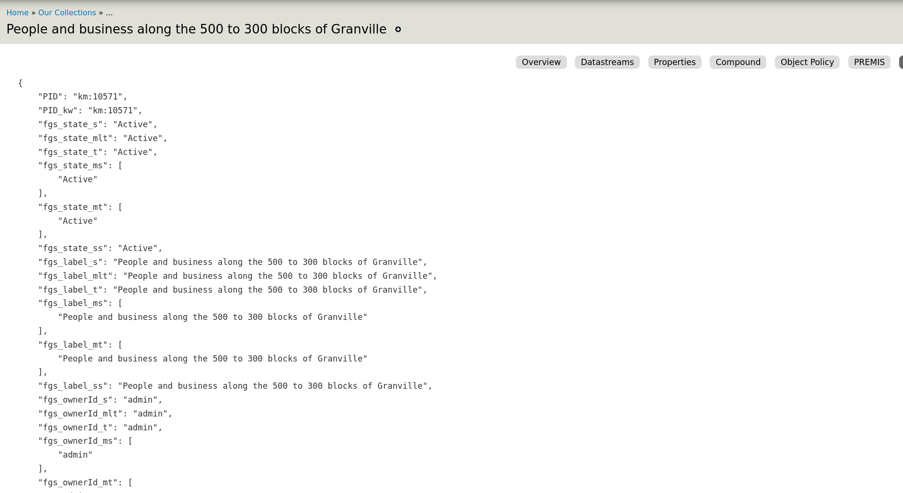

## Overview

Islandora Workbench's main purpose is to load batches of content into an Islandora 2 repository. However, loading
content can also be the last step in migrating from Islandora 7 to Islandora 2. As noted in
the "[Workflows](/islandora_workbench_docs/workflows/#migrations)" documentation, Workbench can be used in the "load"
phase of a typical [extract, transform, load](https://en.wikipedia.org/wiki/Extract,_transform,_load) (ETL) process.

Workbench comes with a standalone script, `get_islandora_7_content.py`, that can be used to extract (a.k.a. "export")
metadata and OBJ datastreams from an Islandora 7 instance. This data can form the basis for Workbench input data.

To run the script, change into the Workbench "i7Import" directory and run:

`python3 get_islandora_7_content.py --config <my_config>`

The script uses a number of configuration variables, all of which come with sensible defaults. Any of the following
parameters can be changed in the user-supplied config file.
<table>
    <thead>
    <tr>
        <th>Parameter</th>
        <th>Default Value</th>
        <th>Description</th>
    </tr>
    </thead>
    <tr>
        <td>solr_base_url</td>
        <td>http://localhost:8080/solr</td>
        <td>URL of your source Islandora 7.x Solr instance.</td>
    </tr>
    <tr>
        <td>islandora_base_url</td>
        <td>http://localhost:8000</td>
        <td>URL of your source Islandora instance.</td>
    </tr>
    <tr>
        <td>csv_output_path</td>
        <td>islandora7_metadata.csv</td>
        <td>Path to the CSV file containing values from Solr.</td>
    </tr>
    <tr>
        <td>obj_directory</td>
        <td>/tmp/objs</td>
        <td>Path to the directory where datastream files will be saved.</td>
    </tr>
    <tr>
        <td>log_file_path</td>
        <td>islandora_content.log</td>
        <td>Path to the log file.</td>
    </tr>
    <tr>
        <td>fetch_files</td>
        <td>true</td>
        <td>Whether or not to fetch and save the datastream files from the source Islandora 7.x instance.</td>
    </tr>
    <tr>
        <td>get_file_uri</td>
        <td>false</td>
        <td>Whether or not to write datastream file URLs to the CSV file instead of fetching the files. One of `get_file_uri` or `fetch_files` can be set  to `true`, but not both.</td>
    </tr>
    <tr>
        <td>field_pattern</td>
        <td>mods_.*(_s|_ms)$</td>
        <td>A regular expression pattern to matching Solr fields to include in the CSV. </td>
    </tr>
    <tr>
        <td>field_pattern_do_not_want</td>
        <td>(marcrelator|isSequenceNumberOf)</td>
        <td>A regular expression pattern to matching Solr fields to not include in the CSV. </td>
    </tr>
    <tr>
        <td>standard_fields</td>
        <td>['PID', 'RELS_EXT_hasModel_uri_s', 'RELS_EXT_isMemberOfCollection_uri_ms',
            'RELS_EXT_isMemberOf_uri_ms', 'RELS_EXT_isConstituentOf_uri_ms',
            'RELS_EXT_isPageOf_uri_ms']
        </td>
        <td>List of fields to Solr fields to include in the CSV not matched by the regular expression in `field_pattern`.</td>
    </tr>
    <tr>
        <td>id_field</td>
        <td>PID</td>
        <td>The Solr field that uniquely identifies each object in the source Islandora 7.x instance.</td>
    </tr>
    <tr>
        <td>id_start_number</td>
        <td>1</td>
        <td>The number to use as the first Workbench ID within the CSV file.</td>
    </tr>
    <tr>
        <td>datastreams</td>
        <td>['OBJ', 'PDF']</td>
        <td>List of datastream IDs to fetch from the source Islandora 7.x instance.</td>
    </tr>
    <tr>
        <td>namespace</td>
        <td>*</td>
        <td>The namespace of objects you want to export from the source Islandora 7.x instance.</td>
    </tr>
    <tr>
        <td>collection</td>
        <td></td>
        <td>PID of a single collection limiting the objects to fetch from the source Islandora 7.x instance. Only matches objects that have the specified collection as their immediate parent. For recursive collection membership, add `tors_ms` as a `solr_filter`, as documented below. Note: the colon in the collection PID must be escaped with a backslash (`\`), e.g., `cartoons\:collection`.</td>
    </tr>
    <tr>
        <td>content_model</td>
        <td></td>
        <td>PID of a single content model limiting the objects to fetch from the source Islandora 7.x instance. Note: the colon in the content model PID must be escaped with a backslash (`\`), e.g., `islandora\:sp_large_image_cmodel`.</td>
    </tr>
    <tr>
        <td>solr_filters</td>
        <td></td>
        <td>key:value pairs to add as filters to the Solr query. See examples below.</td>
    </tr>
    <tr>
        <td>debug</td>
        <td>False</td>
        <td>Print debug information to the console.</td>
    </tr>
    <tr>
        <td>deep_debug</td>
        <td>False</td>
        <td>Print additional debug information to the console.</td>
    </tr>
</table>

## Analyzing your Islandora 7 Solr index

In order to use the configuration options outlined above, you will need to know what fields are in your Islandora 7 Solr index. Not all Islandoras are indexed in the same way, and since most Solr field names are derived from MODS or other XML datastream element names, the specific Solr fieldnames are difficult to predict.

### Using the Islandora Metadata Extras module

The [Islandora Metadata Extras module](https://github.com/bondjimbond/islandora_metadata_extras) provides a "Solr Metadata" tab in each object's Manage menu that shows the raw Solr document for the object. The Solr field names and the values for the current object are easy to identify. Here are two screenshots showing the top section of the output and a sample from the middle of the output:

Top:



Middle:


### Fetching a sample Solr document

If you can't or don't want to install the Islandora Metadata Extras module, you can query Solr directly to get sample document.

[Coming soon]

## Configuring which Solr fields to include in the CSV

As we can see from the examples above, Islandora 7's Solr schema contains a lot of fields, mirroring the richness of MODS (or other XML-based metadata) and the
Fedora 3.x RELS-EXT properties. By default, this script fetches all the fields in the Islandora 7's Solr's index, which will invariably be many, many more fields that you will normally want in the output CSV. You will need to tell the script which fields to exclude and which to include.

The script takes the following approach to providing control over what fields end up in the CSV data it generates:

1. It fetches a list of all fieldnames used in the Solr index.
1. It then matches each fieldname against the regular expression pattern defined in the script's `field_pattern`
   variable, and if the match is successful, includes the fieldname in the CSV. For
   example, `field_pattern = 'mods_.*(_s|_ms)$'` will match every Solr field that starts with "mods_" and ends with
   either "_s" or "_ms".
1. Next, it matches each remaining fieldname against the regular expression patterns defined in the
   script's `field_pattern_do_not_want` variable, and if the match is successful, *removes* the fieldname from the CSV.
   For example, `field_pattern_do_not_want = '(marcrelator|isSequenceNumberOf)'` will remove all fieldnames that contain
   either the string "marcrelator" or "isSequenceNumberOf". Note that the regular expression used in this configuration
   variable is not a negative pattern; in other words, if a fieldname matches this pattern, it is excluded from the
   field list.
1. Finally, it adds to the start of the remaining list of fieldnames every Solr fieldname defined in
   the `standard_fields` configuration variable. This configuration variable provides a mechanism to ensure than any
   fields that are not included in step 2 are present in the generated CSV file.

!!! warning
    You will always want at least the Solr fields "PID", "RELS_EXT_isMemberOfCollection_uri_ms",
    "RELS_EXT_hasModel_uri_s", "RELS_EXT_isMemberOfCollection_uri_ms", "RELS_EXT_isConstituentOf_uri_ms",
    and "RELS_EXT_isPageOf_uri_ms" in your `standard_fields` configuration variable since these fields
    contain information about objects' relationships to each other.

Even with a well-configured set of pattern variables, the column headers are ugly, and there are a lot of them. Here is
a sample from a minimal Islandora 7.x:

```text
file,PID,RELS_EXT_hasModel_uri_s,RELS_EXT_isMemberOfCollection_uri_ms,RELS_EXT_isConstituentOf_uri_ms,RELS_EXT_isPageOf_uri_ms,mods_recordInfo_recordOrigin_ms,mods_name_personal_author_ms,mods_abstract_s,mods_name_aut_role_roleTerm_code_s,mods_name_personal_author_s,mods_typeOfResource_s,mods_subject_geographic_ms,mods_identifier_local_ms,mods_genre_ms,mods_name_photographer_role_roleTerm_code_s,mods_physicalDescription_form_all_ms,mods_physicalDescription_extent_ms,mods_subject_topic_ms,mods_name_namePart_s,mods_physicalDescription_form_authority_marcform_ms,mods_name_pht_s,mods_identifier_uuid_ms,mods_language_languageTerm_code_s,mods_physicalDescription_form_s,mods_accessCondition_use_and_reproduction_s,mods_name_personal_role_roleTerm_text_s,mods_name__role_roleTerm_code_ms,mods_originInfo_encoding_w3cdtf_keyDate_yes_dateIssued_ms,mods_name_aut_s,mods_originInfo_encoding_iso8601_dateIssued_s,mods_originInfo_dateIssued_ms,mods_name_photographer_namePart_s,mods_name_pht_role_roleTerm_text_ms,mods_identifier_all_ms,mods_name_namePart_ms,mods_subject_geographic_s,mods_originInfo_publisher_ms,mods_subject_descendants_all_ms,mods_titleInfo_title_all_ms,mods_name_photographer_role_roleTerm_text_ms,mods_name_role_roleTerm_text_s,mods_titleInfo_title_ms,mods_name_photographer_s,mods_originInfo_place_placeTerm_text_s,mods_name_role_roleTerm_code_ms,mods_name_pht_role_roleTerm_code_s,mods_name_pht_namePart_s,mods_name_pht_namePart_ms,mods_name_role_roleTerm_code_s,mods_genre_all_ms,mods_physicalDescription_form_authority_marcform_s,mods_name_pht_role_roleTerm_code_ms,mods_extension_display_date_ms,mods_name_photographer_namePart_ms,mods_genre_authority_bgtchm_ms,mods_name_personal_role_roleTerm_text_ms,mods_name_pht_ms,mods_name_photographer_role_roleTerm_text_s,mods_language_languageTerm_code_ms,mods_originInfo_place_placeTerm_text_ms,mods_titleInfo_title_s,mods_identifier_uuid_s,mods_language_languageTerm_code_authority_iso639-2b_s,mods_genre_s,mods_name_aut_role_roleTerm_code_ms,mods_typeOfResource_ms,mods_originInfo_encoding_iso8601_dateIssued_ms,mods_name_personal_author_role_roleTerm_text_ms,mods_abstract_ms,mods_language_languageTerm_text_s,mods_genre_authority_bgtchm_s,mods_language_languageTerm_s,mods_language_languageTerm_ms,mods_subject_topic_s,mods_name_photographer_ms,mods_name_pht_role_roleTerm_text_s,mods_recordInfo_recordOrigin_s,mods_name_aut_ms,mods_originInfo_publisher_s,mods_identifier_local_s,mods_language_languageTerm_text_ms,mods_physicalDescription_extent_s,mods_language_languageTerm_code_authority_iso639-2b_ms,mods_name__role_roleTerm_code_s,mods_originInfo_encoding_w3cdtf_keyDate_yes_dateIssued_s,mods_name_photographer_role_roleTerm_code_ms,mods_name_role_roleTerm_text_ms,mods_name_personal_author_role_roleTerm_text_s,mods_accessCondition_use_and_reproduction_ms,mods_physicalDescription_form_ms,sequence
```

The script-generated solr request may not in most cases be useful or even workable. You may need to experiment with the `field_pattern` and `field_pattern_do_not_want` configuration settings to reduce the number of Solr fields.

## Adding filters to your Solr query to limit the objects fetched from the source Islandora

The `namespace`, `collection`, `content_model`, and `solr_filters` options documented above allow you to scope the set of objects exported from the source Islandora 7.x instance. The first three take simple, single values. The last option allows you to add arbitrary filters to the query sent to Solr in the form of key:value pairs, like this:

```text
solr_filters:
 - ancestors_ms: 'some\:collection'
 - fgs_state_s: 'Active'
```

!!! warning
    Colons within PIDs used in filters must be escaped with a backslash (`\`), e.g., `some\:collection`.


## Putting your Solr request in a file

You have the option of
providing their own solr query in a text file and  pointing to the file using the `--metadata_solr_request` option when running the script:

`python3 get_islandora_7_content.py --config <my_config> --metadata_solr_request <my_request.txt>`

The contents of the file must contain a full HTTP request to Solr, e.g.:

```text
http://localhost:8080/solr/select?q=PID:*&wt=csv&rows=1000000&fl=PID,RELS_EXT_hasModel_uri_s,RELS_EXT_isMemberOfCollection_uri_ms,RELS_EXT_isMemberOf_uri_ms,mods_originInfo_encoding_iso8601_dateIssued_mdt
```

The advantage of putting your Solr request in its own file is that you have complete control over the Solr query. Requests to Solr in this file should always include the "wt=csv" and "rows=1000000" parameters (the "rows" parameter should have a value that is greater than the number of objects in your repository, otherwise Solr won't return all objects).


## Using the CSV as input for Workbench

The CSV file generated by this script will almost certainly contain many more columns than you will want to ingest into
Islandora 2. You will probably want to delete columns you don't need, combine the contents of several columns into one,
and edit the contents of others.

As we can see from the example above, the column headings in the CSV are Solr fieldnames (`RELS_EXT_hasModel_uri_s`
, `mods_titleInfo_title_ms`, etc.). You will need to replace those column headers with the equivalent
fields [as defined in your Drupal 9 content type](/islandora_workbench_docs/fields/). In addition, the metadata stored
in Islandora 7's Solr index does not in many cases have the structure Workbench requires, so the data in the CSV file
will need to be edited before it can be used by Workbench to create nodes. The content of Islandora 7 Solr fields is
derived from MODS (or other) XML elements, and, with the exception of text-type fields, will not necessarily map cleanly
to Drupal fields' data types. In other words, to use the CSV data generated by `get_islandora_7_content.py`, you will
need to do some work to prepare it (or "transform" it, to use ETL language) to use it as input for Workbench.

However, the script adds three columns to the CSV file that do not use Solr fieldnames and whose contents you should
*not* edit but that you may need to rename: `file`, `PID`, and `sequence`:

```text
Do not edit name                                        Rename 'sequence' column (e.g.,
or contents of                                          to 'field_weight') but do not
'file' column.                                          edit its contents.
 |                                / Every other column           |
 |    / Rename 'PID' to the       | will need to be              |
 |    | value of your 'id_field'  | deleted, renamed,            |
 |    | setting but do not edit   | or its content               |
 |    | column contents.          | edited.                      |
 v    v                           v                              v
---------------------------------------------------------------------
file,PID,RELS_EXT_hasModel_uri_s,[...],mods_typeOfResource_s,sequence
```

First, the required Workbench column "file" is added to the beginning of each CSV row, and is populated with the
filename of the OBJ datastream. This filename is based on the object's PID, with the the `:` replaced with an
underscore, and has an extension determined by the OBJ datastream's MIME type.

Second, "PID" is the Islandora 7.x PID of each object in the CSV file. This column header can be changed to "id" or
whatever you have defined in your Workbench configuration file's `id_field` setting. Alternatively, you can set the
value of `id_field` to `PID` and not rename that CSV column.

Third, a "sequence" column is added at the end of each CSV row. This is where the `get_islandora_7_content.py` script
stores the sequence number of each child object/page in relation to its parent . If an Islandora 7.x object has a
property in its RELS-EXT datastream `islandora:sSequenceNumberOfxxx` (where "xxx" is the object's parent), the value of
that property is added to the "sequence" column at the end of each row in the CSV. For paged content, this value is
taken from the `islandora:isSequenceNumber` RELS-EXT property. These values are ready for use in the "field_weight"
Drupal field created by the Islandora Defaults module; you can simply rename the "sequence" column header to "
field_weight" when you use the CSV as input for Islandora Workbench. Note that you don't need to configure the script to
include fields that contain "isSequenceNumberOf" or "isSequenceNumber" in your CSV; in fact, because there are so many
of them in a typical Islandora 7 Solr index, you will want to *exclude* them using the `field_pattern_do_not_want`
configuration variable. Excluding them is safe, since the script fetches the sequence information separately from the
other CSV data.

A fourth column in your Workbench CSV, `field_member_of`, is not added automatically. It contains the PID of the parent object, whether it is a collection, the top level object (parent) in a compound object, book object that has pages, etc. If an Islandora object has a value that should be in the `field_member_of` column, it will be in one or more (usually just one) of the folowing columns in the CSV created by the `get_islandora_7_content.py` script:

* `RELS_EXT_isMemberOfCollection`
* `RELS_EXT_isPageOf`
* `RELS_EXT_isSequenceNumberOfXXX` (where XXX is the PID of the parent object)
* `RELS_EXT_isConstituentOf`

All of these columns will likely be present in your CSV, but it is possible that some may not be, for example if your Islandora 7 repository did not have a module enabled that uses one of those RELS-EXT properties.

!!! note
    In general, the CSV that you need to end up with to ingest content into Islandora 2 using Workbench needs to have a structure similar to that described in the "[With page/child-level metadata](https://mjordan.github.io/islandora_workbench_docs/paged_and_compound/#with-pagechild-level-metadata)" section of the Workbench documentation for "Creating paged, compound, and collection content." You should review the points in the "Some important things to note" section of that documentation.


