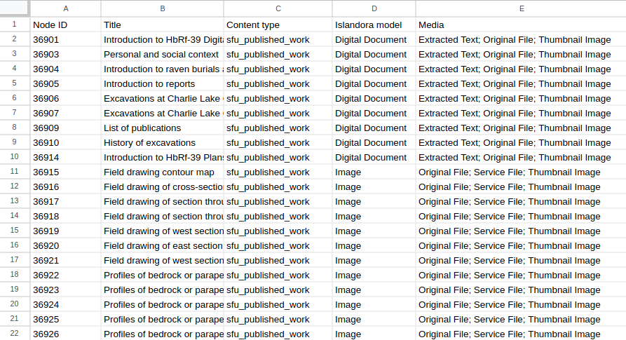

## Exporting image, video, etc. files along with CSV data

In `export_csv` and `get_data_from_view` tasks, you can optionally export media files. To do this, add the following settings to your configuration file:

* `export_file_directory`: This is the path to the directory where Workbench will save the exported files. This is required unless the `export_file_url_instead_of_download` option is set to True.
* `export_file_media_use_term_id`: Optional. This setting tells Workbench which Islandora Media Use term to use to identify the file to export. Defaults to `http://pcdm.org/use#OriginalFile` (for Original File). Can be either a term ID or a term URI. See below for how to export multiple files, with separate Islandora Media Use terms.
* `export_file_url_instead_of_download`: Optional. If set to True, file columns will contain the URL where the media file is located, and files won't be downloaded.
* `additional_files`: Optional. Same as in [Adding Multiple Media](adding_multiple_media.md). Useful for getting out more than just the Original Files.

Note that files need to be accessible to the anonymous Drupal user to be exported.

If you want to export multiple files for each node (e.g. the original file, the extracted text file, the service file, and the thumbnail), include an `additional_files` entry in your configuration, mapping columns names in your output CSV with Media Use term IDs or URIs:

```
additional_files:
  - extracted: http://pcdm.org/use#ExtractedText
  - service: http://pcdm.org/use#ServiceFile
  - thumbnail: http://pcdm.org/use#ThumbnailImage
```

  This will result in the columns `file` (for the original file), `extracted` (containing the path to the extracted text files), `service` ((containing the path to the service files)), and `thumbnail` ((containing the path to the thumbnail files).

## Using the CSV ID to node ID map

The "[CSV ID to node ID map](/islandora_workbench_docs/csv_id_to_node_id_map/)" contains data that relates the value of the "id" column (or whatever column you define using `id_field`) in `create` task CSV to its corrsponding node ID. Workbench provides a script that lets you export this data for reuse, for example as the basis for `update` tasks.


## Using a Drupal View to generate a media report as CSV

You can get a report of which media a set of nodes has using a View. This report is generated using a `get_media_report_from_view` task, and the View configuration it uses is the same as the View configuration described above (in fact, you can use the same View with both `get_data_from_view` and `get_media_report_from_view` tasks). A sample Workbench configuration file looks like:


```yaml
task: get_media_report_from_view
host: "http://localhost:8000/"
view_path: daily_nodes_created
username: admin
password: islandora
export_csv_file_path: /tmp/media_report.csv
# view_paramters is optinal, and used only if your View uses Contextual Filters.
view_parameters:
 - 'date=20231201'
```

The output contains colums for Node ID, Title, Content Type, Islandora Model, and Media. For each node in the View, the Media column contains the media use terms for all media attached to the node separated by semicolons, and sorted alphabetically:


