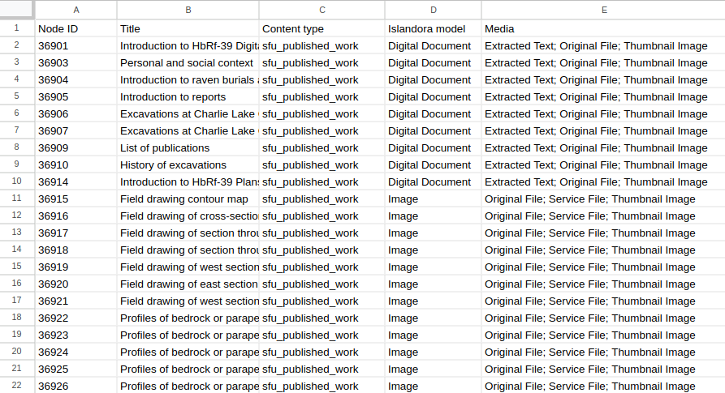

## Exporting image, video, etc. files along with CSV data

In `export_csv` and `get_data_from_view` tasks, you can optionally export media files. To do this, add the following settings to your configuration file:

* `export_file_directory`: This is the path to the directory where Workbench will save the exported files. This is required unless the `export_file_url_instead_of_download` option is set to `true`. If the directory doesn't exist, Workbench will create it (but not any leading directories); if Workbench cannot create the directory, it will exit.
* `export_file_media_use_term_id`: Optional. This setting tells Workbench which Islandora Media Use term to use to identify the file to export. Defaults to `http://pcdm.org/use#OriginalFile` (for Original File). Can be either a term ID or a term URI. See below for how to export multiple files, with separate Islandora Media Use terms.
* `export_file_url_instead_of_download`: Optional. If set to `true`, file columns will contain the URL where the media file is located, and files won't be downloaded.
* `additional_files`: Optional. Uses the same list syntax as in [Adding Multiple Media](adding_multiple_media.md), but with a different purpose: in `create` and `add_media` tasks each entry maps a column in your *input* CSV to a Media Use term, while here each entry maps a column name in your *output* CSV to the Media Use term whose file you want to export. Useful for getting out more than just the Original Files. Values can be term IDs or term URIs; see "Finding the Media Use term URIs and IDs" below.

Note that the `username` and `password` in your configuration are used only to query Drupal for node and media information. Workbench downloads the files themselves without logging in, so the files need to be accessible to anonymous (not logged-in) Drupal users in order to be exported.

If you want to export multiple files for each node (e.g. the original file, the extracted text file, the service file, and the thumbnail), include an `additional_files` entry in your configuration, mapping columns names in your output CSV with Media Use term IDs or URIs:

```
additional_files:
  - extracted: http://pcdm.org/use#ExtractedText
  - service: http://pcdm.org/use#ServiceFile
  - thumbnail: http://pcdm.org/use#ThumbnailImage
```

  This will result in the columns `file` (for the original file), `extracted` (containing the path to the extracted text files), `service` ((containing the path to the service files)), and `thumbnail` ((containing the path to the thumbnail files).

### Finding the Media Use term URIs and IDs

The values you map to column names in `additional_files` (and the value of `export_file_media_use_term_id`) identify terms in your Drupal site's "Islandora Media Use" vocabulary. You can use either the term's URI or its term ID. To look them up:

1. In Drupal, go to the vocabulary's overview page at `/admin/structure/taxonomy/manage/islandora_media_use/overview` (you need permission to administer taxonomy). This lists each Media Use term by name, such as "Original File" or "Thumbnail Image".
1. Click "Edit" for a term. The term ID is the number in the page's URL (for example, `/taxonomy/term/16/edit` is term ID 16), and the term's URI is in the "URL" box of its "External URI" field (for example, `http://pcdm.org/use#ThumbnailImage`).

We recommend using URIs. Term IDs are different from site to site, while URIs identify the same kind of media wherever the term is used, so a configuration file that uses URIs is easier to share and reuse.

Sites that use the standard Islandora Media Use terms will have URIs like these (always confirm them against your own site's vocabulary, since sites can add or change terms):

| Term name | URI |
| --- | --- |
| Original File | `http://pcdm.org/use#OriginalFile` |
| Thumbnail Image | `http://pcdm.org/use#ThumbnailImage` |
| Service File | `http://pcdm.org/use#ServiceFile` |
| Extracted Text | `http://pcdm.org/use#ExtractedText` |
| Intermediate File | `http://pcdm.org/use#IntermediateFile` |
| Preservation Master File | `http://pcdm.org/use#PreservationMasterFile` |

If a node doesn't have a media of the type you ask for, Workbench leaves that cell empty (see below).

### Exporting files for a node's members

If you also want the files of the children of the nodes you are exporting (for example, the images for every page of a book), combine the file settings above, including `additional_files` if you want more than the Original File, with the member settings described in "[Exporting nodes together with their members](/islandora_workbench_docs/exporting_content/#exporting-nodes-together-with-their-members)":

```yaml
task: export_csv
host: "http://localhost:8000"
username: admin
password: islandora
input_csv: nodes_to_export.csv
content_type: islandora_object
export_csv_file_path: output.csv
export_file_directory: /tmp/exported_files
additional_files:
  - thumbnail: http://pcdm.org/use#ThumbnailImage
export_csv_include_members: true
csv_member_max_depth: 3
```

The same combination works in `get_data_from_view` tasks using `get_data_from_view_include_members`. Workbench downloads the files of each starting node and of each of its members, and writes them to the `file` column and to any columns named in `additional_files` (here, `thumbnail`).

For a collection node (1162) with 21 members, the relevant columns of the output CSV look like this (other columns omitted, and the absolute paths shortened here for readability):

| node_id | field_member_of | file | thumbnail |
| --- | --- | --- | --- |
| 1162 | | /tmp/exported_files/pitt_collection.33_tn_large.jpg | /tmp/exported_files/pitt_collection.33_tn.jpg |
| 1332 | 1162 | /tmp/exported_files/pitt_886.25464.ap_jp2.jp2 | /tmp/exported_files/1332.jpg |
| 1333 | 1162 | /tmp/exported_files/pitt_886.15691.ap_jp2.jp2 | /tmp/exported_files/1333.jpg |

Each cell contains the absolute path of one downloaded file. The starting node is listed first, followed by its members; the `field_member_of` column shows which node each member belongs to. Because all downloaded files go into the single `export_file_directory`, it is useful that files from different nodes have different names; if two files have the same name, Workbench adds a numeric suffix to the later one.

If a node doesn't have a media of the type named in an `additional_files` entry, that node's cell in the corresponding column is left empty. The column itself is still created, and the other columns are not affected. For example, if you add `preservation: http://pcdm.org/use#PreservationMasterFile` to the `additional_files` list in the configuration above and none of the exported nodes has a Preservation Master File, the output CSV has a `preservation` column in which every cell is empty, while the `file` and `thumbnail` columns are populated as before.

### Exporting URLs instead of downloading files

If you only need to know where the files are, add `export_file_url_instead_of_download: true` to the configuration. Workbench then downloads nothing, and `export_file_directory` is not needed. The `file` column and any `additional_files` columns contain the URL of each file instead of a path on disk. With the configuration above plus that setting, the output looks like this (hostnames shortened for readability):

| node_id | field_member_of | file | thumbnail |
| --- | --- | --- | --- |
| 1162 | | https://islandora.example.org/system/files/2025-02/pitt_collection.33_tn_large.jpg | https://islandora.example.org/system/files/2025-02/pitt_collection.33_tn.jpg |
| 1332 | 1162 | https://islandora.example.org/system/files/2025-03/pitt_886.25464.ap_jp2.jp2 | https://files.example.org/s3fs-public/2025-03/1332.jpg?VersionId=y6HgbswPYrf |

The URLs are exactly what Drupal reports for each file, so they can differ from row to row. In the sample above, the thumbnails for the members are served from a different host (an Amazon S3 bucket) than the other files, and their URLs end with a query string (`?VersionId=...`). If you use these URLs in a script, keep the whole URL, including the query string.

## Using a Drupal View to generate a media report as CSV

You can get a report of which media a set of nodes has using a View. This report is generated using a `get_media_report_from_view` task, and the View configuration it uses is the same as the View configuration described above (in fact, you can use the same View with both `get_data_from_view` and `get_media_report_from_view` tasks). A sample Workbench configuration file looks like:


```yaml
task: get_media_report_from_view
host: "http://localhost:8000/"
view_path: daily_nodes_created
username: admin
password: islandora
export_csv_file_path: /tmp/media_report.csv
# view_paramters is optinal, and used only if your View uses Contextual Filters.
view_parameters:
 - 'date=20231201'
```

The output contains colums for Node ID, Title, Content Type, Islandora Model, and Media. For each node in the View, the Media column contains the media use terms for all media attached to the node separated by semicolons, and sorted alphabetically:


