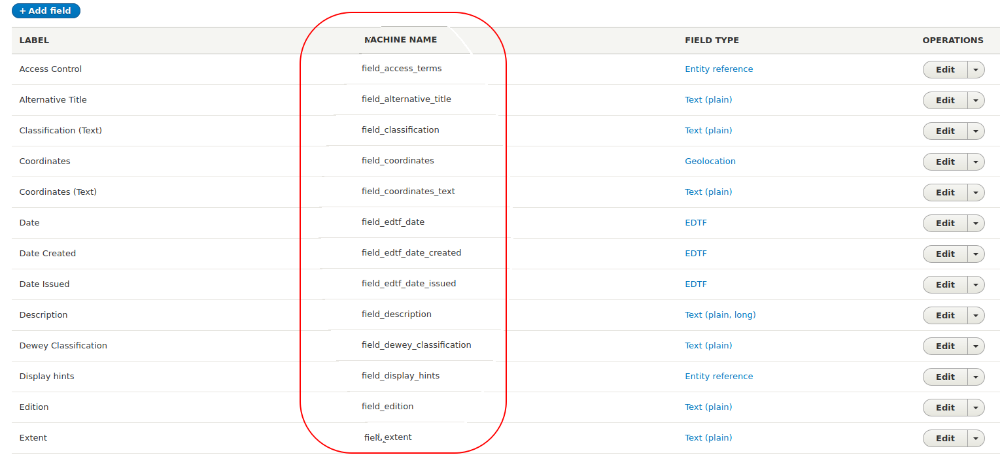
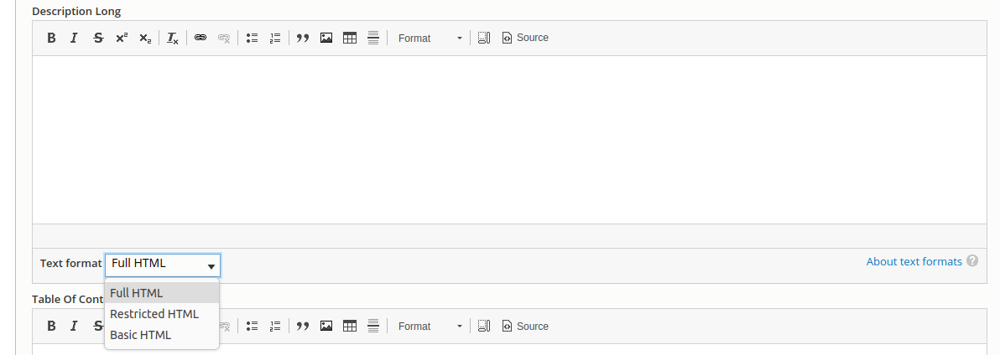

Workbench uses a CSV file to populate Islandora objects' metadata. This file contains the field values that is to be added to new or existing nodes, and some additional reserved columns specific to Workbench. Data in this CSV file can be:

* strings (for string or text fields) like `Using Islandora Workbench for Fun and Profit`
* integers like `7281`
* the binary values `1` or `0`
* Existing Drupal-generated entity IDs (term IDs for taxonomy terms or node IDs for collections and parents), which are integers like `10` or `3549`
* Workbench-specific structured strings for typed relation (e.g., `relators:art:30`), link fields (e.g., `https://acme.net%%Acme Products`), geolocation fields (e.g., `"49.16667,-123.93333"`), and authority link data (e.g., `viaf%%http://viaf.org/viaf/10646807%%VIAF Record`)

!!! note
    As is standard with CSV data, values do not need to be wrapped in double quotation marks (`"`) unless they contain an instance of the delimiter character (e.g., a comma) or line breaks. Spreadsheet applications such as Google Sheets, LibreOffice Calc, and Excel will output valid CSV data.
    If you are using a spreadsheet application, it will take care of wrapping the CSV values in double quotation marks when they are necessary - you do not need to wrap the field values yourself.

## Reserved CSV columns

The following CSV columns are used for specific purposes and in some cases are required in your CSV file, depending on the task you are performing (see below for specific cases). Data in them does not directly populate Drupal content-type fields.

| CSV field name | Task(s) | Note |
| --- | --- ||
| id | create | This CSV field is used by Workbench for internal purposes, and is not added to the metadata of your Islandora objects. Therefore, it doesn't need to have any relationship to the item described in the rest of the fields in the CSV file. You can configure this CSV field name to be something other than `id` by using the `id_field` option in your configuration file. Note that if the specified field contains multiple values, (e.g. `0001|spec-86389`), the entire field value will be used as the internal Workbench identifier. Also note that it is important to use values in this column that are unique across input CSV files if you plan to create parent/child relationships [accross Workbench sessions](/islandora_workbench_docs/paged_and_compound/#creating-parentchild-relationships-across-workbench-sessions). |
| parent_id | create | When creating paged or compound content, this column identifies the parent of the item described in the current row. For information on how to use this field, see "[With page/child-level metadata](/islandora_workbench_docs/paged_and_compound/#with-pagechild-level-metadata)." Note that this field can contain only a single value. In other words, values like `id_0029|id_0030` won't work. If you want an item to have multiple parents, you need to use a later `update` task to assign additional values to the child node's `field_member_of` field.|
| node_id | update, delete, add_media, export_csv, delete_media_by_node | The ID of the node you are updating, deleting, or adding media to. Full URLs (including URL aliases) are also allowed in this CSV field. |
| file | create, add_media | See detail in "Values in the 'file' column", below. |
| media_use_tid | create, add_media | Tells Workbench which terms from the Islandora Media Use vocabulary to assign to media created in `create` and `add_media` tasks. This can be set for all new media in the configuration file; only include it in your CSV if you want row-level control over this value. More detail is available in the "[Configuration](/islandora_workbench_docs/configuration/#media-settings)" docs for `media_use_tid`. |
| url_alias | create, update | See detail in "[Assigning URL aliases](/islandora_workbench_docs/aliases/)". |
| image_alt_text | create |  See detail in "[Adding alt text to images](/islandora_workbench_docs/alt_text/)".|
| checksum | create |  See detail in "[Fixity checking](/islandora_workbench_docs/fixity/)".|
| term_name | create_terms |  See detail in "[Creating taxonomy terms](/islandora_workbench_docs/creating_taxonomy_terms/)".|

### Values in the "file" column

Values in the reserved `file` CSV field contain the location of files that are used to create Drupal Media. By default, Workbench pushes up to Drupal only one file, and creates only one resulting media per CSV record. However, it is possible to push up [multiple files](/islandora_workbench_docs/adding_multiple_media/) per CSV record (and create all of their corresponding media).

File locations in the `file` field can be relative to the directory named in `input_dir`, absolute paths, or URLs. Examples of each:

* relative to directory named in the `input_dir` configuration setting: `myfile.png`
* absolute: `/tmp/data/myfile.png`. On Windows, you can use values like `c:\users\mjordan\files\myfile.png` or `\\some.windows.file.share.org\share_name\files\myfile.png`.
* URL: `http://example.com/files/myfile.png`

Things to note about `file` values in general:

* Relative, absolute, and URL file locations can exist within the same CSV file, or even within the same CSV value.
* By default, if the `file` value for a row is empty, Workbench will log the empty value, both in and outside of `--check`. `file` values that point to files that don't exist will result in Workbench logging the missing file and then exiting, unless `allow_missing_files: true` is present in your config file. Adding `perform_soft_checks` will also tell Workbench to not error out when the value in the `file` column can't be found.
* If you want do not want to create media for any of the rows in your CSV file, include `nodes_only: true` in your configuration file. More detail [is available](/islandora_workbench_docs/nodes_only/).
* `file` values that contain non-ASCII characters are normalized to their ASCII equivalents. See [this issue](https://github.com/mjordan/islandora_workbench/issues/192) for more information.
* The Drupal filesystem where files are stored is determined by each media type's file field configuration. It is not possible to override that configuration.
* The maximum size of files that Workbench can ingest is determined by configuration settings on the Drupal server. [More information](/islandora_workbench_docs/preparing_data/#preparing-to-ingest-large-files) on  adjusting these settings is available.

Things to note about URLs as `file` values:

* Workbench downloads files identified by URLs and saves them in the directory named in `temp_dir` before processing them further; within this directory, each file is saved in a subdirectory named after the value in the row's `id_field` field. It does not delete the files from these locations after they have been ingested into Islandora unless the `delete_tmp_upload` configuration option is set to `true`.
* Files identified by URLs must be accessible to the Workbench script, which means they must not require a username/password; however, they can be protected by a firewall, etc. as long as the computer running Workbench is allowed to retrieve the files without authenticating.
* Currently Workbench requires that the URLs point directly to a file or a service that generates a file, and not a wrapper page or other indirect route to the file.


## Required columns

A small number of columns are required in your CSV, depending on the task you are performing:

| Task | Required in CSV | Note |
| --- | --- ||
| create | id | See detail in "Reserved CSV fields", above. |
| | title | The node title. |
| | file | Empty values in the `file` field are allowed if `allow_missing_files` is present in your configuration file, in which case a node will be created but it will have no attached media. |
| update | node_id | The node ID of an existing node you are updating. |
| delete | node_id | The node ID of an existing node you are deleting. |
| add_media | node_id | The node ID of an existing node you are attaching media to. |
| | file | Must contain a filename, file path, or URL. `allow_missing_files` only works with the `create` task. |

If a required field is missing from your CSV, `--check` will tell you.

## Columns you want Workbench to ignore

In some cases you might want to include columns in your CSV that you want Workbench to ignore. More information on this option is available in the "Sharing the input CSV with other applications" section of the [Workflows](/islandora_workbench_docs/workflows/#sharing-the-input-csv-with-other-applications) documentation.


## CSV fields that contain Drupal field data

These are of two types of Drupal fields, base fields and content-type specific fields.

### Base fields

Base fields are basic node properties, shared by all content types. The base fields you can include in your CSV file are:

* `title`: This field is required for all rows in your CSV for the `create` task. Optional for the 'update' task. Drupal limits the title's length to 255 characters,unless the [Node Title Length](https://www.drupal.org/project/title_length) contrib module is installed. If that module is installed, you can set the maximum allowed title length using the `max_node_title_length` configuration setting.
* `langcode`: The language of the node. Optional. If included, use one of Drupal's language codes as values (common values are 'en', 'fr', and 'es'; the entire list can be seen [here](https://git.drupalcode.org/project/drupal/-/blob/8.8.x/core/lib/Drupal/Core/Language/LanguageManager.php#L224). If absent, Drupal sets the value to the default value for your content type.
* `uid`: The Drupal user ID to assign to the node and media created with the node. Optional. Only available in `create` tasks. If you are creating paged/compound objects from directories, this value is applied to the parent's children (if you are creating them using the page/child-level metadata method, these fields must be in your CSV metadata).
* `created`: The timestamp to use in the node's "created" attribute and in the "created" attribute of the media created with the node. Optional, but if present, it must be in format 2020-11-15T23:49:22+00:00 (the +00:00 is the difference to Greenwich time/GMT). If you are creating paged/compound objects from directories, this value is applied to the parent's children (if you are creating them using the page/child-level metadata method, these fields must be in your CSV metadata).
* `published`: Whether or not the node (and all accompanying media) is published. If present in `add_media` tasks, will override parent node's `published` value. Values in this field are either `1` (for published) or `0` (for unpublished). The default value for this field is defined within each Drupal content type's (and media type's) configuration, and may be determined by contrib modules such as [Workflow](https://www.drupal.org/project/workflow).
* `promote`: Whether or not the node is promoted to the site's front page. `1` (for promoted) or `0` (for not promoted). The default vaue for this field is defined within each Drupal content type's (and media type's) configuration, and may be determined by contrib modules such as [Workflow](https://www.drupal.org/project/workflow).

All base fields other than `uid` can be included in both `create` and `update` tasks.

### Content type-specific fields

These fields correspond directly to fields configured in Drupal nodes, and data you provide in them populates their equivalent field in Drupal entities. The column headings in the CSV file must match machine names of fields that exist in the target node content type. Fields' machine names are visible within the "Manage fields" section of each content type's configuration, here circled in red:



These field names, plus the fields indicated in the "Reserved CSV fields" section above, are the column headers in your CSV file, like this:

```text
file,id,title,field_model,field_description
IMG_1410.tif,01,Small boats in Havana Harbour,25,Taken on vacation in Cuba.
IMG_2549.jp2,02,Manhatten Island,25,"Taken from the ferry from downtown New York to Highlands, NJ. Weather was windy."
IMG_2940.JPG,03,Looking across Burrard Inlet,25,View from Deep Cove to Burnaby Mountain. Simon Fraser University is visible on the top of the mountain in the distance.
IMG_2958.JPG,04,Amsterdam waterfront,25,Amsterdam waterfront on an overcast day.
IMG_5083.JPG,05,Alcatraz Island,25,"Taken from Fisherman's Wharf, San Francisco."
```

!!! note
    If content-type field values apply to all of the rows in your CSV file, you can avoid including them in the CSV and instead use "[CSV field templates](/islandora_workbench_docs/field_templates/)".

#### Using field labels as CSV column headers

By default, Workbench requires that column headers in your CSV file use the machine name of Drupal fields. However, in "create", "update", and "create_terms" tasks, you can use the field labels if you include `csv_headers: labels` in your configuration file. If you do this, you can use CSV file like this:

```text
file,id,title,Model,Description
IMG_1410.tif,01,Small boats in Havana Harbour,25,Taken on vacation in Cuba.
IMG_2549.jp2,02,Manhatten Island,25,"Taken from the ferry from downtown New York to Highlands, NJ. Weather was windy."
IMG_2940.JPG,03,Looking across Burrard Inlet,25,View from Deep Cove to Burnaby Mountain. Simon Fraser University is visible on the top of the mountain in the distance.
IMG_2958.JPG,04,Amsterdam waterfront,25,Amsterdam waterfront on an overcast day.
IMG_5083.JPG,05,Alcatraz Island,25,"Taken from Fisherman's Wharf, San Francisco."
```
Some things to note about using field labels in your CSV:

* if the content type (or vocabulary) that you are populating uses the same label for multiple fields, you won't be able to use labels as your CSV column headers. `--check` will tell you if there are any duplicate field labels.
* Spaces in field labels are OK, e.g. `Country of Publication`.
* Spelling, capitalization, punctuation, etc. in CSV column headers must match the field labels exactly.
* If any field labels contain the character you are using as the CSV delimiter (defined in the `delimiter` config setting), you will need to wrap the column header in quotation marks, e.g. `"Height, length, weight"`.

### Single and multi-valued fields

Drupal allows for fields to have a single value, a specific maximum number of values, or unlimited number of values. In the CSV input file, each Drupal field corresponds to a single CSV field. In other words, the CSV column names must be unique, even if a Drupal field allows multiple values. Populating multivalued fields is explained below.

#### Single-valued fields

In your CSV file, single-valued fields simply contain the value, which, depending on the field type, can be a string or an integer. For example, using the fields defined by the Islandora Defaults module for the "Repository Item" content type, your CSV file could look like this:

```text
file,title,id,field_model,field_description,field_rights,field_extent,field_access_terms,field_member_of
myfile.jpg,My nice image,obj_00001,24,"A fine image, yes?",Do whatever you want with it.,There's only one image.,27,45
```

In this example, the term ID for the tag you want to assign in `field_access_terms` is 27, and the node ID of the collection you want to add the object to (in `field_member_of`) is 45.

#### Multivalued fields

For multivalued fields, you separate the values within a field with a pipe (`|`), like this:

```text
file,title,field_something
IMG_1410.tif,Small boats in Havana Harbour,One subvalue|Another subvalue
IMG_2549.jp2,Manhatten Island,first subvalue|second subvalue|third subvalue
```

This works for string fields as well as taxonomy reference fields, e.g.:

```text
file,title,field_my_multivalued_taxonomy_field
IMG_1410.tif,Small boats in Havana Harbour,35|46
IMG_2549.jp2,Manhatten Island,34|56|28
```

Drupal strictly enforces the maximum number of values allowed in a field. If the number of values in your CSV file for a field exceed a field's configured maximum number of fields, Workbench will only populate the field to the field's configured limit.

The subdelimiter character defaults to a pipe (`|`) but can be set in your config file using the `subdelimiter` configuration setting.

!!! note
    Workbench will remove duplicate values in CSV fields. For example, if you accidentally use `first subvalue|second subvalue|second subvalue` in your CSV, Workbench will filter out the superfluous `second subvalue`. This applies to both `create` and `update` tasks, and within `update` tasks, replacing values and appending values to existing ones. Workbench deduplicates CVS values silently: it doesn't log the fact that it is doing it.

### Drupal field types

The following types of Drupal fields can be populated from data in your input CSV file:

* text (plain, plain long, etc.) fields
* integer fields
* boolean fields, with values 1 or 0
* EDTF date fields
* entity reference (taxonomy and linked node) fields
* typed relation (taxonomy) fields
* link fields
* geolocation fields

Drupal is very strict about not accepting malformed data. Therefore, Islandora Workbench needs to provide data to Drupal that is consistent with field types (string, taxonomy reference, EDTF, etc.) we are populating. This applies not only to Drupal's base fields (as we saw above) but to all fields. A field's type is indicated in the same place as its machine name, within the "Manage fields" section of each content type's configuration. The field types are circled in red in the screen shot below:


Below are guidelines for preparing CSV data that is compatible with common field types configured in Islandora repositories.

#### Text fields

Generally speaking, any Drupal field where the user enters free text into a node add/edit form is configured to be one of the Drupal "Text" field types.

Islandora Workbench supports non-Latin characters in CSV, provided the CSV file is encoded as UTF-8. For example, the following non-Latin text will be added as expected to Drupal fields:

* 一九二四年六月十二日 (Traditional Chinese)
* सरकारी दस्तावेज़, अखबारों में छपे लेख, अकादमिक किताबें (Hindi)
* ᐊᑕᐅᓯᖅ ᓄᓇ, ᐅᓄᖅᑐᑦ ᓂᐲᑦ (Inuktitut)

However, if all of your characters are Latin (basically, the characters found on a standard US keyboard) your CSV file can be encoded as ASCII.

Some things to note about Drupal text fields:

* Some specialized forms of text fields, such as EDTF, enforce or prohibit the presence of specific types of characters (see below for EDTF's requirements).
* Islandora Workbench populates Drupal text fields verbatim with the content provided in the CSV file, with [these exceptions](/islandora_workbench_docs/preparing_data/#how-workbench-cleans-your-input-data). Plus, if a text value in your CSV is longer than its field's maximum configured length, Workbench will truncate the text (see the next point and warning below).
* Text fields may be configured to have a maximum length. Running Workbench with `--check` will produce a warning (both shown to the user and written to the Workbench log) if any of the values in your CSV file are longer than their field's configured maximum length.

!!! warning
    If the CSV value for text field exceeds its configured maximum length, Workbench truncates the value to the maximum length before populating the Drupal field, leaving a log message indicating that it has done so.

#### Text fields with markup

Drupal text fields that are configured to contain "formatted" text (for example, text with line breaks or HTML markup) will have one of the available text formats, such as "Full HTML" or "Basic HTML", applied to them. Workbench treats these fields these fields the same as if they are populated using the node add/edit form, but you will have to tell Workbench, in your configuration file, which text format to apply to them.

When you populate these fields using the node add/edit form, you need to select a text format within the WYSIWYG editor:



When populating these fields using Workbench, you can configure which text format to use either 1) for all Drupal "formatted" text fields or 2) using a per-field configuration.

1) To configure the text format to use for all "formatted" text fields, include the `text_format_id` setting in your configuration file, indicating the ID of the text format to use, e.g., `text_format_id: full_html`. The default value for this setting is `basic_html`.

2) To configure text formats on a per-field basis, include the `field_text_format_ids` (plural) setting in your configuration file, along with a field machine name-to-format ID mapping, like this:

```
field_text_format_ids:
- field_description_long: full_html
- field_abstract: restricted_html
```

If you use both settings in your configuration file, `field_text_format_ids` takes precedence. You only need to configure text formats per field to override the global setting.

!!! note
    Workbench has no way of knowing what text formats are configured in the target Drupal, and has no way of validating that the text format ID you use in your configuration file exists. However, if you use a text format ID that is invalid, Drupal will not allow nodes to be created or updated and will leave error messages in your Workbench log that contain text like `Unprocessable Entity: validation failed.\nfield_description_long.0.format: The value you selected is not a valid choice.`

    By default, Drupal comes configured with three text formats, `full_html`, `basic_html`, and `restricted_html`. If you create your own text format at `admin/config/content/formats`, you can use its ID in the Workbench configuration settings described above.

If you want to include line breaks in your CSV, they must be physical line breaks. `\n` and other escaped line break characters are not recognized by Drupal's "Convert line breaks into HTML (i.e. &lt;br&gt; and &lt;p&gt;)" text filter. CSV data containing physical line breaks must be wrapped in quotation marks, like this:

```
id,file,title,field_model,field_description_long
01,,I am a title,Image,"Line breaks
are awesome."
```

#### Taxonomy reference fields

!!! note
    In the list of a content type's fields, as pictured above, Drupal uses "Entity reference" for all types of entity reference fields, of which Taxonomy references are one. The other most common kind of entity reference field is a node reference field.

Islandora Workbench lets you assign both existing and new taxonomy terms to nodes. Creating new terms on demand during node creation reduces the need to prepopulate your vocabularies prior to creating nodes.

In CSV columns for taxonomy fields, you can use either term IDs (integers) or term names (strings). You can even mix IDs and names in the same field:

```text
file,title,field_my_multivalued_taxonomy_field
img001.png,Picture of cats and yarn,Cats|46
img002.png,Picture of dogs and sticks,Dogs|Sticks
img003.png,Picture of yarn and needles,"Yarn, Balls of|Knitting needles"
```
By default, if you use a term name in your CSV data that doesn't match a term name that exists in the referenced taxonomy, Workbench will detect this when you use `--check`, warn you, and exit. This strict default is intended to prevent users from accidentally adding unwanted terms through data entry error.

Terms can be from any level in a vocabulary's hierarchy. In other words, if you have a vocabulary whose structure looks like this:


you can use the terms IDs or labels for "Automobiles", "Sports cars", or "Land Rover" in your CSV. The term name (or ID) is all you need; no indication of the term's place in the hierarchy is required.

If you add `allow_adding_terms: true` to your configuration file for any of the entity "create" or "update" tasks, Workbench will create the new term the first time it is used in the CSV file following these rules:

* If multiple records in your CSV contain the same new term name in the same field, the term is only created once.
* When Workbench checks to see if the term with the new name exists in the target vocabulary, it queries Drupal for the new term name, looking for an exact match against an existing term in the specified vocabulary. Therefore it is important that term names used in your CSV are identical to existing term names. The query to find existing term names follows these two rules:
    * Leading and trailing whitespace on term names is ignored. Internal whitespace is significant.
    * Case is ignored.
    * Note that Drupal does not distinguish between diacritics. For example, it does not distinguish between "Chylek" and "Chýlek".
* If the term name you provide in the CSV file does not match an existing term name in its vocabulary, the term name from the CSV data is used to create a new term. If it does match, Workbench populates the field in your nodes with a reference to the matching term.

`allow_adding_terms` applies to *all* vocabularies. In general, you do not want to add new terms to vocabularies used by Islandora for system functions such as Islandora Models and Islandora Media Use. In order to exclude vocabularies from being added to, you can register vocabulary machine names in the `protected_vocabularies` setting, like this:

```
protected_vocabularies:
 - islandora_model
 - islandora_display
 - islandora_media_use
```

Adding new terms has some constraints:

* Terms created in this way do not have any external URIs, other fields, or if they are hierarchical. If you want your terms that have any of these features, you will need to either create the terms manually, through a `create_terms` task, or using a third-party module like [Taxonomy Import](https://www.drupal.org/project/taxonomy_import) prior to using their term names in an input CSV.
* Workbench cannot distinguish between identical term names within the same vocabulary. This means you cannot create two different terms that have the same term name (for example, two terms in the Person vocabulary that are identical but refer to two different people). The workaround for this is to create one of the terms before using Workbench and use the term ID instead of the term string.
    * If the same term name exists multiple times in the same vocabulary (again using the example of two Person terms that describe two different people) you should be aware that when you use these identical term names within the same vocabulary in your CSV, Workbench will always choose the first one it encounters when it converts from term names to term IDs while populating your nodes. The workaround for this is to use the term ID for one (or both) of the identical terms, or to use URIs for one (or both) of the identical terms.
* `--check` will identify any new terms that exceed Drupal's maximum allowed length for term names, 255 characters. If a term name is longer than 255 characters, Workbench will truncate it at that length, log that it has done so, and create the term.
* Taxonomy terms created with new nodes are not removed when you delete the nodes.

##### Using term names in multi-vocabulary fields

While most node taxonomy fields reference only a single vocabulary, Drupal does allow fields to reference multiple vocabularies. This ability poses a problem when we use term names instead of term IDs in our CSV files: in a multi-vocabulary field, Workbench can't be sure which term name belongs in which of the multiple vocabularies referenced by that field. This applies to both existing terms and to new terms we want to add when creating node content.

To avoid this problem, we need to tell Workbench which of the multiple vocabularies each term name should (or does) belong to. We do this by namespacing terms with the applicable vocabulary ID.

For example, let's imagine we have a node field whose name is `field_sample_tags`, and this field references two vocabularies, "cats" and "dogs". To use the terms `Tuxedo`, `Tabby`, `German Shepherd` in the CSV when adding new nodes, we need to namespace them with vocabulary IDs like this:


```text
field_sample_tags
cats:Tabby
cats:Tuxedo
dogs:German Shepherd
```

If you want to use multiple terms in a single field, you would namespace them all:

```text
cats:Tuxedo|cats:Misbehaving|dogs:German Shepherd
```
To find the vocabulary ID (referred to above as the "namespace") to use, visit the list of your site's vocabularies at `admin/structure/taxonomy`:


Hover your pointer over the "List terms" button for each vocabulary to reveal the URL to its overview page. The ID for the vocabulary is the string between "manage" and "overview" in the URL. For example, in the URL `admin/structure/taxonomy/manage/person/overview`, the vocabulary ID is "person". This is the namespace you need to use to indicate which vocabulary to add new terms to.

CSV values containing term names that have commas (`,`) in multi-valued, multi-vocabulary fields need to be wrapped in quotation marks (like any CSV value containing a comma), and in addition, the need to specify the namespace within each of the subvalues:

```text
"tags:gum, Bubble|tags:candy, Hard"
```
Using these conventions, Workbench will be certain which vocabulary the term names belong to. Workbench will remind you during its `--check` operation that you need to namespace terms. It determines 1) if the field references multiple vocabularies, and then checks to see 2) if the field's values in the CSV are term IDs or term names. If you use term names in multi-vocabulary fields, and the term names aren't namespaced, Workbench will warn you:

```
Error: Term names in multi-vocabulary CSV field "field_tags" require a vocabulary namespace; value "Dogs" in row 4 does not have one.
```

Note that since `:` is a special character when you use term names in multi-vocabulary CSV fields, you can't add a namespaced term that itself contains a `:`. You need to add it manually to Drupal and then use its term ID (or name, or URI) in your CSV file.

##### Using term URIs instead of term IDs

Islandora Workbench lets you use URIs assigned to terms instead of term IDs. You can use a term URI in the `media_use_tid` configuration option (for example, `"http://pcdm.org/use#OriginalFile"`) and in taxonomy fields in your metadata CSV file:

```
field_model
https://schema.org/DigitalDocument
http://purl.org/coar/resource_type/c_18cc
```

During `--check`, Workbench will validate that URIs correspond to existing taxonomy terms.

Using term URIs has some constraints:

* You cannot create a new term by providing a URI like you can by providing a term name.
* If the same URI is registered with more than one term, Workbench will choose one and write a warning to the log indicating which term it chose and which terms the URI is registered with. However, `--check` will detect that a URI is registered with more than one term and warn you. At that point you can edit your CSV file to use the correct term ID rather than the URI.

##### Using numbers as term names

If you want to use a term name like "1990" in your CSV, you need to tell Workbench to not interpret that term name as a term ID. To do this, add a list of CSV columns to your config file using the `columns_with_term_names` config setting that will only contain term names (and not IDs or URIs, as explained next):

```
columns_with_term_names:
 - field_subject
 - field_tags
```

If you register a column name here, it can contain *only* terms names. Any term ID or URIs will be interpreted as term names.

Note that this is only necessary if your term names are comprised entirely of integers. If they contain decimals (like "1990.3"), Workbench will not interpret them as term IDs and you will not need to tell Workbench to do otherwise.

#### Entity Reference Views fields

Islandora Workbench fully supports taxonomy reference fields that use the "Default" reference type, but only partially supports "Views: Filter by an entity reference View" taxonomy reference fields. To populate this type of entity reference in "create" and "update" tasks, you have two options.

!!! warning
    Regardless of whether you use term IDs or term names in your CSV, Workbench will not validate values in "Views: Filter by an entity reference View" taxonomy reference fields. Term IDs or term names that are not in the referenced View will result in the node not being created or updated (Drupal will return a 422 response).

    However, if `allow_adding_terms` is set to `true`, terms that are not in the referenced vocabulary will be added to the vocabulary if your CSV data contains a vocabulary ID/namespace in the form `vocabid:newterm`. The terms will be added regardless of whether they are within the referenced View. Therefore, for this type of Drupal field, you should not include vocabulary IDs/namespaces in your CSV data for that field.

    Further work on supporting this type of field is being tracked in [this Github issue](https://github.com/mjordan/islandora_workbench/issues/769).

First, if your input CSV contains only term IDs in this type of column, you can do the following:

* use term IDs instead of term names or URIs in your input CSV *and*
* include `require_entity_reference_views: false` in your configuration file.

Alternatively, if you prefer to use term names instead of term IDs in CSV column for this type of field, you will need to create a special Display for the View that is refererenced from that field. To do this:

1. In the View that is referenced, _duplicate_ the view display as a REST Export display. When making the changes to the resulting REST Export display, be careful to modify that display only (and not "All displays") by alaways choosing "This rest_export (override)" during every change.
1. Format: Serializer
    - Settings: json
1. Path: some_path (do not include the leading `/`)
1. Authentication: Basic Auth
1. Access restrictions: Role > View published content (the default; "administrator vocabularies and terms" is needed for other endpoints used by Workbench, but *this* view doesn't require this.)
1. Filter Criteria:
    1. Add  "Taxonomy term / name" from the list of fields
    1. Expose this filter
        1. Choose the "Is equal to" operator
        1. Leave the Value field empty
    1. In the Field identifier field, enter "name"

Your configuration for the new "Taxonomy term: name" filter should look like this:


Then in your Workbench configuration file, using the `entity_reference_view_endpoints` setting, provide a mapping between columns in your CSV file and the applicable Views REST Export display path value (configured in step 3 above). In this example, we define three field/path mappings:

```
entity_reference_view_endpoints:
 - field_linked_agent: /taxonomy/linked_agents
 - field_language: /language/lookup
 - field_subject: /taxonomy/subjects
```

During "create" and "update" tasks, `--check` will tell you if the View REST Export display path is accesible.

#### Typed Relation fields

Typed relation fields contain information about the relationship (or "relation") between a taxonomy term and the node it is attached to. For example, a term from the Person vocabulary, "Jordan, Mark", can be an author, illustrator, or editor of the book described in the node. In this example, "author", "illustrator", and "editor" are the typed relations.

!!! note
    Although Islandora supports Typed Relation fields that allow adding relations to other nodes, currently Workbench only supports adding relations to taxonomies. If you need support for adding Typed Relations to other entities, please leave a comment on [this issue](https://github.com/mjordan/islandora_workbench/issues/421).

The Controlled Access Terms module allows the relations to be sets of terms from external authority lists (for example like the [MARC Relators](https://www.loc.gov/marc/relators/relaterm.html) list maintained by the Library of Congress). Within a Typed Relation field's configuration, the configured relations look like this:


In this screenshot, "relators" is a namespace for the MARC Relators authority list, the codes "acp", "adi", etc are the codes for each relator, and "Art copyist", "Art director", etc. are the human-readable label for each relator.

Within the edit form of a node that has a Typed Relation field, the user interface adds a select list of the relation (the target taxonomy term here is "Jordan, Mark (30))", like this:


To be able to populate Typed Relation fields using CSV data with the three pieces of required data (authority list, relation type, target term), Islandora Workbench supports CSV values that contain the corresponding namespace, relator code, and taxonomy term ID, each separated by a colon (`:`), like this:

`relators:art:30`

In this example CSV value, `relators` is the namespace that the relation type `art` is from (the Library of Congress [Relators](http://id.loc.gov/vocabulary/relators.html) vocabulary), and the target taxonomy term ID is `30`.

!!! note
    Note that the structure required for typed relation values in the CSV file is not the same as the structure of the relations configuration depicted in the screenshot of the "Available Relations" list above.

A second option for populating Typed Relation fields is to use taxonomy term names (as opposed to term IDs) as targets:

`"relators:art:Jordan, Mark"`

!!! warning
    In the next few paragraphs, the word "namespace" is used to describe two different kinds of namespaces - first, a vocabulary ID in the local Drupal and second, an ID for the external authority list of relators, for example by the Library of Congress.

As we saw in the "Using term names in multi-vocabulary fields" section above, if the field that we are populating references multiple vocabularies, we need to tell Drupal which vocabulary we are referring to with a local vocabulary namespace. To add a local vocabulary namespace to Typed Relation field CSV structure, we prepend it to the term name, like this (note the addition of "person"):

`"relators:art:person:Jordan, Mark"`

(In this example, `relators` is the external authority lists's namespace, and `person` is the local Drupal vocabulary namespace, prepended to the taxonomy term name, "Jordan, Mark".)

If this seems confusing and abstruse, don't worry. Running `--check` will tell you that you need to add the Drupal vocabulary namespace to values in specific CSV columns.

The final option for populating Typed Relation field is to use HTTP URIs as typed relation targets:

`relators:art:http://markjordan.net`

If you want to include multiple typed relation values in a single field of your CSV file (such as in "field_linked_agent"), separate the three-part values with the same subdelimiter character you use in other fields, e.g. (`|`) (or whatever you have configured as your `subdelimiter`):

`relators:art:30|relators:art:45`

or

`"relators:art:person:Jordan, Mark|relators:art:45"`

##### Adding new typed relation targets

Islandora Workbench allows you to add new typed relation targets while creating and updating nodes. These targets are taxonomy terms. Your configuration file must include the `allow_adding_terms: true` option to add new targets. In general, adding new typed relation targets is just like adding new taxonomy terms as described above in the "Taxonomy relation fields" section.

An example of a CSV value that adds a new target term is:

`"relators:art:person:Jordan, Mark"`

You can also add multiple new targets:

`"relators:art:person:Annez, Melissa|relators:art:person:Jordan, Mark"`

Note that:

* For multi-vocabulary fields, new typed relator targets must be accompanied by a vocabulary namespace (`person` in the above examples).
* You cannot add new relators (e.g. `relators:foo`) in your CSV file, only new target terms.

!!! note
    Adding the typed relation namespace, relators, and vocabulary names is a major hassle. If this information is the same for all values (in all rows) in your `field_linked_agent` column (or any other typed relation field), you can use [CSV value templates](/islandora_workbench_docs/csv_value_templates/) to reduce the tedium.

#### EDTF fields

Running Islandora Workbench with `--check` will validate [Extended Date/Time Format (EDTF) Specification](https://www.loc.gov/standards/datetime/) dates (Levels 0, 1, and 2) in EDTF fields. Some common examples include:

| Type | Examples |
| --- | --- |
| Date | 1976-04-23 |
| | 1976-04 |
| Qualified date | 1976? |
| | 1976-04~ |
| | 1976-04-24% |
| Date and time | 1985-04-12T23:20:30 |
| Interval | 1964/2008 |
|  | 2004-06/2006-08 |
|  | 2004-06-04/2006-08-01 |
|  | 2004-06/2006-08-01 |
| Set | [1667,1668,1670..1672] |
|  | [1672..1682] |
|  | [1672,1673] |
|  | [..1672] |
|  | [1672..] |

Subvalues in multivalued CSV fields are validated separately, e.g. if your CSV value is `2004-06/2006-08|2007-01/2007-04`, `2004-06/2006-08` and `2007-01/2007-04` are validated separately.

!!! note
    EDTF supports a very wide range of specific and general dates, and in some cases, valid dates can look counterintuitive. For example, "2001-34" is valid (it's Sub-Year Grouping meaning 2nd quarter of 2001).


#### Link fields

The link field type stores URLs (e.g. `https://acme.com`) and link text in separate data elements. To add or update fields of this type, Workbench needs to provide the URL and link text in the structure Drupal expects. To accomplish this within a single CSV field, we separate the URL and link text pairs in CSV values with double percent signs (`%%`), like this:

```text
field_related_websites
http://acme.com%%Acme Products Inc.
```

You can include multiple pairs of URL/link text pairs in one CSV field if you separate them with the subdelimiter character:

```text
field_related_websites
http://acme.com%%Acme Products Inc.|http://diy-first-aid.net%%DIY First Aid
```

The URL is required, but the link text is not. If you don't have or want any link text, omit it and the double quotation marks:

```text
field_related_websites
http://acme.com
```

```text
field_related_websites
http://acme.com|http://diy-first-aid.net%%DIY First Aid
```

#### Authority link fields

The authority link field type stores abbreviations for authority sources (i.e., external controlled vocabularies such as national name authorities), authority URIs (e.g. `http://viaf.org/viaf/153525475`) and link text in separate data elements. Authority link fields are most commonly used on taxonomy terms, but can be used on nodes as well.

To add or update fields of this type, Workbench needs to provide the authority source abbreviation, URI and link text in the structure Drupal expects. To accomplish this within a single CSV field, we separate the three parts in CSV values with double percent signs (`%%`), like this:

```text
field_authority_vocabs
viaf%%http://viaf.org/viaf/10646807%%VIAF Record
```

You can include multiple triplets of source abbreviation/URL/link text in one CSV field if you separate them with the subdelimiter character:

```text
field_authority_vocabs
viaf%%http://viaf.org/viaf/10646807%%VIAF Record|other%%https://github.com/mjordan%%Github
```

The authority source abbreviation and the URI are required, but the link text is not. If you don't have or want any link text, omit it:

```text
field_authority_vocabs
viaf%%http://viaf.org/viaf/10646807
```

```text
field_authority_vocabs
viaf%%http://viaf.org/viaf/10646807|other%%https://github.com/mjordan%%Github
```

#### Geolocation fields

The Geolocation field type, managed by the [Geolocation Field](https://www.drupal.org/project/geolocation) contrib module, stores latitude and longitude coordinates in separate data elements. To add or update fields of this type, Workbench needs to provide the latitude and longitude data in these separate elements.

To simplify entering geocoordinates in the CSV file, Workbench allows geocoordinates to be in `lat,long` format, i.e., the latitude coordinate followed by a comma followed by the longitude coordinate. When Workbench reads your CSV file, it will split data on the comma into the required lat and long parts. An example of a single geocoordinate in a field would be:

```text
field_coordinates
"49.16667,-123.93333"
```

You can include multiple pairs of geocoordinates in one CSV field if you separate them with the subdelimiter character:

```text
field_coordinates
"49.16667,-123.93333|49.25,-124.8"
```

Note that:

* Geocoordinate values in your CSV need to be wrapped in double quotation marks, unless the `delimiter` key in your configuration file is set to something other than a comma.
* If you are entering geocoordinates into a spreadsheet, you may need to escape leading `+` and `-` signs since they will make the spreadsheet application think you are entering a formula. You can work around this by escaping the `+` an `-` with a backslash (`\`), e.g., `49.16667,-123.93333` should be `\+49.16667,-123.93333`, and `49.16667,-123.93333|49.25,-124.8` should be `\+49.16667,-123.93333|\+49.25,-124.8`. Workbench will strip the leading `\` before it populates the Drupal fields.
    * Excel: leading `+` and `-` need to be escaped
    * Google Sheets: only `+` needs to be escaped
    * LibreOffice Calc: neither `+` nor `-` needs to be escaped

#### Paragraphs (Entity Reference Revisions fields)

[Entity Reference Revisions](https://www.drupal.org/project/entity_reference_revisions) fields are similar to Drupal's core Entity Reference fields used for taxonomy terms but are intended for entities that are not intended for reference outside the context of the item that references them. For Islandora sites, this is used for [Paragraph](https://www.drupal.org/project/paragraphs) entities.

In order to populate paragraph entites using Workbench in `create` and `update` tasks, you need to enable and configure the REST endpoints for paragraphs. To do this, ensure the REST UI module is enabled, then go to Configuration/Web Services/REST Resources (`/admin/config/services/rest`) and enable "Paragraph". Then edit the settings for Paragraph to the following:

* Granularity = Method
* GET
    * formats: jsonld, json
    * authentication: jwt_auth, basic_auth, cookie
* POST
    * formats: json
    * authentication: jwt_auth, basic_auth, cookie
* DELETE
    * formats: json
    * authentication: jwt_auth, basic_auth, cookie
* PATCH
    * formats: json
    * authentication: jwt_auth, basic_auth, cookie

!!! note
    Pargraphs are locked down from REST updates by default. To add new and update paragraph values you must enable the `paragraphs_type_permissions` submodule and ensure the Drupal user in your configuration file has sufficient privledges granted at `/admin/people/permissions/module/paragraphs_type_permissions`.


Paragraphs are handy for Islandora as they provide flexibility in the creation of more complex metadata (such as complex titles, typed notes, or typed identifiers) by adding Drupal fields to paragraph entities, unlike the Typed Relationship field which hard-codes properties. However, this flexibility makes creating an Workbench import more complicated and, as such, requires additional configration.

For example, suppose you have a "Full Title" field (`field_full_title`) on your Islandora Object content type referencing a paragraph type called "Complex Title" (`complex_title`) that contains "main title" (`field_main_title`) and "subtitle" (`field_subtitle`) text fields. The input CSV would look like:

```text
field_full_title
My Title: A Subtitle|Alternate Title
```

In this example we have two title values, "My Title: A Subtitle" (where "My Title" is the main title and " A Subtitle" is the subtitle) and "Alternate Title" (which only has a main title). To map these CSV values to our paragraph fields, we need to add the following to our configuration file:

```yml
paragraph_fields:
  node:
    field_full_title:
      type: complex_title
      field_order:
        - field_main_title
        - field_subtitle
      field_delimiter: ':'
      subdelimiter: '|'
```

This configuration defines the paragraph field on the node (`field_full_title`) and its child fields (`field_main_title` and `field_subtitle`), which occur within the paragraph in the order they are named in the `field_order` property. Within the data in the CSV column, the values corresponding to the order of those fields are separated by the character defined in the `field_delimiter` property. `subdelimiter` here is the same as the `subdelimiter` configuration setting used in non-paragraph multi-valued fields; in this example it overrides the default or globally configured value. We use a colon for the field delimiter in this example as it is often used in titles to denote subtitles. Note that in the above example, the space before "A" in the subtitle will be preserved. Whether or not you want a space there in your data will depend on how you display the Full Title field.

!!! warning
    Note that Workbench assumes all fields within a paragraph are single-valued. See [this Github issue](https://github.com/mjordan/islandora_workbench/issues/887) for updates.

When using Workbench to update paragraphs using `update_mode: replace`, any null values for fields within the paragraph (such as the null subtitle in the second "Alternate Title" instance in the example) will null out existing field values. However, considering each paragraph as a whole field value, Workbench behaves the same as for all other fields - `update_mode: replace` will replace all paragraph entities with the ones in the CSV, but if the CSV does not contain any values for this field then the field will be left as is.


##### Using Paragraph fields in `create_terms` and `update_terms` tasks

Using Paragraphs in `create_terms` and `update_terms` tasks works the same way as it does in `create` and `update` tasks, with one exception: whereas the the above configuration snippet that defines the fields and their order indicates the `node` entity type in the second line of the snippet, in configurations for creating or updating terms, the entity type should be `taxonomy_term`, like this:

```yml
paragraph_fields:
  taxonomy_term:
    field_related_person_paragraph:
      type: related_person_bundle
      field_order:
        - field_related_person
        - field_related_person_note
      field_delimiter: '^'
      subdelimiter: '|'
```


## Values in the "field_member_of" column

The `field_member_of` column can take a node ID, a full URL to a node, or a URL alias. For instance, all of these refer to the same node and can be used in `field_member_of`:

- `648` (node ID)
- `https://islandora.traefik.me/node/648` (full URL)
- `https://islandora.traefik.me/mycollection` (full URL using an alias)
- `/mycollection` (URL alias)

If you use any of these types of values other than the bare node ID, Workbench will look up the node ID based on the URL or alias.

"field_member_of" is multivalued; you can include any combination of the above types of values in the same CSV cell.

## Values in the "field_domain_access" column

The Domain Access module, part of the [Domain](https://www.drupal.org/project/domain) suite of modules, creates a required, multivalued field with the machine name `field_domain_access` that controls, at the node level, which domains the node shows up in. When populating this field in your Workbench CSV, replace the periods in domain names with `_`. For example, if the domains you want to allow a node to show up in are `test1.testing.edu` and `test2.testing.edu`, the values in your `field_domain_access` field look like this:

```text
test1_testing_edu
test1_testing_edu
test1_testing_edu|test2_testing_edu
test2_testing_edu
```