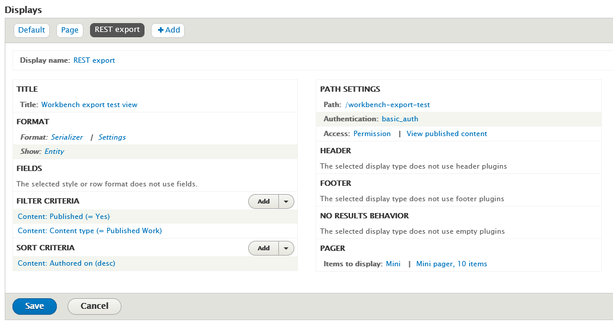

Islandora Workbench can generate several different CSV files you might find useful.

## CSV file templates

!!! note
    This section describes creating CSV *file* templates. For information on CSV *field* templates, see the "[Using CSV field templates](/islandora_workbench_docs/field_templates/)" section.

You can generate a template CSV file by running Workbench with the `--get_csv_template` argument:

`./workbench --config config.yml --get_csv_template`

With this option, Workbench will fetch the field definitions for the content type named in your configuration's `content_type` option and save a CSV file with a column for each of the content type's fields. You can then populate this template with values you want to use in a `create` or `update` task. The template file is saved in the directory indicated in your configuration's `input_dir` option, using the filename defined in `input_csv` with `.csv_file_template` appended.

The template also contains three additional rows:

* human-readable label
* whether or not the field is required in your CSV for `create` tasks
* sample data
* number of values allowed (either a specific maximum number or 'unlimited')
* the name of the section in the documentation covering the field type

Here is a screenshot of this CSV file template loaded into a spreadsheet application:


Note that the first column, and all the rows other than the field machine names, should be deleted before you use a populated version of this CSV file in a `create` task. Also, you can remove any columns you do not intend on populating during the `create` task:


## CSV file containing a row for every newly created node

In some situations, you may want to create stub nodes that only have a small subset of fields, and then populate the remaining fields later. To facilitate this type of workflow, Workbench provides an option to generate a simple CSV file containing a record for every node created during a `create` task. This file can then be used later in `update` tasks to add additional metadata or in `add_media` tasks to add media.

 You tell Workbench to generate this file by including the optional `output_csv` setting in your `create` task configuration file. If this setting is present, Workbench will write a CSV file at the specified location containing one record per node created. This CSV file contains the following fields:

 * `id` (or whatever column is specified in your `id_field` setting): the value in your input CSV file's ID field
 * `node_id`: the node ID for the newly created node
 * `content_type`: the node's content type
 * `uuid`: the new node's UUID
 * `uid`: the ID of the user who created the node
 * `created`: the date stamp the node was created
 * `changed`: the date stamp the node was last updated
 * `published`: 1 if the node is published, 0if it is unpublished
 * `promote`: 1 if the node is promoted to the home page, 0 if it is not
 * `langcode`: the node' language code
 * `title`: the node's title
 * `url_alias`: the node's URL alias, if there is one

 The file will also contain empty columns corresponding to all of the fields in the target content type. An example, generated from a 2-record input CSV file, looks like this (only left-most part of the spreadsheet shown):

 

This CSV file is suitable as a template for subsequent `update` tasks, since it already contains the `node_id`s for all the stub nodes plus column headers for all of the fields in those nodes. You can remove from the template any columns you do not want to include in your `update` task. You can also use the node IDs in this file as the basis for later `add_media` tasks; all you will need to do is delete the other columns and add a `file` column containing the new nodes' corresponding filenames.

If you want to include in your output CSV all of the fields (and their values) from the input CSV, add `output_csv_include_input_csv: true` to your configuration file. This option is useful if you want a CSV that contains the node ID and a field such as `field_identifier` or other fields that contain local identifiers, DOIs, file paths, etc. If you use this option, all the fields from the input CSV are added to the output CSV; you cannot configure which fields are included.

## CSV file containing field data for existing nodes

The `export_csv` task generates a CSV file that contains one row for each node identified in the input CSV file. The cells of the CSV are populated with data that is consistent with the structures that Workbench uses in `update` tasks. Using this CSV file, you can:

* see in one place all of the field values for nodes, which might be useful during quality assurance after a `create` task
* modify the data and use it as input for an `update` task using the `update_mode: replace` configuration option.

The CSV file contains two of the extra rows included in the CSV file template, described above (specifically, the human-readable field label and number of values allowed), and the left-most "REMOVE THIS COLUMN (KEEP THIS ROW)" column. To use the file as input for an `update` task, simply delete the extraneous column and rows.

A sample configuration file for an `export_csv` task is:

```yaml
task: export_csv
host: "http://localhost:8000"
username: admin
password: islandora
input_csv: nodes_to_export.csv
export_csv_term_mode: name
content_type: my_custom_content_type
# If export_csv_field_list is not present, all fields will be exported.
export_csv_field_list: ['title', 'field_description']
# Specifying the output path is optional; see below for more information.
export_csv_file_path: output.csv
```

The file identified by `input_file` has only one column, "node_id":

```text
node_id
7653
7732
7653
```

Some things to note:

* The output includes data from nodes only, not media.
* Unless a file path is specified in the `export_csv_file_path` configuration option, the output CSV file name is the name of the input CSV file (containing node IDs) with ".csv_file_with_field_values" appended. For example, if you `export_csv` configuration file defines the `input_csv` as "my_export_nodes.csv", the CSV file created by the task will be named "my_export_nodes.csv.csv_file_with_field_values". The file is saved in the directory identified by the `input_dir` configuration option.
* You can include either vocabulary term IDs or term names (with accompanying vocabulary namespaces) in the CSV. By default, term IDs are included; to include term names instead, include `export_csv_term_mode: name` in you configuration file.
* A single `export_csv` job can only export nodes that have the content type identified in your Workbench configuration. By default, this is "islandora_object". If you include node IDs in your input file for nodes that have a different content type, Workbench will skip exporting their data and log the fact that it has done so.
* If you don't want to export all the fields on a content type, you can list the fields you want to export in the `export_csv_field_list` configuration option.

!!! warning
    Using the `export_csv_term_mode: name` option will slow down the export, since Workbench must query Drupal to get the name of each term. The more taxonomy or typed relation fields in your content type, the slower the export will be with `export_csv_term_mode` set to "name".

## Using a Drupal View to identify content to export as CSV

You can use a new or existing View to tell Workbench what nodes to export into CSV. This is done using a `get_data_from_view` task. A sample configuration file looks like this:

```yaml
task: get_data_from_view
host: "http://localhost:8000/"
view_path: '/daily_nodes_created_test'
username: admin
password: islandora
content_type: pubished_work
export_csv_file_path: /tmp/islandora_export.csv
# If export_csv_field_list is not present, all fields will be exported.
# node_id and title are always included.
export_csv_field_list: ['field_description', 'field_extent']
# 'view_paramters' is optinal, and used only if your View uses Contextual Filters.
# In this setting you identify any URL parameters configured as Contextual Filters
# for the View. Note that values in the 'view_parameters' configuration setting
# are literal parameter=value strings that include the =, not YAML key: value
# pairs used elsewhere in the Workbench configuration file.
view_parameters:
 - 'date=20231202'
```

The `view_path` setting should contain the value of the "Path" option in the Views configuration page's "Path settings" section. The `export_csv_file_path` is the location where you want your CSV file saved.

In the View configuration page:

1. Add a "REST export" display.
1. Under "Format" > "Serializer" > "Settings", choose "json".
1. In the View "Fields" settings, leave "The selected style or row format does not use fields" as is (see explanation below).
1. Under "Path", add a path where your REST export will be accessible to Workbench. As noted above, this value is also what you should use in the `view_path` setting in your Workbench configuration file.
1. Under "Pager" > "Items to display", choose "Paged output, mini pager". In "Pager options" choose 10 items to display.
1. Under "Path settings" > "Access", choose "Permission" and "View published content". Under "Authentication", choose "basic_auth" and "cookie".

Here is a screenshot illustrating these settings:



To test your REST export, in your browser, join your Drupal hostname and the "Path" defined in your View configuration. Using the values in the configuration file above, that would be `http://localhost:8000/workbench-export-test`. You should see raw JSON (or formatted JSON if your browser renders JSON to be human readable) that lists the nodes in your View.

!!! warning
    If your View includes nodes that you do not want to be seen by anonymous users, or if it contains unpublished nodes, adjust the access permissions settings appropriately, and ensure that the user identified in your Workbench configuration file has sufficient permissions.

You can optionally configure your View to use a single Contextual Filters, and expose that Contextual Filter to use one or more query parameters. This way, you can include each query parameter's name and its value in your configuration file using Workbench's `view_parameters` config setting, as illustrated in the sample configuration file above. The configuration in the View's Contextual Filters for this type of parameter looks like this:


By adding a Contextual Filterf to your View display, you can control what nodes end up in the output CSV by including the value you want to filter on in your Workbench configuration's `view_parameters` setting. In the screenshot of the "Created date" Contextual Filter shown here, the query parameter is `date`, so you include that parameter in your `view_parameters` list in your configuration file along with the value you want to assign to the parameter (separated by an `=` sign), e.g.:

```
view_parameters:
 - 'date=20231202'
```

will set the value of the `date` query parameter in the "Created date" Contextual Filter to "20231202".

Some things to note:

* Note that the values you include in `view_parameters` apply only to your View's Contextual Filter. Any "Filter Criteria" you include in the main part of your View configuration also take effect. In other words, both "Filter Criteria" and "Contextual Filters" determine what nodes end up in your output CSV file.
    * You can only include a single Contextual Filter in your View, but it can have multiple query parameters.
* REST export Views displays don't use fields in the same way that other Views displays do. In fact, Drupal says within the Views user interface that for REST export displays, "The selected style or row format does not use fields." Instead, these displays export the entire node in JSON format. Workbench iterates through all fields on the node JSON that start with `field_` and includes those fields, plus `node_id` and `title`, in the output CSV.
* If you don't want to export all the fields on a content type, you can list the fields you want to export in the `export_csv_field_list` configuration option.
* Only content from nodes that have the content type identified in the `content_type` configuration setting will be written to the CSV file.
* If you want to export term names instead of term IDs, include `export_csv_term_mode: name` in your configuration file. The warning about this option slowing down the export applies to this task and the `export_csv` task.

## Using a Drupal View to generate a media report as CSV

You can get a report of which media a set of nodes has using a View. This report is generated using a `get_media_report_from_view` task, and the View configuration it uses is the same as the View configuration described above (in fact, you can use the same View with both `get_data_from_view` and `get_media_report_from_view` tasks). A sample Workbench configuration file looks like:


```yaml
task: get_media_report_from_view
host: "http://localhost:8000/"
view_path: daily_nodes_created
username: admin
password: islandora
export_csv_file_path: /tmp/media_report.csv
# view_paramters is optinal, and used only if your View uses Contextual Filters.
view_parameters:
 - 'date=20231201'
```

The output contains colums for Node ID, Title, Content Type, Islandora Model, and Media. For each node in the View, the Media column contains the media use terms for all media attached to the node separated by semicolons, and sorted alphabetically:


## Exporting image, video, etc. files along with CSV data

In `export_csv` and `get_data_from_view` tasks, you can optionally export media files. To do this, add the following settings to your configuration file:

* `export_file_directory`: This is the path to the directory where Workbench will save the exported files. This is required unless the `export_file_url_instead_of_download` option is set to True.
* `export_file_media_use_term_id`: Optional. This setting tells Workbench which Islandora Media Use term to use to identify the file to export. Defaults to `http://pcdm.org/use#OriginalFile` (for Original File). Can be either a term ID or a term URI. See below for how to export multiple files, with separate Islandora Media Use terms.
* `export_file_url_instead_of_download`: Optional. If set to True, file columns will contain the URL where the media file is located, and files won't be downloaded.
* `additional_files`: Optional. Same as in [Adding Multiple Media](adding_multiple_media.md). Useful for getting out more than just the Original Files.

Note that files need to be accessible to the anonymous Drupal user to be exported.

If you want to export multiple files for each node (e.g. the original file, the extracted text file, the service file, and the thumbnail), include an `additional_files` entry in your configuration, mapping columns names in your output CSV with Media Use term IDs or URIs:

```
additional_files:
  - extracted: http://pcdm.org/use#ExtractedText
  - service: http://pcdm.org/use#ServiceFile
  - thumbnail: http://pcdm.org/use#ThumbnailImage
```

  This will result in the columns `file` (for the original file), `extracted` (containing the path to the extracted text files), `service` ((containing the path to the service files)), and `thumbnail` ((containing the path to the thumbnail files).

## Using the CSV ID to node ID map

The "[CSV ID to node ID map](/islandora_workbench_docs/csv_id_to_node_id_map/)" contains data that relates the value of the "id" column (or whatever column you define using `id_field`) in `create` task CSV to its corrsponding node ID. Workbench provides a script that lets you export this data for reuse, for example as the basis for `update` tasks.
