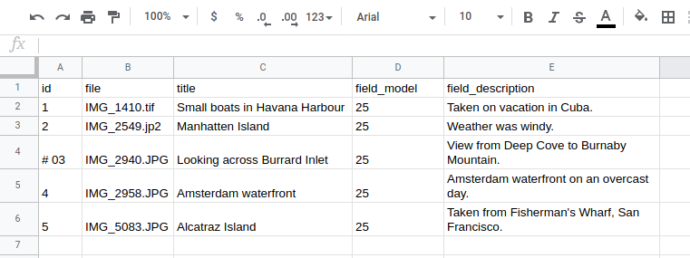

## Commenting out CSV rows

You can comment out rows in your input CSV, Excel file, or Google Sheet by adding a hash mark (`#`) as the first character of the value in the first column. Workbench ignores these rows, both when it is run with and without `--check`. Commenting out rows works in all tasks that use CSV data.

For example, the third row in the following CSV file is commented out:

```text
file,id,title,field_model,field_description
IMG_1410.tif,01,Small boats in Havana Harbour,25,Taken on vacation in Cuba.
IMG_2549.jp2,02,Manhatten Island,25,Weather was windy.
#IMG_2940.JPG,03,Looking across Burrard Inlet,25,View from Deep Cove to Burnaby Mountain.
IMG_2958.JPG,04,Amsterdam waterfront,25,Amsterdam waterfront on an overcast day.
IMG_5083.JPG,05,Alcatraz Island,25,"Taken from Fisherman's Wharf, San Francisco."
```

Since column order doesn't matter to Workbench, the same row is commented out in both the previous example and in this one:

```text
id,file,title,field_model,field_description
01,IMG_1410.tif,Small boats in Havana Harbour,25,Taken on vacation in Cuba.
02,IMG_2549.jp2,Manhatten Island,25,Weather was windy.
# 03,IMG_2940.JPG,Looking across Burrard Inlet,25,View from Deep Cove to Burnaby Mountain.
04,IMG_2958.JPG,Amsterdam waterfront,25,Amsterdam waterfront on an overcast day.
05,IMG_5083.JPG,Alcatraz Island,25,"Taken from Fisherman's Wharf, San Francisco."
```

Commenting works the same with in Excel and Google Sheets. Here is the CSV file used above in a Google Sheet:



You can also use commenting to include actual *comments* in your CSV/Google Sheet/Excel file:

```text
id,file,title,field_model,field_description
01,IMG_1410.tif,Small boats in Havana Harbour,25,Taken on vacation in Cuba.
02,IMG_2549.jp2,Manhatten Island,25,Weather was windy.
# Let's not load the following record right now.
# 03,IMG_2940.JPG,Looking across Burrard Inlet,25,View from Deep Cove to Burnaby Mountain.
04,IMG_2958.JPG,Amsterdam waterfront,25,Amsterdam waterfront on an overcast day.
05,IMG_5083.JPG,Alcatraz Island,25,"Taken from Fisherman's Wharf, San Francisco."
```

## Using CSV row ranges

The `csv_start_row` and `csv_stop_row` configuration settings allow you to tell Workbench to only process a specific subset of input CSV records. Both settings are optional and can be used in any task, and apply when using text CSV, Google Sheets, or Excel input files. Each setting takes as its value a row number (ignoring the header row). For example, row number 2 is the second row of data after the CSV header row. Below are some example configurations.
  
Process CSV rows 10 to the end of the CSV file (ignoring rows 1-9):

`csv_start_row: 10`

Process only CSV rows 10-15 (ignoring all other rows):

`csv_start_row: 10`  
`csv_stop_row: 15` 

Process CSV from the start of the file to row 20 (ignoring rows 21 and higher):

`csv_stop_row: 20` 

If you only want to process a single row, use its position in the CSV for both `csv_start_row` or `csv_stop_row` (for example, to only process row 100):

`csv_start_row: 100`  
`csv_stop_row: 100` 

!!! note
    When the `csv_start_row` or `csv_stop_row` options are in use, Workbench will display a message similar to the following when run:

    `Using a subset of the input CSV (will start at row 10, stop at row 15).`

## Ignoring CSV columns

Islandora Workbench strictly validates the columns in the input CSV to ensure that they match Drupal field names and reserved Workbench column names. To accommodate CSV columns that do not correspond to either of those types, or to eliminate a column during testing or troubleshooting, you can tell Workbench to ignore specific columns that are present in the CSV. To do this, list the column headers in the `ignore_csv_columns` configuration setting. The value of this setting is a list. For example, if you want to include a `date_generated` column in your CSV (which is neither a Workbench reserved column or a Drupal field name), include the following in your Workbench configuration file:

```
ignore_csv_columns: ['date_generated']
```

If you want Workbench to ignore the "data_generated" column and the "field_description" columns, your configuration would look like this:

```
ignore_csv_columns: ['date_generated', 'field_description']
```

Note that if a column name is listed in the `csv_field_templates` [setting](/islandora_workbench_docs/field_templates/), the value for the column defined in the template is used. In other words, the values in the CSV are ignored, but the field in Drupal is still populated using the value from the field template.


