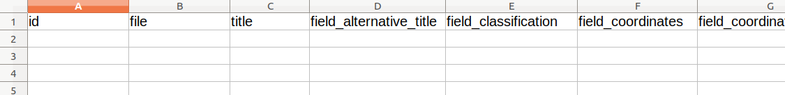

Islandora Workbench can generate several different CSV files you might find useful.

### CSV file templates

!!! note
    This documentation describes creating CSV *file* templates. For information on CSV *field* templates, see the "[Using CSV field templates](/islandora_workbench_docs/field_templates/)" section.

You can generate a template CSV file by running Workbench with the `--get_csv_template` argument:

`./workbench --config config.yml --get_csv_template`

With this option, Workbench will fetch the field definitions for the content type named in your configuration's `content_type` option and save a CSV file with a column for each of the content type's fields. You can then populate this template with values you want to use in a `create` or `update` task. The template file is saved in the directory indicated in your configuration's `input_dir` option, using the filename defined in `input_csv` with `.csv_file_template` appended.

The template also contains three additional rows:

* human-readable label
* whether or not the field is required in your CSV for `create` tasks
* sample data
* number of values allowed (either a specific maximum number or 'unlimited')
* the name of the section in the documentation covering the field type

Here is a screenshot of this CSV file template loaded into a spreadsheet application:


Note that the first column, and all the rows other than the field machine names, should be deleted before you use a populated version of this CSV file in a `create` task. Also, you can remove any columns you do not intend on populating:



### Creating a CSV file containing a row for every newly created node

In some situations, you may want to create stub nodes that only have a small subset of fields, and then populate the remaining fields later. To facilitate this type of workflow, Workbench provides an option to generate a simple CSV file containing a record for every node created during a `create` task. This file can then be used later in `update` tasks to add additional metadata or in `add_media` tasks to add media.

 You tell Workbench to generate this file by including the optional `output_csv` setting in your `create` task configuration file. If this setting is present, Workbench will write a CSV file at the specified location containing one record per node created. This CSV file contains the following fields:

 * `id` (or whatever column is specified in your `id_field` setting): the value in your input CSV file's ID field
 * `node_id`: the node ID for the newly created node
 * `uuid`: the new node's UUID
 * `status`: true if the node is published, False if it is unpublished
 * `title`: the node's title

 The file will also contain empty columns corresponding to all of the fields in the target content type. An example, generated from a 2-record input CSV file, looks like this (only left-most part of the spreadsheet shown):

 

This CSV file is suitable as a template for subsequent `update` tasks, since it already contains the `node_id`s for all the stub nodes plus column headers for all of the fields in those nodes. You can remove from the template any columns you do not want to include in your `update` task. You can also use the node IDs in this file as the basis for later `add_media` tasks; all you will need to do is delete the other columns and add a `file` column containing the new nodes' corresponding filenames.

If you want to include in your output CSV all of the fields (and their values) from the input CSV, add `output_csv_include_input_csv: true` to your configuration file. This option is useful if you want a CSV that contains the node ID and a field such as `field_identifier` or other fields that contain local identifiers, DOIs, file paths, etc. If you use this option, all the fields from the input CSV are added to the output CSV; you cannot configure which fields are included.

### Exporting field data into a CSV file

The `export_csv` task generates a CSV file that contains one row for each node identified in the input CSV file. The cells of the CSV are populated with data that is consistent with the structures that Workbench uses in `update` tasks. Using this CSV file, you can:

* see in one place all of the field values for nodes, which might be useful during quality assurance after a `create` task
* modify the data and use it as input for an `update` task using the `update_mode: replace` configuration option.

The CSV file contains two of the extra rows included in the CSV file template, described above (specifically, the human-readable field label and number of values allowed), and the left-most "REMOVE THIS COLUM (KEEP THIS ROW)" column. To use the file as input for an `update` task, simply delete the extraneous column and rows.

A sample configuration file for an `export_csv` task is:

```yaml
task: export_csv
host: "http://localhost:8000"
username: admin
password: islandora
input_csv: nodes_to_export.csv
export_csv_term_mode: name
content_type: my_custom_content_type
# If export_csv_field_list is not present, all fields will be exported.
export_csv_field_list: ['title', 'field_description']
# Specifying the output path is optional; see below for more information.
export_csv_file_path: output.csv
```

The file identified by `input_file` has only one column, "node_id":

```text
node_id
7653
7732
7653
```

Some things to note:

* The output includes data from nodes only, not media.
* Unless a file path is specificed in the `export_csv_file_path` configuration option, the output CSV file name is the name of the input CSV file (containing node IDs) with ".csv_file_with_field_values" appended. For example, if you `export_csv` configuration file defines the `input_csv` as "my_export_nodes.csv", the CSV file created by the task will be named "my_export_nodes.csv.csv_file_with_field_values". The file is saved in the directory identified by the `input_dir` configuration option.
* You can include either vocabulary term IDs or term names (with accompanying vocabulary namespaces) in the CSV. By default, term IDs are included; to include term names instead, include `export_csv_term_mode: name` in you configuration file.
* A single `export_csv` job can only export nodes that have the content type identified in your Workbench configuration. By default, this is "islandora_object". If you include node IDs in your input file for nodes that have a different content type, Workbench will skip exporting their data and log the fact that it has done so.
* If you don't want to export all the fields on a content type, you can list the fields you want to export in the `export_csv_field_list` configuration option.

!!! warning
    Using the `export_csv_term_mode: name` option will slow down the export, since Workbench must query Drupal to get the name of each term. The more taxonomy or typed relation fields in your content type, the slower the export will be with `export_csv_term_mode` set to "name".
