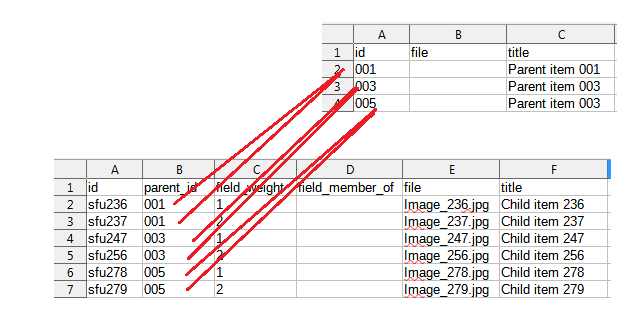

Islandora Workbench provides three ways to create paged and compound content:

* using a subdirectory structure to define the relationship between the parent item and its children
* using page-level metadata in the CSV to establish that relationship
* using a secondary task.

### Using subdirectories

Enable this method by including `paged_content_from_directories: true` in your configuration file. Use this method when you are creating books, newspaper issues, or other paged content where your pages don't have their own metadata. This method groups page-level files into subdirectories that correspond to each parent, and does not require (or allow) page-level metadata in the CSV file. Each parent (book, newspaper issue, etc.) has a row on the CSV file, e.g.:

```text
id,title,field_model,field_display_hints
book1,How to Use Islandora Workbench like a Pro,28,2
book2,Using Islandora Workbench for Fun and Profit,28,2
```

!!! note
    Unlike every other Islandora Workbench "create" configuration, the metadata CSV should not contain a `file` column. This means that content created using this method cannot be created using the same CSV file as other content.

Each parent's pages are located in a subdirectory of the input directory that is named to match the value of the `id` field of the parent item they are pages of:

```text
books/
├── book1
│   ├── page-001.jpg
│   ├── page-002.jpg
│   └── page-003.jpg
├── book2
│   ├── isbn-1843341778-001.jpg
│   ├── using-islandora-workbench-page-002.jpg
│   └── page-003.jpg
└── metadata.csv
```

The page filenames have significance. The sequence of the page is determined by the last segment of each filename before the extension, and is separated from the rest of the filename by a dash (`-`), although you can use another character by setting the `paged_content_sequence_separator` option in your configuration file. For example, using the filenames for "book1" above, the sequence of "page-001.jpg" is "001". Dashes (or whatever your separator character is) can exist elsewhere in filenames, since Workbench will always use the string after the *last* dash as the sequence number; for example, the sequence of "isbn-1843341778-001.jpg" for "book2" is also "001". Workbench takes this sequence number, strips of any leader zeros, and uses it to populate the `field_weight` in the page nodes, so "001" becomes a weight value of 1, "002" becomes a weight value of 2, and so on.

Titles for pages are generated automatically using the pattern `parent_title` + `, page` + `sequence_number`, where "parent title" is inherited from the page's parent node and "sequence number" is the page's sequence. For example, if a page's parent has the title "How to Write a Book" and its sequence number is 450, its automatically generated title will be "How to Write a Book, page 450". You can override this pattern by including the `page_title_template`  setting in your configuration file. The value of this setting is a simple string template. The default, which generates the page title pattern described above, is `'$parent_title, page $weight'`. There are only two variables you can include in the template, `$parent_title` and `$weight`, although you do not need to include either one if you don't want that information appearing in your page titles.

Finally, even though only minimal metadata is assigned to pages using this method (i.e., the automatically generated title and Islandora model), you can add additional metadata to pages using a separate `update` task.

Important things to note when using this method:

* To use this method of creating paged content, you must include `paged_content_page_model_tid` in your configuration file and set it to your Islandora's term ID for the "Page" term in the Islandora Models vocabulary (or to `http://id.loc.gov/ontologies/bibframe/part`).
* The Islandora model of the parent is not set automatically. You need to include a `field_model` value for each item in your CSV file.
* You should also include a `field_display_hints` column in your CSV. This value is applied to the parent nodes and also the page nodes, unless the `paged_content_page_display_hints` setting is present in you configuration file. However, if you normally don't set the "Display hints" field in your objects but use a Context to determine how objects display, you should not include a `field_display_hints` column in your CSV file.
* `id` can be defined as another field name using the `id_field` configuration option. If you do define a different ID field using the `id_field` option, creating the parent/paged item relationships will still work.
* The Drupal content type for page nodes is inherited from the parent, unless you specify a different content type in the `paged_content_page_content_type` setting in your configuration file.
* If your page directories contain files other than page images, you need to include the `paged_content_image_file_extension` setting in your configuration. Otherwise, Workbench can't tell which files to create pages from.

#### Ingesting OCR (and other) files with page images

You can tell Workbench to add OCR and other media related to page images when using the "Using subdirectories" method of creating paged content. To do this, add the OCR files to your subdirectories, using the base filenames of each page image plus an extension like `.txt`:

```text
books/
├── book1
│   ├── page-001.jpg
│   ├── page-001.txt
│   ├── page-002.jpg
│   ├── page-002.txt
│   ├── page-003.txt
│   └── page-003.jpg
├── book2
│   ├── isbn-1843341778-001.jpg
│   ├── isbn-1843341778-001.txt
│   ├── using-islandora-workbench-page-002.jpg
│   ├── using-islandora-workbench-page-002.txt
│   ├── page-003.txt
│   └── page-003.jpg
└── metadata.csv
```

Then, add the following settings to your configuration file:

- `paged_content_from_directories: true` (as described above)
- `paged_content_page_model_tid` (as described above)
- `paged_content_image_file_extension`: this is the file extension, without the leading `.`, of the page images, for example `tif`, `jpg`, etc.
- `paged_content_additional_page_media`: this is a list of mappings from Media Use term IDs or URIs to the file extensions of the OCR or other files you are ingesting. See the example below.

An example configuration is:

```yaml
task: create
host: "http://localhost:8000"
username: admin
password: islandora
input_dir: input_data/paged_content_example
standalone_media_url: true
paged_content_from_directories: true
paged_content_page_model_tid: http://id.loc.gov/ontologies/bibframe/part
paged_content_image_file_extension: jpg
paged_content_additional_page_media:
 - http://pcdm.org/use#ExtractedText: txt
```

You can add multiple additional files (for example, OCR and hOCR) if you provide a Media Use term-to-file-extension mapping for each type of file:

```yaml
paged_content_additional_page_media:
 - http://pcdm.org/use#ExtractedText: txt
 - https://www.wikidata.org/wiki/Q288405: hocr
```

You can also use your Drupal's numeric Media Use term IDs in the mappings, like:

```yaml
paged_content_additional_page_media:
 - 354: txt
 - 429: hocr
```

!!! note
    Using hOCR media for Islandora paged content nodes may not be configured on your Islandora repository; hOCR and the corresponding URI are used here as an example only.

In this case, Workbench looks for files with the extensions `txt` and `hocr` and creates media for them with respective mapped Media Use terms. The paged content input directory would look like this:

```text
books/
├── book1
│   ├── page-001.jpg
│   ├── page-001.txt
│   ├── page-001.hocr
│   ├── page-002.jpg
│   ├── page-002.txt
│   ├── page-002.hocr
│   ├── page-003.txt
│   ├── page-003.hocr
│   └── page-003.jpg
```

!!! warning
    It is important to temporarily disable actions in Contexts that generate media/derivatives that would conflict with additional media you are adding using the method described here. For example, if you are adding OCR files, in the "Page Derivatives" Context listed at `/admin/structure/context`, disable the "Extract text from PDF or image" action prior to running Workbench, and be sure to re-enable it afterwards. If you do not do this, the OCR media added by Workbench will get overwritten with the one that Islandora generates using the "Extract text from PDF or image" action.


### With page/child-level metadata

Using this method, the metadata CSV file contains a row for every item, both parents and children. You should use this method when you are creating books, newspaper issues, or other paged or compound content where each page has its own metadata, or when you are creating compound objects of any Islandora model. The file for each page/child is named explicitly in the page/child's `file` column rather than being in a subdirectory. To link the pages to the parent, Workbench establishes parent/child relationships between items with  a special `parent_id` CSV column.

Values in the `parent_id` column, which only apply to rows describing pages/children, are the `id` value of their parent. For this to work, your CSV file must contain a `parent_id` field *plus* the standard Islandora fields `field_weight`, `field_member_of`, and `field_model` (the role of these last three fields will be explained below). The `id` field is required in all CSV files used to create content, so in this case, your CSV needs both an `id` field and a `parent_id` field.

The following example illustrates how this works. Here is the raw CSV data:

```text
id,parent_id,field_weight,file,title,field_description,field_model,field_member_of
001,,,,Postcard 1,The first postcard,28,197
003,001,1,image456.jpg,Front of postcard 1,The first postcard's front,29,
004,001,2,image389.jpg,Back of postcard 1,The first postcard's back,29,
002,,,,Postcard 2,The second postcard,28,197
006,002,1,image2828.jpg,Front of postcard 2,The second postcard's front,29,
007,002,2,image777.jpg,Back of postcard 2,The second postcard's back,29,
```
The empty cells make this CSV difficult to read. Here is the same data in a spreadsheet:


The data contains rows for two postcards (rows with `id` values "001" and "002") plus a back and front for each (the remaining four rows). The `parent_id` value for items with `id` values "003" and "004" is the same as the `id` value for item "001", which will tell Workbench to make both of those items children of item "001"; the `parent_id` value for items with `id` values "006" and "007" is the same as the `id` value for item "002", which will tell Workbench to make both of those items children of the item "002". We can't populate  `field_member_of` for the child pages in our CSV because we won't have node IDs for the parents until they are created as part of the same batch as the children.

In this example, the rows for our postcard objects have empty `parent_id`, `field_weight`, and `file` columns because our postcards are not children of other nodes and don't have their own media. (However, the records for our postcard objects do have a value in `field_member_of`, which is the node ID of the "Postcards" collection that already/hypothetically exists.) Rows for the postcard front and back image objects have a value in their `field_weight` field, and they have values in their `file` column because we are creating objects that contain image media. Importantly, they have no value in their `field_member_of` field because the node ID of the parent isn't known when you create your CSV; instead, Islandora Workbench assigns each child's `field_member_of` dynamically, just after its parent node is created.

Some important things to note:

* The `parent_id` column can contain only a single value. In other words, values like `id_0029|id_0030` won't work. If you want an item to have multiple parents, you need to use a later `update` task to assign additional values to the child node's `field_member_of` field.
* Currently, you need to include the option `allow_missing_files: true` in your configuration file when using this method to create paged/compound content. See [this issue](https://github.com/mjordan/islandora_workbench/issues/297) for more information.
* `id` can be defined as another field name using the `id_field` configuration option. If you do define a different ID field using the `id_field` option, creating the parent/child relationships will still work.
* The values of the `id` and `parent_id` columns do not have to follow any sequential pattern. Islandora Workbench treats them as simple strings and matches them on that basis, without looking for sequential relationships of any kind between the two fields.
* The CSV records for children items don't need to come *immediately* after the record for their parent, but they do need to come after that CSV record. (`--check` will tell you if it finds any child rows that come before their parent rows.) This is because Workbench creates nodes in the order their records are in the CSV file (top to bottom). As long as the parent node has already been created when a child node is created, the parent/child relationship via the child's `field_member_of` will be correct. See the next paragraph for some suggestions on planning for large ingests of paged or compound items.
* Currently, you must include values in the children's `field_weight` column (except when creating a collection and its members at the same time; see below). It may be possible to automatically generate values for this field (see [this issue](https://github.com/mjordan/islandora_workbench/issues/84)).
* Currently, Islandora model values (e.g. "Paged Content", "Page") are not automatically assigned. You must include the correct "Islandora Models" taxonomy term IDs in your `field_model` column for all parent and child records, as you would for any other Islandora objects you are creating. Like for `field_weight`, it may be possible to automatically generate values for this field (see [this issue](https://github.com/mjordan/islandora_workbench/issues/85)).

Since parent items (collections, book-level items, newspaper issue-level items, top-level items in compound items, etc.) need to exist in Drupal before their children can be ingested, you need to plan your "create" tasks accordingly. For example:

* If you want to use a single "create" task to ingest all the parents and children at the same time, for each compound item, the parent CSV record must come before the records for the children/pages.
* If you would rather use multiple "create" tasks, you can create all your collections first, then, in subsequent "create" tasks, use their respective node IDs in the `field_member_of` CSV column for their members. If you use a separate "create" task to create members of a single collection, you can define the value of `field_member_of` in a [CSV field template](/islandora_workbench_docs/field_templates/).
* If you are ingesting a large set of books, you can ingest the book-level items first, then use their node IDs in a separate CSV for the pages of all books (each using their parent book node's node ID in their `field_member_of` column). Or, you could run a separate "create" task for each book, and use a CSV field template containing a `field_member_of` entry containing the book item's node ID.
* For newspapers, you could create the top-level newspaper first, then use its node ID in a subsequent "create" task for both newspaper issues and pages. In this task, the `field_member_of` column in rows for newspaper issues would contain the newspaper's node ID, but the rows for newspaper pages would have a blank `field_member_of` and a `parent_id` using the parent issue's `id` value.

### Using a secondary task

You can configure Islandora Workbench to execute two "create" tasks - a primary and a secondary - that will result in all of the objects described in both CSV files being ingested during the same Workbench job. Parent/child relationships between items are created by referencing the row IDs in the primary task's CSV file from the secondary task's CSV file. The benefit of using this method is that each task has its own configuration file, allowing you to create children that have a different Drupal content type than their parents.

The primary task's CSV describes the parent objects, and the secondary task's CSV describes the children. The two are linked via references from children CSV's `parent_id` values to their parent's `id` values, much the same way as in the "With page/child-level metadata" method described above. The difference is that the references span CSV files. The parents and children each have their own CSV input file (and also their own configuration file). Each task is a standard Islandora Workbench "create" task, joined by one setting in the primary's configuration file, `secondary_tasks`, as described below.

In the following example, the top CSV file (the primary) describes the parents, and the bottom CSV file (the secondary) describes the children:



As you can see, values in the `parent_id` column in the secondary CSV reference values in the `id` column in the primary CSV: `parent_id` 001 in the secondary CSV matches `id` 001 in the primary, `parent_id` 003 in the secondary matches `id` 003 in the primary, and so on.

You configure secondary tasks by adding the `secondary_tasks` setting to your primary configuration file, like this:

```yaml
task: create
host: "http://localhost:8000"
username: admin
password: islandora
# This is the setting that links the two configuration files together.
secondary_tasks: ['children.yml']
input_csv: parents.csv
nodes_only: true
```

In the `secondary_tasks` setting, you name the configuration file of the secondary task. The secondary task's configuration file (in this example, named "children.yml") contains no indication that it's a secondary task:

```yaml
task: create
host: "http://localhost:8000"
username: admin
password: islandora
input_csv: kids.csv
csv_field_templates:
 - field_model: http://purl.org/coar/resource_type/c_c513
query_csv_id_to_node_id_map_for_parents: true
```

!!! note
    The CSV ID to node ID map is required in secondary `create` tasks. Workbench will automatically change the `query_csv_id_to_node_id_map_for_parents` to `true`, regardless of whether that setting is in your secondary task's config file.

!!! note
    The `nodes_only` setting in the above example primary configuration file and the `csv_field_templates` setting in the secondary configuration file are not relevant to the primary/secondary task functionality; they're included to illustrate that the two configuration files can differ.

When you run Workbench, it executes the primary task first, then the secondary task. Workbench keeps track of pairs of `id` + node IDs created in the primary task, and during the execution of the secondary task, uses these to populate the `field_member_of` values in the secondary task with the node IDs corresponding to the referenced primary `id` values.

Some things to note about secondary tasks:

* Only "create" tasks can be used as the primary and secondary tasks.
* When you have a secondary task configured, running `--check` will validate both tasks' configuration and input data.
* The secondary CSV must contain `parent_id` and `field_member_of` columns. `field_member_of` must be empty, since it is auto-populated by Workbench using node IDs from the newly created parent objects. If you want to assign an order to the child objects within each parent object, include `field_weight` with the appropriate values (1, 2, 3, etc., the lower numbers being earlier/higher in sort order).
* If a row in the secondary task CSV does not have a `parent_id` that matches an `id` of a row in the primary CSV, or if there is a matching row in the primary CSV and Workbench failed to create the described node, Workbench will skip creating the child and add an entry to the log indicating it did so.
* As already stated, each task has its own configuration file, which means that you can specify a `content_type` value in your secondary configuration file that differs from the `content_type` of the primary task.
* You can include more than one secondary task in your configuration. For example, `secondary_tasks: ['first.yml', 'second.yml']` will execute the primary task, then the "first.yml" secondary task, then the "second.yml" secondary task in that order. You would use multiple secondary tasks if you wanted to add children of different content types to the parent nodes.


#### Specifying paths to the python interpreter and to the workbench script

When using secondary tasks, there are a couple of situations where you may need to tell Workbench where the python interpreter is located, and where the "workbench" script is located.

The first is when you use a secondary task within a scheduled job (such as running Workbench via Linux's cron). Depending on how you configure the cron job, you will likely need to tell Workbench what the absolute path to the python interpreter is and what the path to the workbench script is. This is because, unless your cronjob changes into Workbench's working directory, Workbench will be looking in the wrong directory for the secondary task. The two config options you should use are:

* `path_to_python`
* `path_to_workbench_script`

An example of using these settings is:

```yaml
secondary_tasks: ['children.yml']
path_to_python: '/usr/bin/python'
path_to_workbench_script: '/home/mark/islandora_workbench/workbench'
```

The second situation is when using a secondary task when running Workbench in Windows and "python.exe" is not in the PATH of the user running the scheduled job. Specifying the absolute path to "python.exe" will ensure that Workbench can execute the secondary task properly, like this:

```yaml
secondary_tasks: ['children.yml']
path_to_python: 'c:/program files/python39/python.exe'
path_to_workbench_script: 'd:/users/mark/islandora_workbench/workbench'
```

### Creating parent/child relationships across Workbench sessions

It is possible to use `parent_id` values in your CSV that refer to `id` values from earlier Workbench sessions. In other words, you don't need to create parents and their member/child nodes within the same Workbench job; you can create parents in an earlier job and refer to their `id` values in later jobs.

This is possible because during `create` tasks, Workbench records each newly created node ID and its corresponding value from the input CSV's `id` (or configured equivalent) column. It also records any values from the CSV `parent_id` column, if they exist. This data is stored in a simple SQLite database called the "[CSV ID to node ID map](/islandora_workbench_docs/generating_csv_files/#using-the-csv-id-to-node-id-map)".

Because this database persists across Workbench sessions, you can use `id` values in your input CSV's `parent_id` column from previously loaded CSV files. The mapping between the previously loaded parents' `id` values and the values in your current CSV's `parent_id` column are stored in the CSV ID to node ID map database.

!!! note
    It is important to use unique values in your CSV `id` (or configured equivalent) column, since if duplicate ID values exist in this database, Workbench can't know which corresponding node ID to use. In this case, Workbench will create the child node, but it won't assign a parent to it. `--check` will inform you if this happens with messages like `Warning: Query of ID map for parent ID "0002" returned multiple node IDs: (771, 772, 773, 774, 778, 779).`, and your Workbench log will also document that there are duplicate IDs.

!!! warning
    By default, Workbench only checks the CSV ID to node ID map for parent IDs created in the same session as the children. If you want to assign children to parents created in previous Workbench sessions, you need to set the `query_csv_id_to_node_id_map_for_parents` configuration setting to `true`.

### Creating collections and members together

Using a variation of the "With page/child-level metadata" approach, you can create a collection node and assign members to it at the same time (i.e., in a single Workbench job). Here is a simple example CSV which shows the references from the members' `parent_id` field to the collections' `id` field:

```text
id,parent_id,file,title,field_model,field_member_of,field_weight
1,,,A collection of animal photos,24,,
2,1,cat.jpg,Picture of a cat,25,,
3,1,dog.jpg,Picture of a dog,25,,
3,1,horse.jpg,Picture of a horse,25,,
```

The use of the `parent_id` and `field_member_of` fields is the same here as when creating paged or compound children. However, unlike with paged or compound objects, in this case we leave the values in `field_weight` empty, since Islandora collections don't use `field_weight` to determine order of members. Collection Views are sorted using other fields.

!!! warning
    Creating collection nodes and member nodes using this method assumes that collection nodes and member nodes have the same Drupal content type. If your collection objects have a Drupal content type that differs from their members' content type, you need to use the "Using a secondary task" method to ingest collections and members in the same Workbench job.

### Summary

The following table summarizes the different ways Workbench can be used to create parent/child relationships between nodes:

| Method | Relationships created by | field_weight | Advantage |
| --- | --- | --- | --- |
| Subdirectories | Directory structure | Do not include column in CSV; autopopulated. | Useful for creating paged content where pages don't have their own metadata. |
| Parent/child-level metadata in same CSV | References from child's `parent_id` to parent's `id` in same CSV data | Column required; values required in child rows | Allows including parent and child metadata in same CSV. |
| Secondary task | References from `parent_id` in child CSV file to `id` in parent CSV file | Column and values recommended in secondary (child) CSV data | Primary and secondary tasks have their own configuration and CSV files, which allows children to have a Drupal content type that differs from their parents' content type. Allows creation of parents and children in same Workbench job. |
| Collections and members together | References from child (member) `parent_id` fields to parent (collection) `id` fields in same CSV data | Column required in CSV but must be empty (collections do not use weight to determine sort order) | Allows creation of collection and members in same Islandora Workbench job. |


