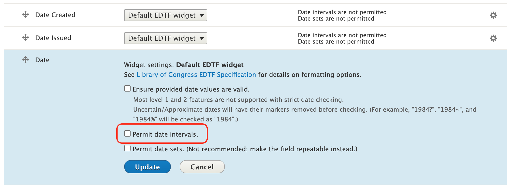

!!! note
    If you are encountering problems not described here, please [open an issue](https://github.com/mjordan/islandora_workbench/issues) and help improve Islandora Workbench!

## Workbench is failing to ingest some nodes and is leaving messages in the log mentioning HTTP response code 422.

This is probably caused by unexpected data in your CSV file that Workbench's `--check` validation is not finding. If you encounter these messages, please [open an issue](https://github.com/mjordan/islandora_workbench/issues) and share any relevant entries in your Workbench log and Drupal log (as an admin user, go to Admin > Reports > Recent log messages) so we can track down the problem.

One of the most common causes of this error is that one or more of the vocabularies being populated in your `create` task CSV contain required fields other than the default term name. It is possible to have Workbench create these fields, but you must do so as a separate `create_terms` task. See "[Creating taxonomy terms](/islandora_workbench_docs/creating_taxonomy_terms)" for more information.

## --check is telling me that one the rows in my CSV file has more columns than headers.

The most likely problem is that one of your CSV values contains a comma but is not wrapped in double quotes.

## Workbench is slow.

True, it can be slow. However, users have found that the following strategies increase Workbench's speed substantially:

* Running Workbench on the same server that Drupal is running on (e.g. using "localhost" as the value of `host` in your config file). While doing this negates Workbench's most important design principle - that it does not require access to the Drupal server's command line - during long-running jobs such as those that are part of migrations, this is the best way to speed up Workbench.
* Using local instead of remote files. If you populate your `file` or "additional files" fields with filenames that start with "http", Workbench downloads each of those files before ingesting them. Providing local copies of those files in advance of running Workbench will eliminate the time it takes Workbench to download them.
* Avoid confirming taxonomy terms' existence during `--check`. If you add `validate_terms_exist: false` to your configuration file, Workbench will not query Drupal for each taxonomy term during `--check`. This option is suitable if you know that the terms don't exist in the target Drupal. Note that this option only speeds up `--check`; it does not have any effect when creating new nodes.

## Workbench crashes or slows down my Drupal server.

If Islandora Workbench is putting too much strain on your Drupal server, you should try enabling the `pause` configuration option. If that works, replace it with the `adaptive_pause` option and see if that also works. The former option pauses between all communication requests between Workbench and Drupal, while the latter pauses only if the server's response time for the last request is longer than the average of the last 20 requests.

Note that both of these settings will slow Workbench down, which is their purpose. However, `adaptive_pause` should have less impact on overall speed since it only pauses between requests if it detects the server is getting slower over time. If you use `adaptive_pause`, you can also tune the `adaptive_pause_threshold` option by incrementing the value by .5 intervals (for example, from the default of 2 to 2.5, then 3, etc.) to see if doing so reduces strain on your Drupal server while keeping overall speed acceptable. You can also lower the value of `adaptive_pause` incrementally to balance strain with overall speed.

## The text in my CSV does not match how it looks when I view it in Drupal.

If a field is configured in Drupal to use [text filters](https://www.drupal.org/node/213156), the HTML that is displayed to the user may not be exactly the same as the content of the node add/edit form field. If you check the node add/edit form, the content of the field should match the content of the CSV field. If it does, it is likely that Drupal is apply a text filter. See [this issue](https://github.com/mjordan/islandora_workbench/issues/328) for more information.

## My Islandora uses a custom media type and I need to tell Workbench what file field to use.

If you need to create a media that is not one of the standard Islandora types (Image, File, Digital Document, Video, Audio, Extracted Text, or FITS Technical metadata), you will need to include the  `media_file_fields` setting in your config file, like this:


```yaml
media_file_fields:
 - mycustommedia_machine_name: field_custom_file
 - myothercustommedia_machine_name: field_other_custom_file
```

This configuration setting adds entries to the following default mapping of media types to file field names:

```yaml
'file': 'field_media_file',
'document': 'field_media_document',
'image': 'field_media_image',
'audio': 'field_media_audio_file',
'video': 'field_media_video_file',
'extracted_text': 'field_media_file',
'fits_technical_metadata': 'field_media_file'
```

## I've pulled in updates to Islandora Workbench from Github but when I run it, Python complains about not being able to find a library.

This is likely due to the addition of a new Python library to Workbench. Rerunning `setup.py` will install the missing library. Details are available in the "Updating Islandora Workbench" section of the [Requirements and Installation](https://mjordan.github.io/islandora_workbench_docs/installation/#updating-islandora-workbench) docs.

## EDTF 'interval' values are not rendering in Islandora properly.

Islandora can display EDTF interval values (e.g., `2004-06/2006-08`, `193X/196X`) properly, but by default, the configuration that allows this is disabled (see [this issue](https://github.com/Islandora/documentation/issues/1889) for more information). To enable it, for each field in your Islandora content types that use EDTF fields, visit the "Manage form display" configuration for the content type, and for each field that uses the "Default EDTF widget", within the widget configuration (click on the gear), check the "Permit date intervals" option and click "Update":



## My CSV file has a `url_alias` column, but the aliases are not being created.

First thing to check is whether you are using the [Pathauto](https://www.drupal.org/project/pathauto) module. It also creates URL aliases, and since by default Drupal only allows one URL alias, in most cases, the aliases it creates will take precedence over aliases created by Workbench.

## I'm installing Workbench on Windows and it's failing because Microsoft Visual C++ is not installed

On Windows, the "iteration_utilities" library that Workbench uses requires Microsoft Visual C++ 14.0 or higher. Often, this is already installed, in which case `setup.py` will execute successfully. However, if you see the following error when running Workbench's `setup.py`:

> Setup script exited with error: Microsoft Visual C++ 14.0 or greater is required. Get it with "Microsoft C++ Build Tools": https://visualstudio.microsoft.com/visual-cpp-build-tools/

you will need to visit that site, download the "Build Tools" and install them.

## My Drupal has the "Standalone media URL" option at `/admin/config/media/media-settings` checked, and I'm using Workbench's `standalone_media_url: true` option in my config, but I'm still getting lots of errors.

Bue sure to clear Drupal's cache every time you change the "Standalone media URL" option. More information can be found [here](/islandora_workbench_docs/installation/#configuring-drupals-media-urls).


## I'm having trouble getting Workbench to work in a cronjob

The most common problem you will encounter when running Islandora Workbench in a cronjob is that Workbench can't find its configuration file, or input/output directories. The easiest way to avoid this is to use absolute file paths everywhere, including as the value of Workbench's `--config` parameter, in configuration files, and in `file` and `additional_files` columns in your input CSV files.

In some cases, particularly if you are using a secondary task to create pages or child items, you many need to use the `path_to_python` and `path_to_workbench_script` configuration settings.
