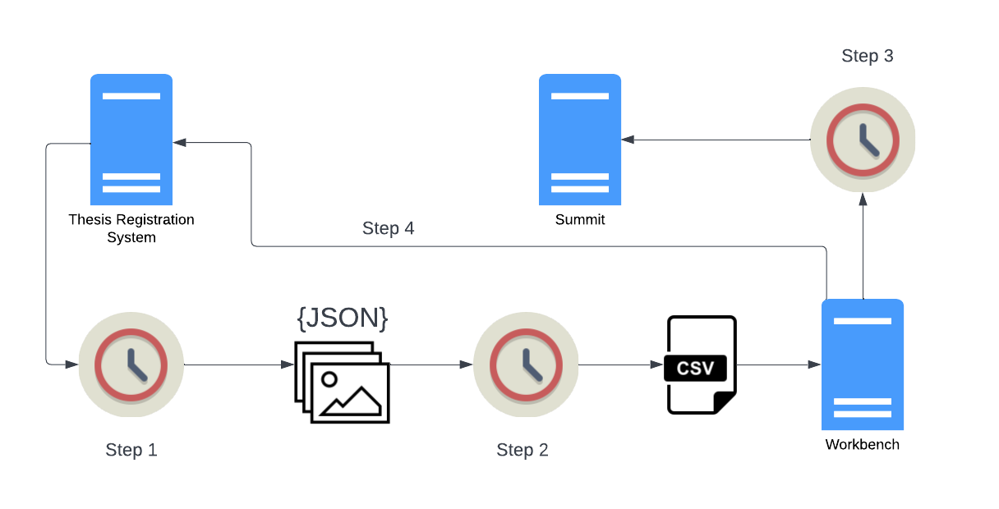

Islandora Workbench can be used in a variety of content ingest workflows. Several are outlined below.

## Batch ingest

This is the most common workflow. A user prepares a CSV file and accompanying media files, and runs Workbench to ingest the content:


Note that within this basic workflow, options exist for creating nodes with [no media](/islandora_workbench_docs/nodes_only/), and creating stub nodes [from files](/islandora_workbench_docs/creating_nodes_from_files/) (i.e., no accompanying CSV file).

## Distributed batch ingest

It is possible to separate the tasks of creating a node and its accompanying media. This can be done in a couple of ways:

* creating the nodes first, using the `nodes_only: true` configuration option, and [adding media to those nodes](/islandora_workbench_docs/adding_media/) separately
* creating stub nodes [directly from media files](/islandora_workbench_docs/creating_nodes_from_files/), and [updating the nodes](/islandora_workbench_docs/updating_nodes/) separately


In this workflow, the person creating the nodes and the person updating them later need not be the same. In both cases, Workbench can create an [output CSV](/islandora_workbench_docs/output_csv/) that can be used in the second half of the workflow.

## Migrations

Islandora Workbench is not intended to replace Drupal's Migrate framework, but it can be used in conjunction with other tools and processes as part of an "[extract, transform, load](https://en.wikipedia.org/wiki/Extract,_transform,_load)" (ETL) workflow. The source could be any platform. If it is Islandora 7, several tools exist to extract content, including the [get_islandora_7_content.py](/islandora_workbench_docs/exporting_islandora_7_content/) script that comes with Workbench or the [Islandora Get CSV](https://github.com/mjordan/islandora_get_csv) module for Islandora 7. This content can then be used as input for Islandora Workbench, as illustrated here:


On the left side of the diagram, `get_islandora_7_content.py` or the Islandora Get CSV module are used in the "extract" phase of the ETL workflow, and on the right side, running the user's computer, Islandora Workbench is used in the "load" phase. Before loading the content, the user would modify the extracted CSV file to confirm with Workbench's CSV content requirements.

The advantage of migrating to Islandora in this way is that the exported CSV file can be cleaned or supplemented (manually or otherwise) prior to using it as Workbench's input. The specific tasks required during this "transform" phase will vary depending on the quality and consistency of metadata and other factors.

!!! note
    Workbench's ability to add multiple media to a node at one time is useful during migrations, if you want to reuse derivatives such as thumbnails and OCR transcripts from the source platform. Using this ability can speed up ingest substantially, since Islandora won't need to generate derivative media that are added this way . See the "[Adding multiple media](/islandora_workbench_docs/adding_multiple_media)" section for more information.

## Watch folders

Since Islandora workbench is a command-line tool, it can be run in a scheduled job such as Linux "cron". If CSV and file content are present when Workbench runs, Workbench will operate on them in the same way as if a person ran Workbench manually. In the diagram below, the source of the files is the daily output of someone scanning images. If these images are saved in the directory that is specified in Workbench's `input_dir` configuration option, and Workbench is run in a cron job using the "[create_from_files](/islandora_workbench_docs/creating_nodes_from_files/)" task, nodes will be created when the cron job executes (over night, for example):


A variation on this workflow is to combine it with the "Distributed" workflow described above:


In this workflow, the nodes are created overnight and then updated with CSV data the next day.

!!! note
    Islandora Workbench does not detect changes in directories. While tools to do so exist, Workbench's ability to ingest Islandora content in batches makes it useful to scheduled jobs, as opposed to realtime detection of new files in a directory.

## Integrations with other systems

A combination of the "Migrations" workflow and the "Watch folder" workflow can be used to automate the periodic movement of content from a source system (in the diagram below, Open Journal Systems or Archivematica) into Islandora:


The extraction of data from the source system, conversion of it into the CSV and file arrangement Workbench expects, and running of Workbench can all be scripted and executed in sequence using scheduled jobs. The [case study below](/islandora_workbench_docs/workflows/#case-study) provides a full, operational example of this workflow.

### Using hooks

Islandora Workbench provides several "[hooks](/islandora_workbench_docs/hooks/)" that allow you to execute external scripts at specific times. For example, the "post-action script" enables you to execute scripts immediately after a node is created or updated, or a media is created. Drupal informs Workbench if an action was successful or not, and in either case, post-action hook scripts registered in the Workbench configuration file execute. These scripts can interact with external applications:


Potential uses for this ability include adding new Islandora content to external processing queues, or informing upstream applications like those described in the "Integrations with other systems" section above that content they provide has been (or has not been) ingested into Islandora. As a simpler example, post-action hook scripts can be used to write custom or special-purpose log files.

!!! warning
    Schedulers such as Linux `cron` usually require that all file paths are absolute, unless the scheduler changes its current working directory when running a job. When running Islandora Workbench in a scheduled job, all paths to files and directories included in configuration files should be absolute, not relative to Workbench. Also, the path to Workbench configuration file used as the value of `--config` should be absolute. If a scheduled job is not executing the way you expect, the first thing you should check is whether all paths to files and directories are expressed as absolute paths, not relative paths.

### Sharing the input CSV with other applications

Some workflows can benefit from having Workbench share its input CSV with other scripts or applications. For example, you might use Workbench to ingest nodes into Islandora but want to use the same CSV file in a script to create metadata for loading into another application such as a library discovery layer.

Islandora Workbench strictly validates the columns in the input CSV to ensure that they match Drupal field names. To accommodate CSV columns that do not correspond to Drupal field names, you can tell Workbench to ignore specific columns that are present in the CSV. To do this, list the non-Workbench column headers in the `ignore_csv_columns` configuration setting. For example, if you want to include a `date_generated` and a `qa by` column in your CSV, include the following in your Workbench configuration file:

```
ignore_csv_columns: ['date_generated', 'qa by']
```

With this setting in place, Workbench will ignore the `date_generated` column in the input CSV. More information on this feature [is availalable](/islandora_workbench_docs/ignoring_csv_rows_and_columns/#ignoring-csv-columns).

### Case study

Simon Fraser University Library uses Islandora Workbench to automate the transfer of theses from its locally developed thesis registration application (called, unsurprisingly, the [Thesis Registration System](https://theses.lib.sfu.ca), or TRS) to [Summit](https://summit.sfu.ca), the SFU institutional research respository. This transfer happens through a series of scheduled tasks that run every evening. 

This diagram depicts the automated workflow, with an explanation of each step below the diagram. This case study is an example of the "[Integration with other systems](/islandora_workbench_docs/workflows/#integrations-with-other-systems)" workflow described above.



Each step is a separate cron job. The jobs run an hour apart - step 1 runs at 7:00 PM, step 2 runs at 8:00 PM, step 3 at 9:00 PM, and step 4 at 10:00 PM.

#### Step 1: Fetch the day's theses from the TRS

The first scheduled task runs a script that fetches a list of all the theses approved by the SFU Library [Thesis Office](https://www.lib.sfu.ca/help/publish/thesis) staff during that day. Every thesis that has been approved and does not have in its metadata a URL in Summit is in the daily list. (The fact that a thesis doesn't have a Summit URL in its TRS metadata yet will come up again in Step 4; we'll come back to that later.)

After retrieving the list of theses, the script retrieves the metadata for each thesis (as a JSON file), the thesis PDF file, and, if they are present, any supplemental data files such as Excel, CSV, or video files attached to the thesis. All the data for each thesis is written to a temporary directory, where it becomes input to the script described in Step 2.

#### Step 2: Convert the TRS data into CSV

The script executed in this step converts the thesis data into a Workbench input CSV file. If there are any theses in a daily batch that have supplemental files, the script generates a second CSV file that is used in a Workbench secondary task to create compound objects (described in more detail in the next step).

#### Step 3: Run Islandora Workbench

With the thesis CSV created in step 2 in place (and the accompanying supplemental file CSV, if there are any supplemental files in the day's batch), a scheduled job executes Islandora Workbench. The main Workbench configuration file looks like this:

```yaml
```

The input CSV looks like this:

```csv
[example to come]
```

Supplemental files for a thesis are created as child nodes, with the thesis node containing the PDF media as the parent. Here is an [example in Summit](https://summit.sfu.ca/item/35389) that has two supplemental video files. These child nodes are created using a Workbench [secondary task](/islandora_workbench_docs/paged_and_compound/#using-a-secondary-task). The configuration file for this secondary task looks like this:

```yaml
```

The input CSV for this secondary task looks like this:

```csv
[example to come]
```

#### Step 4: Update the TRS

If a thesis (and any supplemental files, if present) have been successfully added to Summit, Workbench uses a [post-node-create hook](/islandora_workbench_docs/hooks/#post-action-scripts) to run a script that updates the TRS in two ways:

1. it populates the "Summit URL" field in the thesis record in the TRS, and
1. it updates the student's user record in the TRS to prevent the student from logging into the TRS.

The "Summit URL" for a thesis not only links the metadata in the TRS with the migrated item in Summit, it is also used to prevent theses from entering the daily feed described in Step 1. Specifically, theses that have been migrated to Summit (and therefore have a "Summit URL") are excluded from the daily feed generated by the TRS. This prevents a thesis from being migrated more than once. If for some reason the Thesis Office wants a thesis to be re-migrated to Summit, all they need to do is delete the first copy from Summit, then remove the "Summit URL" from the thesis metadata in the TRS. Doing so will ensure that the thesis gets into the next day's feed.

Thesis Office staff do not want students logging into the TRS after their theses have been published in Summit. To prevent a student from logging in, once a thesis has been successfully ingested, Workbench executes a post-node-creation hook script that disables the student's user record in the TRS. If a student wants to log into the TRS after their thesis has been migrated, they need to contact the Thesis Office.


#### Not depicted in the diagram

* After Workbench has completed executing, a final daily job runs that parses out entries from the Workbench log and the log written by the TRS daily script, and emails those entries to the Summit administrator to warn them of any errors that may have occurred.
* There is an additional monthly scheduled job (that runs on the first day of each month) that generates MARC records for each thesis added to Summit in the previous month. Before it finishes executing, this script emails the resulting MARC communications file to the Library's metadata staff, who load it into the Library's catalogue.
