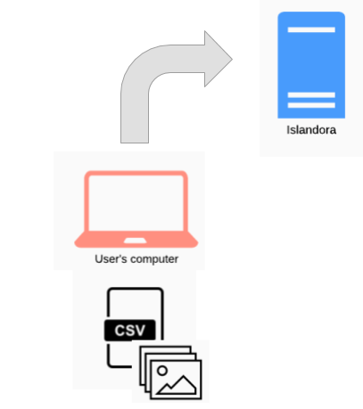
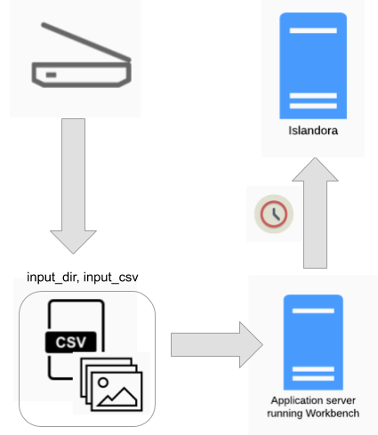
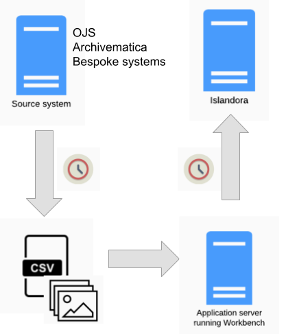

Islandora Workbench can be used in a variety of content ingest workflows. Several are outlined below.

## Batch ingest

This is the most common workflow. A user prepares a CSV file and accompanying media files, and runs Workbench to ingest the content:

Note that within this basic workflow, options exist for creating nodes with [no media](/islandora_workbench_docs/nodes_only/), and creating stub nodes [from files](/islandora_workbench_docs/creating_nodes_from_files/) (i.e., no accompanying CSV file).

## Distributed batch ingest

It is possible to separate the tasks of creating a node and its accompanying media. This can be done in a couple of ways:

* creating the nodes first, using the `nodes_only: true` configuration option, and [adding media to those nodes](/islandora_workbench_docs/adding_media/) separately
* creating stub nodes [directly from media files](/islandora_workbench_docs/creating_nodes_from_files/), and [updating the nodes](/islandora_workbench_docs/updating_nodes/) separately

In this workflow, the person creating the nodes and the person updating them later need not be the same. In both cases, Workbench can create an [output CSV](/islandora_workbench_docs/output_csv/) that can be used in the second half of the workflow.

## Migrations

Islandora Workbench is not intended to replace Drupal's Migrate framework, but it can be used in conjunction with other tools and processes to create Islandora content using the output of a source repository platform, such as the "[get_islandora_7_content.py](/islandora_workbench_docs/exporting_islandora_7_content/)" script that comes with Workbench or the [Islandora Get CSV](https://github.com/mjordan/islandora_get_csv) module for Islandora 7.x. This content can then be used as input for Islandora Workbench, as illustrated here:

An advantage of migrating to Islandora in this way is that the CSV file can be cleaned or supplemented (manually or otherwise) prior to using it as Workbench's input.

## Watch folders

Since Islandora workbench is a command-line tool, it can be run in a scheduled job such as Linux "cron". If CSV and file content are present when Workbench runs, Workbench will operate on them in the same way as if a person ran Workbench manually. In the diagram below, the source of the files is the daily output of someone scanning images. If these images are saved in the directory that is specified in Workbench's `input_dir` configuration option, and Workbench is run in a cron job using the "[create_from_files](/islandora_workbench_docs/creating_nodes_from_files/)" task, nodes will be created when the cron job executes (over night, for example):

A variation on this workflow is to combine it with the "Distributed" workflow described above:

In this workflow, the nodes are created overnight and then updated with CSV data the next day.

!!! note
    Islandora Workbench does not detect changes in directories. While tools to do so exist, Workbench's ability to ingest Islandora content in batches makes it useful to scheduled jobs, as opposed to realtime detection of new files in a directory.

## Integrations with other systems

A combination of the "Migrations" workflow and the "Watch folder" workflow can be used to automate the periodic movement of content from a source system (in the diagram below, Open Journal Systems or Archivematica) into Islandora:

The extraction of data from the source system, conversion of it into the CSV and file arrangement Workbench expects, and running of Workbench can all be scripted and executed in sequence using scheduled jobs.
